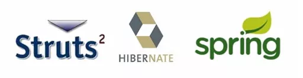
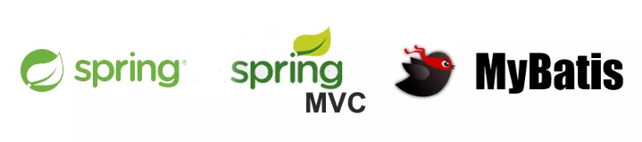
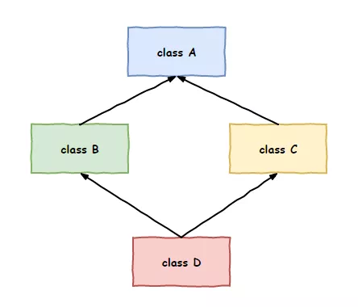
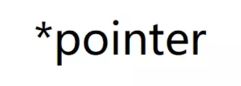
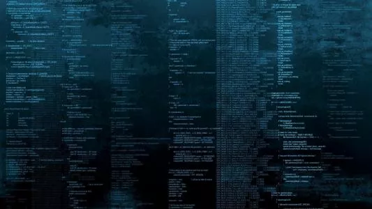
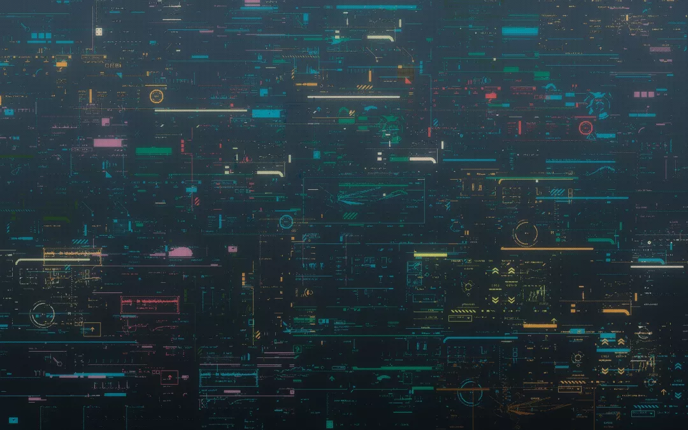

C++最近不太开心，自己曾经也是红极一时的编程语言，参与构建了无数的基础设施软件。但随着互联网时代的崛起，以PHP和Java为首的语言在Web开发领域以势如破竹，摧枯拉朽之势收获了一大票的追随者。

曾经的王者难道已经廉颇老矣了吗？C++郁郁寡欢，今晚多喝了几杯，竟做起梦来，梦里，他来到了一个平行宇宙······

## **初遇Java'**

眼前的白光慢慢褪去，不多时，一个熟悉的身影出现在C++的面前。

“这不是Java老弟吗，你怎么也在借酒消愁啊”，C++上前打了个招呼。

“你认错了，我是Java'，唉日子过不下去了，大家都不用我做开发了”，说完又喝了一杯。

“你别开玩笑了，你Java有那么多追随者，`SSH`框架和`SSM`框架大行其道，过不下去的应该是我C++才对，来我陪你喝”，C++说完也喝了一杯。

Java'放下了手里的酒杯，“什么是SSH和SSM，我怎么听不懂啊？”

C++指着Java'说道：“你就别装了，`SSH就是Spring+Struts2+Hibernate，SSM就是Spring+SpringMVC+Mybatis`，这是你Java做Web开发的看家宝贝，你怎么会不知道”

“我没有装，我是真不知道，我从来就没有这些啊”

C++有些疑惑，继续问道：“`反射`你总该知道吧”

Java'还是摇摇头。

看着他一脸真诚不像是在撒谎，C++突然恍然大悟，这里难道不是我原来的世界？原来呼风唤雨的Java在这个世界里怎么就成了这个样子，C++不禁发出了感叹。

“那你知道这里人气最高的编程语言是什么吗？”

“大哥，这个你就没有必要问了吧，不就是你C++'吗”

听到这个回答，C++大喜，没想到自己在这里人气最高，嘴角不经意的上扬。

## **新世界**

告别了Java'，继续前行，想看看在这个世界里，自己究竟为什么这么受欢迎。

路上，他看到了一段这个世界的C++'代码，竟惹得他有些不快。

“这里怎么不能多重继承了？这个interface关键字又是什么东西？”，他边看边吐槽。

这时旁边一位热心的路人告诉他，“多重继承早就被废除了，这玩意儿用起来容易出事儿。取而代之的是用接口，就是你说的interface定义的东西。”

“照你这么说，纯虚函数也没有了？”

“有了接口定义，还要什么纯虚函数”

C++略微点了点头，虽然有些变化，但还是可以接受。不过继续看下去，他开始不淡定了。

“这里的C++'代码为什么没有指针，这可是我的看家本领啊”，他吐槽到。

路人笑着告诉他，“看来你是外地来的吧，许多年前就没有指针了，不仅如此，现在都用垃圾回收了，不用直接管理内存了，日子别提有多快乐了”。

旁边来了一堆围观群众，纷纷嘲笑C++的土里土气。

C++气愤的回击：“祖宗之法不可变，直接操作内存才是C++的精神”

“指针那是人家C的东西，也不是C++原创的啊”，群众继续嘲笑他。

C++不再理会，继续低头研究起这里的代码。随着对这个世界的不断了解，C++心里的怒气越来越大。

## **C++'**

周围的人群逐渐散去，却独有一人站到最后。

“你好，我是C++'，我注意你很久了”，那人说到。

“原来你就是C++'啊，你看你干的这叫什么事儿”，C++没有好脸色的说到。

“你这是从何说起？”

“你怎么把C++的核心精神都丢光了，指针也没有，泛型编程也没有，多重继承也没有，你还有个啥？”

“那些东西太复杂门槛太高，我有垃圾回收，我有反射，我还能跨平台，你不思进取早晚必败”

C++不甘示弱，“谁说我没有进步，我在保留基础原则不动摇的基础上引入了很多变化啊，像自动类型推导、lambda表达式、move转移语义，甚至还弄了智能指针，我很努力的好吗”

C++'叹了一口气，“看来你确实很努力，不过你知道程序员想要的是什么吗？”

C++愣了一下，没有回答。

“走，带你去一个地方”，C++'带着C++到了一座宏伟的宫殿。

C++'缓缓的推开了宫殿的大门，无边无际的代码海洋出现在了他俩的面前。

“看到了吗？这里面是无数个标准的库组件，远处那几座显眼的高楼就是应用最广的几大框架，有web的，数据库的，网络通信的，用户界面的，在这里，程序员能找到他们想要的一切······”

C++被眼前的景象惊呆了，这是多么庞大的工程。

“别再去折腾语法糖和奇奇怪怪的特性了，好好为程序员服务，让他们高兴才是生存之道。”，C++'继续说到。

C++若有所思的点了点头，接下来深入到这些代码海洋中，详细了解了这个世界的C++'和他的不同。

## **酒醒之后**

不知过了多久，C++从梦中醒来，梦里发生的一切历历在目。

回想起那个世界C++'说过的话，他举着旁边的酒杯问自己：变成了那样的C++，还能叫C++吗？

一声苦笑，一饮而尽······

## **彩蛋**

> 在回去的路上，又碰到了Java'
>
> Java'说到，“怎么样，我们这里人气最高的编程语言是不是名不虚传？”
>
> 这时，不知哪里冒出一人应道：“谁在背后议论我”
>
> Java'赶紧催促C++，“快走，他又来了”