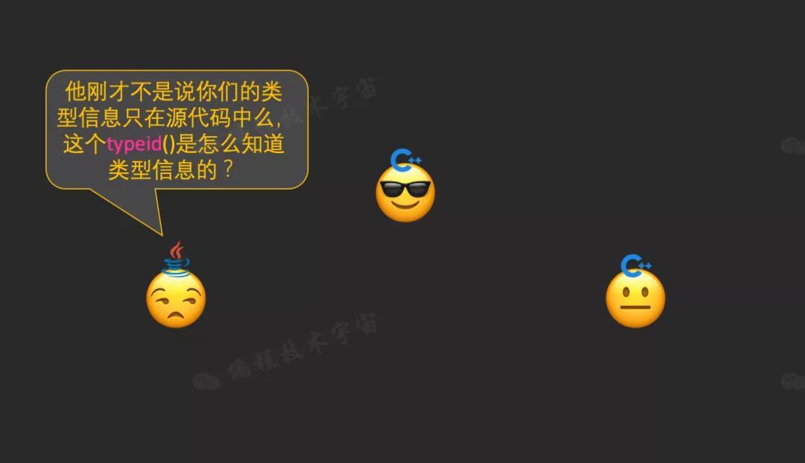
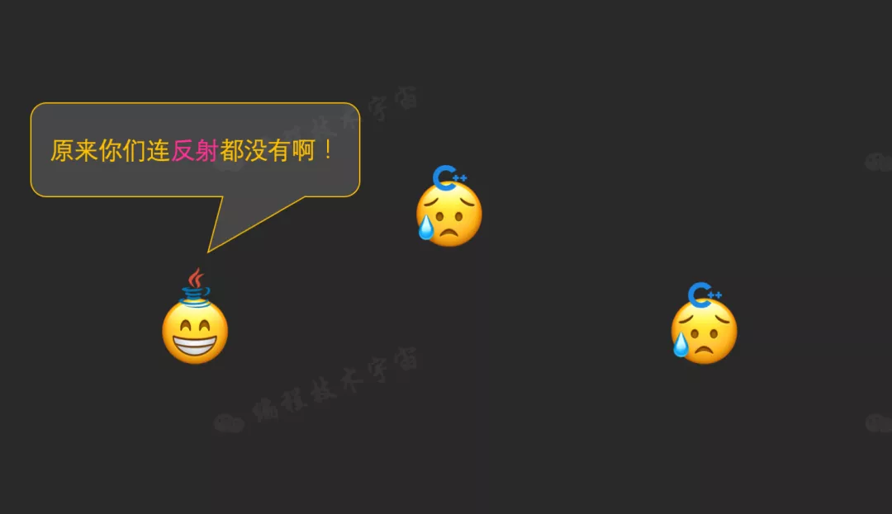
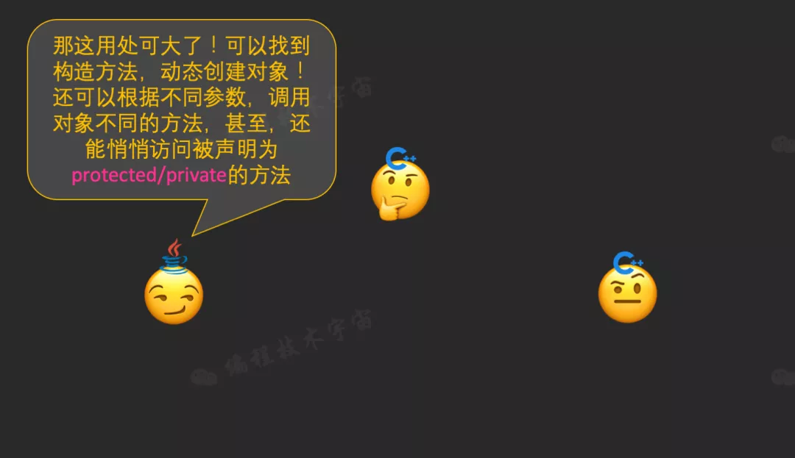

面向对象编程语言，都绕不开的话题是类和对象。对象都有类型，这在源代码级别都好理解，但如何能在运行的时候也能知道类型呢？

**C++** 作为静态编译型语言，对运行时类型识别RTTI的支持最弱，只能看到一个简单的名字，C++标准并没有规定RTTI信息的具体实现方式，交给各大编译器自己发挥。

**Java**同样作为编译型语言，实现了完整的反射机制，不仅作为信息获取，还能根据这些信息动态创建对象，修改访问属性等等。由于反射的支持，Java才有了Spring、MyBatis等各种功能强大的框架。

**Python**作为解释执行的脚本语言，其抽象的层次更高，类型信息更加丰富，动态创建、甚至新增、删除属性和方法都不在话下。

不过听说C++23可能会引入全新的反射特性，不知道是什么样子的呢？你怎么看？如果C++也有反射，你会用来做什么呢？