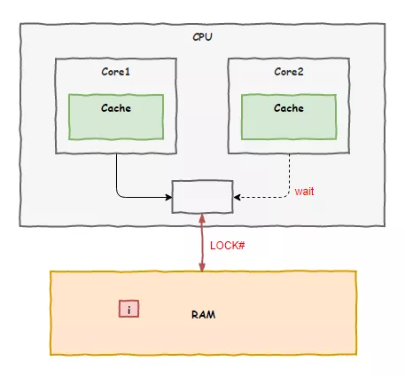
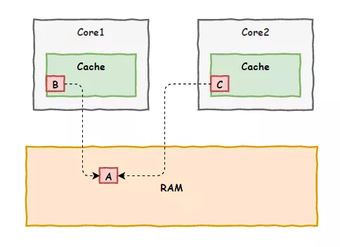
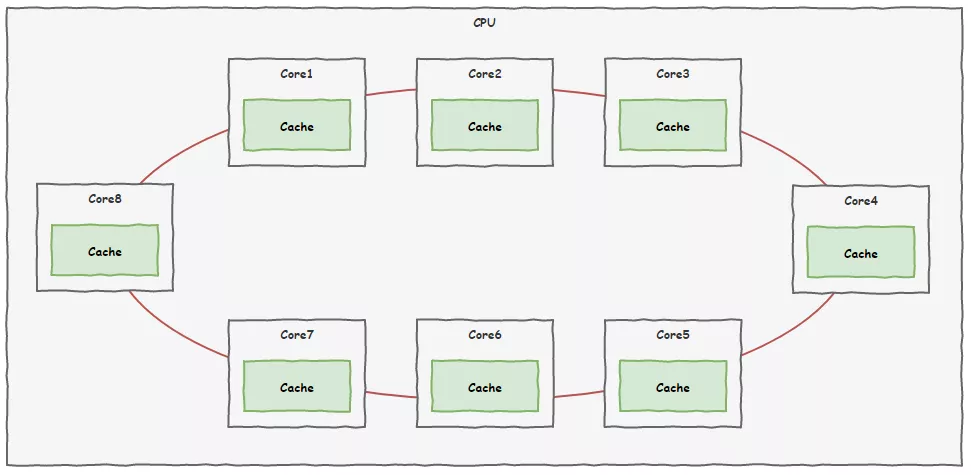
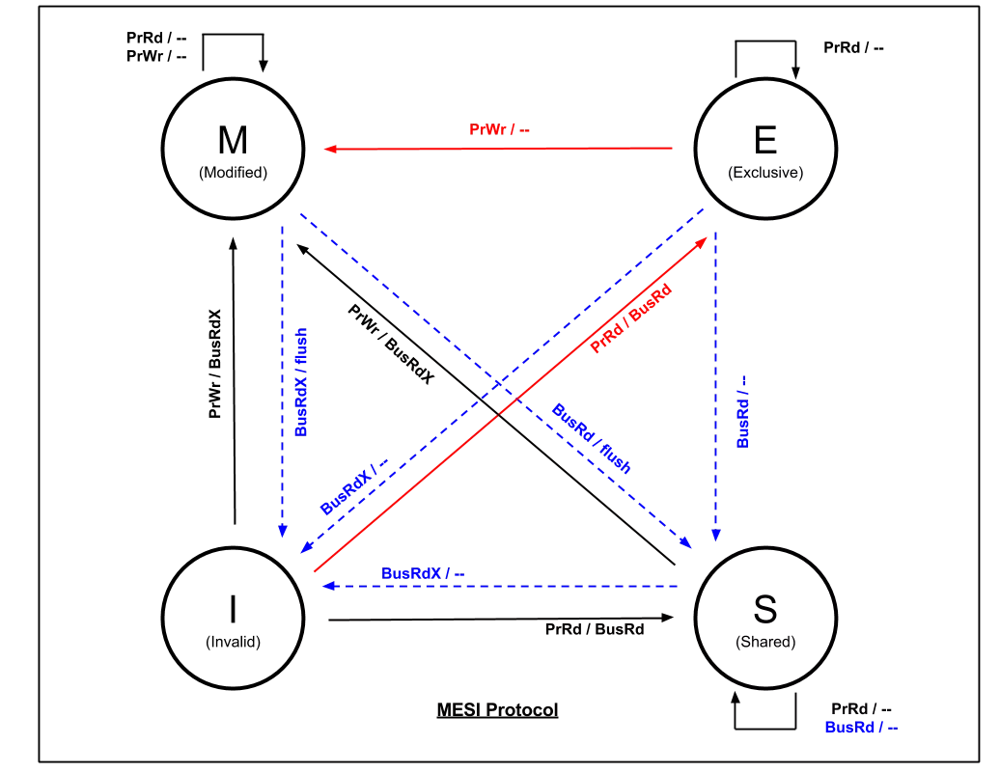

## **i++问题**

“阿Q赶快回去吧，隔壁二号车间的虎子说我们改了他们的数据，上门来闹事了”

由于老K的突然出现，我不得不提前结束与小黑的交流，赶回了CPU一号车间。

见到我回来，虎子立刻朝我嚷嚷：“你们是怎么回事？才几纳秒的时间，就把数据给我改了，你说这事怎么办吧！”

我听着迷迷糊糊的，连连说到：“虎子你先别急，我刚回来，到底出什么事儿了，先让我了解清楚好不好？”

接下来，老K把事情的经过告诉了我。原来，我们两个CPU车间各自负责的线程都在执行一个`i++`的操作，我们都把`i`的值放到了自己的缓存中，完了之后都没有通知对方，加了两次但结果却只有一次，出现了`数据不一致问题`。

## **原子操作**

了解清楚事情的原委之后，我向虎子说道：“大家都执行一样的代码，这事儿也不能怪我们啊”

虎子一听急了，“怎么不怪你们了，我们比你们先一步找内存拿走了i，那你们得等我们加完之后再用啊，不信你可以打电话问内存那家伙，看看是不是我们二号车间先来的”

“好好好，你先冷静一下，你看我们又不知道你们先去拿了，这不情有可原吗，再说现在事情已经出了，我们应该一起坐下来想个办法避免以后再次出现这种问题，你说是不是？”

虎子叹了口气问道：“那你说说你有什么办法？”

我继续说道：“你看啊，像咱们在执行`i++`这种操作的时候就不应该被干扰”

“不被干扰？”

“对，比如虎子你们二号车间在访问i的时候，我们一号车间就不能访问，需要等着，等你们访问完成我们再来，非常简单的办法却很有用”

虎子听完一愣，“这不就是加锁吗？你是想怪程序员做i++前没有加锁？”

“的确是加锁，不过这种简单操作还要程序员来加锁那也太麻烦了，咱们CPU内部处理好就行了”

“内部处理，你打算怎么实现？”，虎子问到。

“这，，让我想想···”，虎子问到了具体实现，我倒还没想到这一步。

这时，一旁的老K站了出来：“我倒是有个办法，可以找总线主任啊，他是负责协调各个车间使用系统总线访问内存的总指挥，让他在中间协调一下应该不难”

老K一语点醒梦中人，接着我们就去找了总线主任，后来我们商量出了一套解决方案：我们定义了一个叫`原子操作`的东西，表示这是一个不可切分的动作，谁要执行原子操作，总线主任就在系统总线上加上一个`LOCK#`信号，其他车间的想去访问内存就得等着，直到原子操作指令执行完毕。

我们把这套方案上报了领导，很快就批下来了，后面我们8个车间都按照这套方案来工作，以后程序员们把i++这样的动作换成原子操作后，问题就能迎刃而解。

不过施行了一段时间之后，各个车间却开始大倒苦水：就因为某个车间要执行一个原子操作，就让总线主任把系统总线锁住，其他车间的人都没法访问内存，都干不了活了，严重影响工作效率。

抱怨归抱怨，在没有更好的替代方案出现之前，日子还得过下去。

## **缓存引发的问题**

不过，没过多久，数据不一致问题又一次出现了。

这一次，倒不是加法的问题，我们两车间还是因为各自缓存的原因，先后修改了变量的值，对方没有即时知道，误用了错误的值，以致酿成大错。

“阿Q，上次那办法好是好，可解决不了这一次的问题啊”，虎子再次找上门来。

“你来的正好，我正想去找你说这事呢”

“哦，是吗，难不成你想到破解之道了？”

“只是一些初步的想法，问题的核心在于现在咱们各个车间各自为政，都有自己的私有缓存，各自修改数据后向内存更新时也不互相打招呼，缺少一个联络机制”

虎子点了点头，“确实，所以咱们需要建立一个联络机制，来对各个车间的缓存内容进行统一管理是吗？”

“对！这事儿咱俩说了可不算，我建议召集8个核心车间的代表，统一开一个会议，详细讨论下这个问题。哦，对了，把总线主任也叫上，他经验丰富说不定能提供一些思路”

## **缓存一致性协议MESI**

很快，咱们CPU的8个核心车间就为此问题召开了会议，并且取得了非常重要的成果。

我们牵了一条新的专线，把8个核心车间连接起来，用于各个车间之间进行信息沟通，不同于CPU外部的总线系统，大家把这个叫`片内总线`。

新的线路铺设好了，以后大家就可以通过这条线路即时沟通，为了解决之前出现的问题，大家还制定了一套规则，叫做`缓存一致性协议`。

规则里面规定了所有车间的缓存单元——`缓存行`有四种状态：

- 已修改Modified (M)

> 缓存行已经被修改了，与内存的值不一样。如果别的CPU内核要读内存这块数据，要赶在这之前把该缓存行回写到主存，把状态变为共享(S).

- 独占Exclusive (E)

> 缓存行只在当前CPU核心缓存中，而且和内存中数据一样。当别的CPU核心读取它时，状态变为共享；如果当前CPU核心修改了它，就要变为已修改状态。

- 共享Shared (S)

> 缓存行存在于多个CPU核心的缓存中，而且和内存中的内容一致。

- 无效Invalid (I)

> 缓存行是无效的

四种状态之间的转换是这样的：

按照这套规则，大家不能再像以前那样随意了，各车间对自家缓存进行读写时，都要相互通一下气，避免使用过时的数据。

除此之外，还规定如果一块内存区域被多个车间都缓存，就不再允许多个车间同时去修改缓存了。

会议还有另外一个收获，以前被各车间诟病的每次原子操作都要锁定总线，导致大家需要访问内存的都只能干等着的问题也得到了解决。以后总线主任不再需要锁定总线了，通过这次的缓存一致性协议就可以办到。

自此以后，数据不一致的问题总算是根治了，咱们8个车间又可以愉快的工作了。