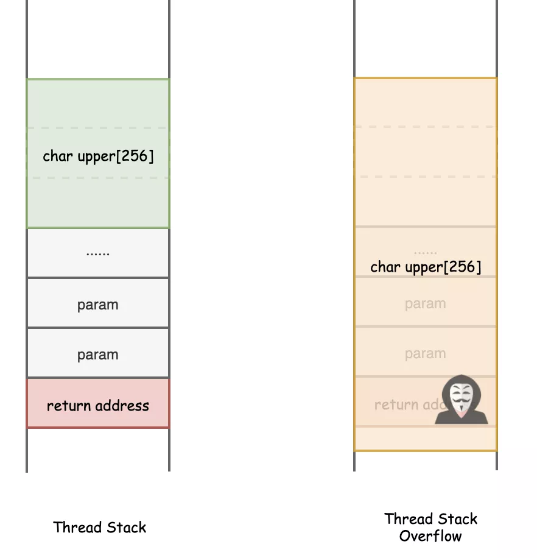
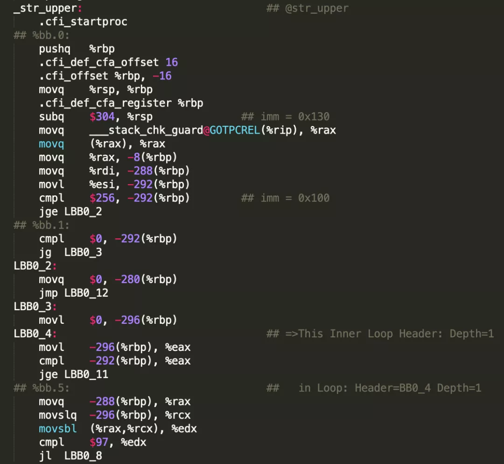
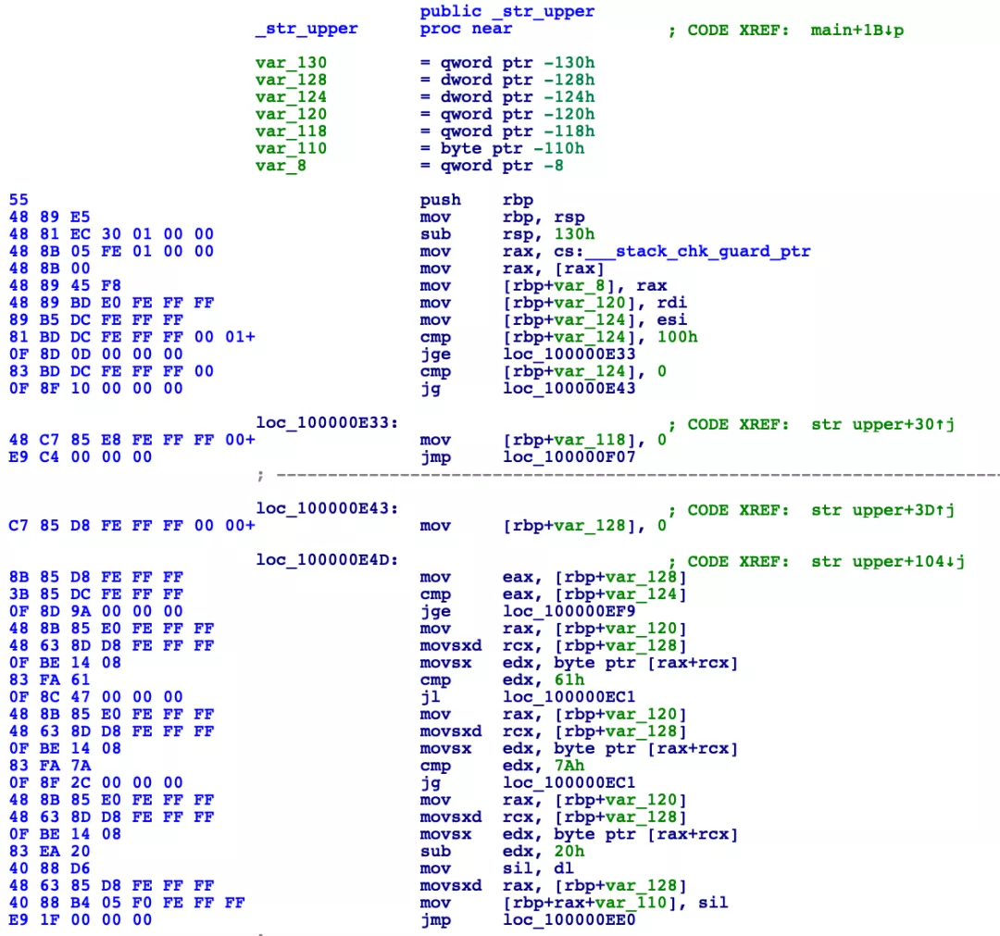

## **我是一个函数**

我是一个函数，名叫str_upper，我可以把输入的字符串从小写变成大写。不信你看，我长这样：

```
char* str_upper(char* str, int len) {
  
  char upper[256];
  
  if (len >= 256 || len <= 0) 
    return nullptr;

  for (int i = 0; i < len; i++) {
    if (str[i] >= 'a' && str[i] <= 'z') {
      upper[i] = str[i] - 32;
    } else {
      upper[i] = str[i];
    }
  }
  
  return upper;
}
```

上面是我的源代码形式，听我的好朋友str_lower说，一会儿我们就要一起被送到一个叫**编译器**的地方加工处理了，我心里害怕极了。

## **编译器之旅**

没多久，我们就来到了这里，一座很庞大到高楼，里面有好多精密的机器在不停的运转着。

一进入大厅，好多函数代码在这里排队等待。

我抬头向上望去，不知道有多少层楼，每一层都有一个指示牌，从下往上分别写着：

> - 预处理
> - 词法分析
> - 语法分析
> - 语义分析
> - ···

再往上太远就看不太清楚了。

所有的函数代码按照文件为单位排好队，静静地等待着。

不过没有等太久，就轮到了我们这一队。

来了一个工作人员把我们带到了一个房间，让我们都好好躺着，一台机器快速的从头到尾扫描了一遍，将我们所在文件中出现的**#include**和**#define**全部给替换掉了。

接着，通过房间里的电梯，将我们送上了二楼。

接下来的一段时间，我们在好几层楼都做了“体检”，每个函数都被那些像CT一样的机器照了个遍。

不一会儿，来到了编译层，这一层有一个特别奇怪的机器，我看到一个个函数被送了进去，出来的时候都变了样子。不仅如此，接待处的工作人员看起来很凶，我这下更加紧张了。

## **函数调用约定**

工作人员拿到了我的资料，瞅了几眼，问到：“请问你的**调用约定**是什么？”

我有些懵，不太懂他的意思，小声问到：“不好意思，你刚问什么？”

工作人员有点不耐烦了，提高了音量，“我是问你调用约定是什么？调用约定啊！”

看见我仍然一脸茫然，工作人员直接给我的资料上调用约定那一栏盖上了一个标记：**cdecl**。

我有点摸不着头脑，同行的小伙伴str_lower拽了我一下说到：“他是在问你**函数的调用约定**，就是约定调用函数的方式，涉及怎么传递参数，谁来恢复调用栈等”

他这一说我才反映过来，“这个调用约定都有哪些可选的呢？”

“一般有三种：”

> - cdcel，参数从右往左入栈，主调函数负责恢复栈平衡
> - stdcall，参数从右往左入栈，被调函数负责恢复栈平衡
> - fastcall，参数通过寄存器传递，寄存器不够再用栈传递

“他刚才看你没有显式声明，就默认给你cdecl的方式了”，小伙伴继续说到。

我点了点头，原来调用个函数还有这么多讲究呐！

## **Stack Canary**

“别闲聊了，快进去吧！”，工作人员催我了。

我准备走向那台可怕的机器。

“唉，等一下”，正紧张着，工作人员又叫住了我。

我回头看去，工作人员正招手让我过去。

“你好，是我的代码有什么问题吗？”，我紧张的问到，生怕有错误被打回去，连累我们整个文件都要被遣返。

“不是，是我注意到你的函数里有一个局部数组，需要给你加一下栈溢出保护”，工作人员说到。

我看了下我的代码，确实有一个局部字符数组：

```
char upper[256];
```

“栈溢出保护是什么啊？”，我小声问到。

工作人员没有搭理我，忙着给我的资料上加东西。

旁边的小伙伴又把我拽了过去，说到：“咱们函数里面定义的局部变量、参数是存放在线程栈里面的。线程要不断游走在不同的函数中，调用函数后为了能回到原来的地方，调用之前把返回地址也放在了线程栈里。就像这样，你看会不会有什么问题：”



我仔细看了下，“哦，要是越界访问我的upper数组，那就可以修改返回地址，那可就危险了！”

“很聪明嘛！”

“那这个怎么加保护呢？”，我问到。

“你看，函数进来之前，先在局部变量和返回地址之间设置一个数值，函数返回之前再去检查一下，如果栈里的数据被破坏了，检查这个数值就能发现，提前抛出异常！”，小伙伴耐心的解释到。

“这样啊，那岂不是要把我打回去加上你说的这些设置和检查代码？”，我继续提问。

这时，工作人员听到了我们的闲聊，“不用，我们编译器自动添加好了，快去吧，已经处理好了”

我瞥了一眼，看到我的资料上增加了一个叫**Stack Canary**的标记。

我小心翼翼的走进了那架奇怪的机器，立刻就失去了知觉，等我醒来时，我的身体已经发生了变化，变成了一堆奇怪的代码，现在我长这样了：



## **链接**

没过一会儿，我们这一队的所有函数代码都编译完成，大家从原来的.c文件都搬到了新家：一个.o文件，我也再次见到了小伙伴str_lower。

“咱们是不是已经完成了编译，可以离开这里了吧？”

“还不行，编译虽然是完成了，还差链接这一步呢！”

又过了一小会儿，和我们一起过来的其他文件的函数代码也编译完成了，咱们一堆.o文件一起被送到了编译器大厦的顶楼：链接层。

这一层也有一个巨大的机器，机器背后连接了一个管道，不知通向了哪里。

我们这一批的所有.o文件挨个走进了这个巨大的机器，像是一条时空隧道一般，穿行于其间，我感觉到了巨大的压力把我们挤压在了一起，很快我们再一次失去了意识。

醒来之后，我发现所有的函数们都被合在了一个文件中，这是一个可执行文件，而我的身体也再次发生了变化，变成了一段段的二进制指令，现在我长这样了：



终于离开了编译器，真是一趟难忘的旅程，不过我再也不想来了······

## **彩蛋**

> 没想到命运跟我开了一个玩笑，我的第一次运行就出了错！
>
> 我又要被打回去重新改造，再走一遍这魔鬼般的旅程。
>
> 你能帮我看看，我的代码哪里有错吗？