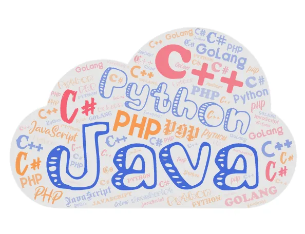

## **哈希表华山论剑**

比特宇宙编程语言联合委员会准备举办一次大会，主题为**哈希表**，给各大编程语言帝国都发去了邀请函。

很快就到了大会这一天

联合委员会秘书长开场发言：“诸位，为促进技术交流与发展，增强各帝国友谊，联合委员会特设此盛会，感谢诸位的捧场”

会场传来一阵鼓掌声······

秘书长继续发言：“本次大会的主题是**哈希表**，人类程序员使用最多的数据容器之一，各大编程语言帝国相信都有实现。今天的大会就围绕哈希表分为几个议题讨论，首先是第一个议题：**存储结构与冲突解决**”

## **存储结构与冲突解决**

来自GoLang帝国的`map`率先发言：“哈希表，哈希表，首先得是个表嘛，所以最基本的要用一个数组来存储，数组中的每一个元素叫做`bucket`。至于hash冲突嘛，就用链表来解决嘛”

GoLang帝国的map说完，有人站了起来：“英雄所见略同！在下C++帝国的`unordered_map`，我们基本上也是选择的这种方法”

此时，Python帝国的代表提出了质疑：“链表确实可以解决冲突，不过嘛，这要是冲突太多，链表太长，搜寻起来岂不费时？”

GoLang帝国的map和C++帝国的unordered_map面面相觑，不知如何应对。

“链表太长的话，那就转成树结构！”，就在这时，又有人站了起来。

见有人起身，Python帝国代表转身问道：“在下乃Python帝国的字典`dict{}`，敢问阁下怎么称呼”

“我是Java帝国的`HashMap`，和前面两位兄台的策略大体相同，只是在冲突过多，具体来说链表长度超过8的时候就转换成红黑树的结构，以此加快查找”

说完，map、unordered_map松了一口气，和HashMap一起坐下了。

dict{}继续发问：“在座的都是这个思路，用链表解决冲突？”

说完，另外一位代表站了起来，“等等，我们C#帝国的`HashTable`就没用链表！”

dict{}露出了满意的表情，“那你们是怎么解决冲突的呢？”

“咱HashTable内部使用的是双重散列法，咱内部不止一种哈希计算方式，一次Hash冲突，咱就换一个再算，直到找到有空位的地方存储”，HashTable回答到。

dict{}看起来有些失望，估计这也不是他所用的方式。

“你问了半天，还没说你们Python是怎么处理冲突的呢？”，Java帝国的HashMap开口了。

“是啊，是啊”，其他代表也跟着起哄。

见众人起哄，dict{}只好应答：“链表法固然不错，不过需要在插入数据过程中动态分配内存构建链表节点，开销不小，我们没有采用。”

“那到底用了啥，你倒是说啊，快急死我了”，C++的unordered_map有些急了。

“我们用的是一种叫**开放寻址法**的策略，如果发现了冲突，就按照制定的策略从这个位置往后找，直到找到有空的位置存储”，dict{}继续说到。

“哪有那么简单的事，你把别人的位置占了，那对应那个位置的数据来了怎么办？还有查找怎么找？删除怎么处理？这不全乱套了吗”，unordered_map追问不舍。

“是这样的，按照我们既定的规则，在查找的时候就需要额外做一些工作，另外删除的时候也不能直接删除，否则会破坏规则链条·····”，接下来一段时间，dict{}给大家仔细介绍了他们的处理思路。

“你这个也太麻烦了，不如我们链表法来的清晰明了”

“这怎么就麻烦了？这好处不显而易见嘛？”，dict{}也不甘示弱。

这时，秘书长打断了大家的争辩：“诸位，诸位，静一静，静一静，咱们这个议题到此为止，进入下一个议题：**哈希到位置映射**”

## **哈希到位置映射**

急性子的C++帝国代表`unordered_map`第一个说话：“这有什么好讨论的，不就是用hash值对哈希表数组长度进行一个求模运算吗？”

“就是，这有什么好讨论的”，C#帝国的`HashTable`也附和到。

“哎，此言差矣，我就没用取模运算”，众人望去，这Python帝国的dict{}又要闹什么新鲜玩意。

GoLang帝国的`map`问道：“老哥用的什么办法，别卖关子了，快说来听听”

dict{}扫了众人一眼说到，“我的办法就是：”

这是怎么个映射法？众代表皆摸不着头脑，议论纷纷，唯有Java帝国的`HashMap`听闻微微一笑。

dict{}见状问道：“HashMap兄台，莫非知晓其中玄机？”

只见HashMap不紧不慢的站了起来说到：“哈希表长度是2的幂次，减1之后的二进制均变成了1，比如长度16，减1变成15，也就是二进制1111。再进行与运算，相当于取了哈希值的低位，直接映射到对应的数组位置，与运算比取模运算要快不少。不瞒诸位，我HashMap中也是使用的这种方式，此乃雕虫小技，不值得炫耀”

众代表听完纷纷点头称赞，dict{}不知何时却已坐下。

C#的`HashTable`问道：“这样直接取低几位，会不会造成Hash值到数组到映射不均匀，拿你举的例子来说，18的二进制是0001 0010，34的二进制是0010 0010，他们的低4位都一样，和1111与上以后都是0010，也就是都该存到数组的2号位，这岂不是一定程度上的增加了冲突的概率吗？”

突如其来的质疑并没有让HashMap慌乱，反而是从容不迫的解释到：“C#代表的这个问题提的非常好，不知dict{}兄台是如何处理的。我们的方案是在进行与运算映射之前，对hash值进行一个处理，具体来说就是将其高16位与低16位进行一个异或运算，如此一来，最终参与与运算的部分就融合了原始hash的全部信息，而不仅仅是低位。”

众代表听完再次点头称赞。

秘书长打破了平静，“看来大家收获都颇丰，咱们接着下一个话题吧：**初始容量与扩容**”

## **初始容量与扩容**

众代表这一次皆不争先，互相观望。

秘书长见状说到：“没人主动，那我可就要点名了······”

“那就我先吧”，Java帝国的`HashMap`站了起来，“我的默认初始容量是16，有一个叫**负载因子**的参数，默认是0.75。我的策略是，如果内部数组的空间使用了超过75%，那就要准备扩容了，否则后续Hash冲突的概率就会很大。哦对了，扩容时容量得是2的指数次方，原因前面已经交代了”

`dict{}`第二个起身：“嗯，差不多，我的默认初始容量是8，扩容的时候也是要求是2的指数次方，另外我的负载因子是2/3，扩容时机比这位HashMap老哥更早一些”

C#帝国代表`HashTable`听闻也起身发言：“我的初始容量是3，至于负载因子嘛，我经过大量实验测试，得出的数据在两位之间，是0.72。容量大小方面我就没有2的指数次方的要求了，而是要求一个**素数**。之所以要求素数的原因，是因为我使用的求模运算进行的映射，使用素数的话，冲突会少一些。”

这时，C++帝国代表`unordered_map`也说话了，“巧了！我也是素数哎，你看，我提前把容量都算好存起来了，到时候扩容就挨个取就行了。”

## **尾声**

时间过的很快，在大家热情的讨论中，一上午时间很快就结束了。

大会临近尾声，秘书长致辞宣布：“感谢各位代表积极探讨，大会取得圆满成功，本次大会到此结束，咱们下次再会！”

会场再次传来一阵热烈的鼓掌声······

然而就在此时，会场外突然传来一个声音：“举办如此盛会，怎能少了我”

众人望去，皆叹：“他果然还是来了”

## **彩蛋**

> 会后，C#帝国代表拉住了C++帝国代表
>
> “兄弟，八卦一下，你这取的是个啥名，你看我和Java帝国的代表都叫**Hashxxx**，你咋不也叫**hash_map**或者**hash_table**之类的名字呢？叫什么**unordered_map**”
>
> “哎，兄台你有所不知，其实我也不想叫这名字，只是，，，这话说来话长了······”，unordered_map叹了口气。