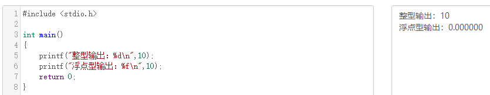

# 四种类型转换总结

#### *static_cast*

- 基类和子类之间转换：
  `static_cast` 的使用，当且仅当类型之间可隐式转化时，`static_cast` 的转化才是合法的。有一个例外，那就是类层次间的向下转型，`static_cast` 可以完成类层次间的向下转型，但是向下转型无法通过隐式转换完成。

  - 向上转换安全：子类指针转换成父类指针是安全的;
  - 向下转换不安全：父类指针转换成子类指针是不安全的。
  - `static_cast`不能进行无关类型(如非基类和子类)指针之间的转换。

  

  ```cpp
    
  class Base{ }; class Derived : public base{ /**....*/ };
    Base*    B = new Base;
    Derived* D = static_cast<Drived*>(B); // 不安全
  
  ```

- 为什么不安全？   

  D指向本质上还是B的对象模型，D指向的内存模型中可能存在B没有的成员变量。如果 `D->foo()` 中使用了 `D` 的成员变量，那么这个函数调用就是不安全的。因此，向下转换是安全的。

- `static_cast` 还可以在左值和右值之间显示地转换。虽然不能隐式地将左值转换为右值，但是可以使用`static_cast`显示地将左值转换为右值。

- 基本数据类型转换: `enum`, `int`, `char`, `float`等。安全性问题由开发者来保证。

- 把空指针转换成目标类型的空指针

  ```c
      int* iptr = static_cast<int*>(::malloc(sizoef(int)));
  ```

- 把任何类型的表达式转换成void类型：`static_cast<void>(iptr)`

- `static_cast` 不能去掉类型的`const、volitale`属性(用`const_cast`)

- 隐式转换都建议使用 `static_cast` 进行标明和替换

#### *dynamic_cast*

专门用于将多态基类的指针或引用强制转换为派生类的指针或引用，而且能够检查转换的安全性。对于不安全的指针转换，转换结果返回 nullptr 指针。

使用特点：　　

- 基类必须要有虚函数，因为`dynamic_cast`是运行时类型检查，需要运行时类型信息，而这个信息是存储在类的虚函数表中，只有一个类定义了虚函数，才会有虚函数表　　

- 对于下行转换，`dynamic_cast`是安全的（当类型不一致时，转换过来的是空指针），而`static_cast`是不安全的（当类型不一致时，转换过来的是错误意义的指针，可能造成踩内存，非法访问等各种问题), `reinterpreter_cast` 下行转换是可以转换，但是不安全。　

- 相同基类不同子类之间的交叉转换，转换结果是是 nullptr

  ```c
    class Base
    {
    public: 
      virtual void fun() { } 
    };
  
    class Drived : public base {
    public:
      int i;
    };
  
    Base     *Bptr = new Drived()；//语句0
    Derived *Dptr1 = static_cast<Derived*>(Bptr);  //语句1；
    Derived *Dptr2 = dynamic_cast<Derived*>(Bptr); //语句2；
  ```

此时语句1和语句2都是安全的，因为此时 `Bptr` 确实是指向的派生类的内存模型，所以两个类型转换都是安全的。`Dptr1` 和 `Dptr2` 可以尽情访问 `Drived` 类中的成员，绝对不会出问题。但是如果此时语句0更改为如下表达：

```c
  Base* Bptr = new Base(); `
```

那么 `Bptr` 指向的是`Base`对象内存模型。因此语句1是不安全的，因为如果访问子类的数据成员，其行为将是未定义。而语句2返回的是 `nullptr`，更加直观的告诉用户不安全。

#### *reinterpreter_cast*

用于进行各种不同类型的指针之间、不同类型的引用之间以及指针和能容纳指针的整数类型之间的转换。转换时执行的是**逐 `byte` 复制**的操作。

- `reinterpret_cast`是从底层对数据仅仅进行重新解释，但没有进行二进制的转换，依赖具体的平台，可移植性差；　　
- `reinterpret_cast`可以将整型转换为指针，也可以把指针转换为数组；　　
- `reinterpret_cast`可以在指针和引用里进行肆无忌惮的转换；

#### *const_cast*

- 常量指针转换为非常量指针， 并且仍然指向原来的对象　　

- 常量引用被转换为非常量引用，并且仍然指向原来的对象

  ------

  #### [32、C和C++的类型安全](https://interviewguide.cn/#/Doc/Knowledge/C++/基础语法/基础语法?id=32、c和c的类型安全)

  **什么是类型安全？**

  类型安全很大程度上可以等价于内存安全，类型安全的代码不会试图访问自己没被授权的内存区域。“类型安全”常被用来形容编程语言，其根据在于该门编程语言是否提供保障类型安全的机制；有的时候也用“类型安全”形容某个程序，判别的标准在于该程序是否隐含类型错误。

  类型安全的编程语言与类型安全的程序之间，没有必然联系。好的程序员可以使用类型不那么安全的语言写出类型相当安全的程序，相反的，差一点儿的程序员可能使用类型相当安全的语言写出类型不太安全的程序。绝对类型安全的编程语言暂时还没有。

  **（1）C的类型安全**

  C只在局部上下文中表现出类型安全，比如试图从一种结构体的指针转换成另一种结构体的指针时，编译器将会报告错误，除非使用显式类型转换。然而，C中相当多的操作是不安全的。以下是两个十分常见的例子：

  - printf格式输出

  

  上述代码中，使用%d控制整型数字的输出，没有问题，但是改成%f时，明显输出错误，再改成%s时，运行直接报segmentation fault错误

  - malloc函数的返回值

  malloc是C中进行内存分配的函数，它的返回类型是void*即空类型指针，常常有这样的用法char* pStr=(char*)malloc(100*sizeof(char))，这里明显做了显式的类型转换。

  类型匹配尚且没有问题，但是一旦出现int* pInt=(int*)malloc(100\*sizeof(char))就很可能带来一些问题，而这样的转换C并不会提示错误。

  **（2）C++的类型安全**

  如果C++使用得当，它将远比C更有类型安全性。相比于C语言，C++提供了一些新的机制保障类型安全：

  - 操作符new返回的指针类型严格与对象匹配，而不是void*

  - C中很多以void*为参数的函数可以改写为C++模板函数，而模板是支持类型检查的；

  - 引入const关键字代替#define constants，它是有类型、有作用域的，而#define constants只是简单的文本替换

  - 一些#define宏可被改写为inline函数，结合函数的重载，可在类型安全的前提下支持多种类型，当然改写为模板也能保证类型安全

  - C++提供了**dynamic_cast**关键字，使得转换过程更加安全，因为dynamic_cast比static_cast涉及更多具体的类型检查。

    例1：使用void*进行类型转换

  

   例2：不同类型指针之间转换

  ```cpp
  #include<iostream>
  using namespace std;
  
  class Parent{};
  class Child1 : public Parent
  {
  public:
      int i;
      Child1(int e):i(e){}
  };
  class Child2 : public Parent
  {
  public:
      double d;
      Child2(double e):d(e){}
  };
  int main()
  {
      Child1 c1(5);
      Child2 c2(4.1);
      Parent* pp;
      Child1* pc1;
  
      pp=&c1; 
      pc1=(Child1*)pp;  // 类型向下转换 强制转换，由于类型仍然为Child1*，不造成错误
      cout<<pc1->i<<endl; //输出：5
  
      pp=&c2;
      pc1=(Child1*)pp;  //强制转换，且类型发生变化，将造成错误
      cout<<pc1->i<<endl;// 输出：1717986918
      return 0;
  }Copy to clipboardErrorCopied
  ```

  上面两个例子之所以引起类型不安全的问题，是因为程序员使用不得当。第一个例子用到了空类型指针void*，第二个例子则是在两个类型指针之间进行强制转换。因此，想保证程序的类型安全性，应尽量避免使用空类型指针void*，尽量不对两种类型指针做强制转换。