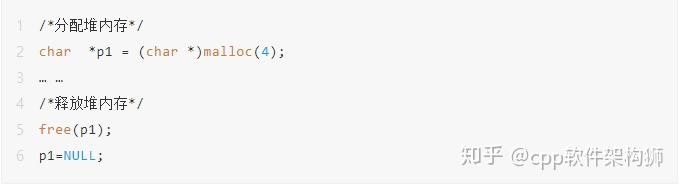

内存分配中的栈与堆主要存在如下区别。

### **1) 分配与释放方式**

栈内存是由编译器自动分配与释放的，它有两种分配方式：静态分配和动态分配。

- 静态分配是由编译器自动完成的，如局部变量的分配（即在一个函数中声明一个 int 类型的变量i时，编译器就会自动开辟一块内存以存放变量 i）。与此同时，其生存周期也只在函数的运行过程中，在运行后就释放，并不可以再次访问。
- 动态分配由 alloca 函数进行分配，但是栈的动态分配与堆是不同的，它的动态分配是由编译器进行释放，无需任何手工实现。值得注意的是，虽然用 alloca 函数可以实现栈内存的动态分配，但 alloca 函数的可移植性很差，而且在没有传统堆栈的机器上很难实现。因此，不宜使用于广泛移植的程序中。当然，完全可以使用 C99 中的变长数组来替代 alloca 函数。

而堆内存则不相同，它完全是由程序员手动申请与释放的，程序在运行的时候由程序员使用内存分配函数（如 malloc 函数）来申请任意多少的内存，使用完再由程序员自己负责使用内存释放函数（如 free 函数）释放内存，如下面的代码所示：

对栈内存的自动释放而言，虽然堆上的数据只要程序员不释放空间就可以一直访问，但是，如果一旦忘记了释放堆内存，那么将会造成内存泄漏，导致程序出现致命的潜在错误。

### **2) 分配的碎片问题**

对堆来说，频繁分配和释放（malloc / free）不同大小的堆空间势必会造成内存空间的不连续，从而造成大量碎片，导致程序效率降低；而对栈来讲，则不会存在这个问题。

### **3) 分配的效率**

大家都知道，栈是机器系统提供的数据结构，计算机会在底层对栈提供支持，例如，分配专门的寄存器存放栈的地址，压栈出栈都有专门的执行指令，这就决定了栈的效率比较高。一般而言，只要栈的剩余空间大于所申请空间，系统就将为程序提供内存，否则将报异常提示栈溢出。
而堆则不同，它是由 C/C++ 函数库提供的，它的机制也相当复杂。例如，为了分配一块堆内存，首先应该知道操作系统有一个记录空闲内存地址的链表，当系统收到程序的申请时，会遍历该链表，寻找第一个空间大于所申请空间的堆节点，然后将该节点从空闲节点链表中删除，并将该节点的空间分配给程序。而对于大多数系统，会在这块内存空间的首地址处记录本次分配的大小，这样，代码中的 delete 语句才能正确释放本内存空间。另外，由于找到的堆节点的大小不一定正好等于申请的大小，系统会自动将多余的那部分重新放入空闲链表中。很显然，堆的分配效率比栈要低得多。

### **4) 申请的大小限制**

由于操作系统是用链表来存储空闲内存地址（内存区域不连续）的，同时链表的遍历方向是由低地址向高地址进行的。因此，堆内存的申请大小受限于计算机系统中有效的虚拟内存。
而栈则不同，它是一块连续的内存区域，**其地址的增长方向是向下进行的，向内存地址减小的方向增长**。由此可见，栈顶的地址和栈的最大容量一般都是由系统预先规定好的，如果申请的空间超过栈的剩余空间时，将会提示溢出错误。由此可见，相对于堆，能够从栈中获得的空间相对较小。

### **5) 存储的内容**

对栈而言，一般用于存放函数的参数与局部变量等。例如，在函数调用时，第一个进栈的是（主函数中的）调用处的下一条指令（即函数调用语句的下一条可执行语句）的地址，然后是函数的各个参数，**在大多数 C 编译器中，参数是由右往左入栈的，最后是函数中的局部变量（注意 static 变量是不入栈的）**。

**对堆而言，具体存储内容由程序员根据需要决定存储数据。**