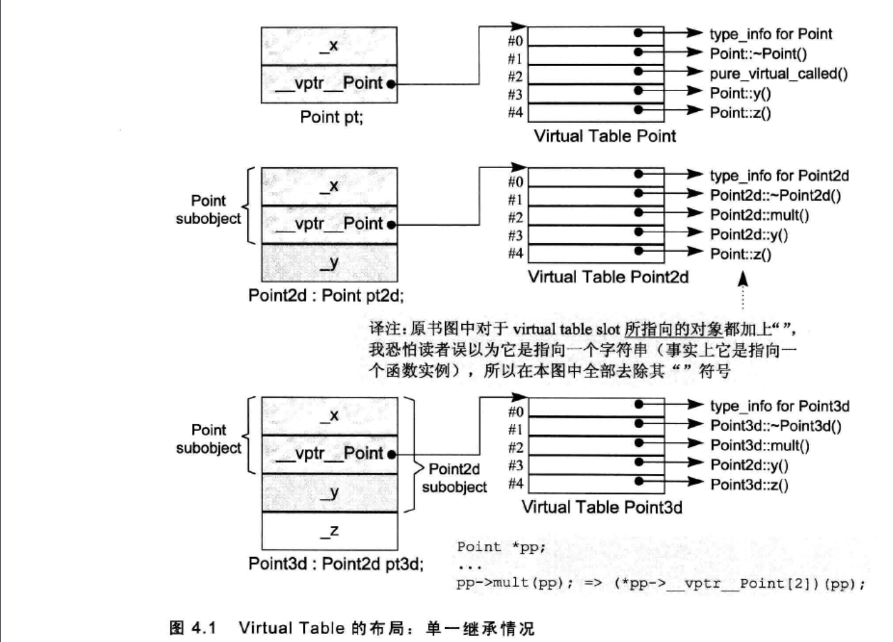

# Virtual Member Functions

每个声明了虚函数或者继承了有虚函数的类，都会有一个自己的`vtbl`。同时该类的每个对象都会包含一个`vptr`去指向该`vtbl`。虚函数按照其声明顺序放于 `vtbl` 表中, `vtbl` 数组中的每一个元素对应一个函数指针。如果子类覆盖了父类的虚函数，将被放到了虚表中原来父类虚函数的位置。

如果 `normalize()`是一个 `virtual member function`，那么调用：**`ptr->normalize();`**

实际上会被编译器转化为：**`(\*ptr->vptr[1])(ptr);`**

- `vptr` 是指向虚函数表的指针
- `1` 是表中该函数的索引，
- `ptr` 表示的是`this`指针

显示地调用“虚函数”可以压制机制，比如说，`point3d::normalized()`就不会触发虚拟机制，其行为和非静态成员函数行为一致，直接可以在编译时确定调用类的`normalized()`。

**注意**：类的对象调用虚函数是不具有多态性质，只能调用对象本身的虚拟函数版本。

```cpp
    Point3d obj;
    obj.normalize();
    // 会被编译器转换为:  *obj.vptr[1](&obj); 虽然正确，但是没有必要，相当于point3d::normalized()，
    // 决议方式类似于非静态成员函数： normalize_7Point3dFv(&obj);
```

显示地调用“虚函数”可以压制机制，比如说，`point3d::normalized()`就不会触发虚拟机制，其行为和非静态成员函数行为一致，直接可以在编译时确定调用类的`normalized()`。

**注意**：类的对象调用虚函数是不具有多态性质，只能调用对象本身的虚拟函数版本。

```
    Point3d obj;
    obj.normalize();
    // 会被编译器转换为:  *obj.vptr[1](&obj); 虽然正确，但是没有必要，相当于point3d::normalized()，
    // 决议方式类似于非静态成员函数： normalize_7Point3dFv(&obj);
```

# 虚函数的继承

对于一个虚函数调用`ptr->z();`，其中`z()`是一个虚函数，对于类而言需要什么信息才能让我们在执行期调用正确的`z()`实例：

- `ptr`所指向对象的真实类型。这可使得我们**选择**正确的`z()`实例·
- `z()`实例的位置，使得我们可以**正确的找到并且调用它**

基于上面的要求，因此在每个多态类上增加两个数据成员：

- 一个字符串或者数字，表示`class`的类型，

- 一个指针，指向虚函数表，表格中持有程序的`virtual function`执行期地址

  > 虚函数地址，在编译时期就可以确定。
  >
  > 因为类中如果有虚函数，这在编译时期就可以确定，并且获得其地址。这个地址是固定的，在执行期不能改变。因此虚函数表的大小和内容都不会改变，其构建和存取都可以在编译期完成，不需要执行期的参与。

为了能在执行期找到这些地址，分为编译器部分和执行期任务：

- 编译器还做了两个任务：
  - 为了找到表格，每个具有虚函数的类对象都被放置了一个由编译器内部产生的指针`vptr`，指向这个虚函数表格
  - 为了找到地址，每个`virtual function`都被指派了一个表格索引值。
- 执行期任务：传入调用虚函数的对象，在特定的`virtual table slot`中激活`virtual function`，也就是调用这个虚函数。

一个类只有一个虚函数表，每个表中可能含有三种类型的虚函数：

- 此类定义的函数实例。包括重写了父类中的虚函数
- 从父类中继承的且没有重写的虚函数
- 纯虚函数

#### 实例

```cpp
#include <iostream>
#include <string.h>

class Point
{
public:
    virtual ~Point();
    virtual Point &mult(float) = 0;
    float x() const { return _x; }
    virtual float y() const { return 0; }
    virtual float z() const { return 0; }

protected:
    Point(float x = 0.0);
    float _x;
};

class Point2d : public Point
{
public:
    Point2d(float x = 0.0, float y = 0.0)
        : Point(x), _y(y)
    {
    }

    ~Point2d();

    // 改写虚函数
    Point2d &mult(float);
    float y() const { return _y; }

protected:
    float _y;
};

class Point3d : public Point2d
{
public:
    Point3d(float x = 0.0, float y = 0.0, float z = 0.0)
        : Point2d(x, y), _z(z)
    {
    }

    ~Point3d();

    // 改写虚函数
    Point3d &mult(float);
    float z() const { return _z; }

protected:
    float _z;
};
```

对于上面的继承关系，对应的虚函数表格如下图。可看见，对于子类从父类继承的虚函数，在子类的虚函数中的索引保持不变，无论这个虚函数被子类重写没有。



此时，对虚函数的调用`ptr->z();`：

- 在调用 `z()` 的时候，并不知道`ptr`所指向对象的真正类型，但是我们明白经过`ptr`可以找到真正对象的虚函数表
- 虽然不知道哪一个 `z()` 会被调用，但是知道每一个`z()`都是被放在了索引值为4的地方。

这些信息可以这个调用在编译期转换为：`(*ptr->vptr[4])(ptr);`。`vptr`表示被安插的指针，指向虚函数表格，4表示`z()`在表中的索引。**唯一在执行期确定的是ptr到底是指向哪一个对象**。


