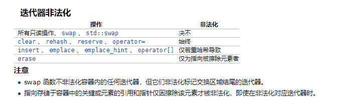

# 迭代器失效的场景

- 序列式容器 序列式容器会失效的原因是因为其存储都是连续的，因此删除或者插入一个元素都有可能导致其他元素的迭代器失效。

  - `vector`

    - 在遍历时，执行`erase`会导致删除节点之后的全部失效
    - 在`push_back`时，之前的`end()`操作得到的迭代器失效
    - `insert/push_back`导致`capacity()`改变，那么之前的`first()/end()`得到的迭代器会失效

  - `insert`一个元素，如果空间没有分配，那么插入节点之前的迭代器位置有效，之后的失效。

    简而言之：导致内存分配的全会失效，导致元素移动的会局部失效

  - `deque`

    - 在首尾添加元素，会导致迭代器失效，但是指针、引用不会失效
    - 其余位置插入元素，迭代器、指针、引用都是失效
    - 在首尾之外的位置删除元素，那么其他位置的迭代器都失效
    - 在首尾删除元素，只是会导致被指向的删除元素的迭代器失效

- 关联式容器

  - 基于哈希表实现的*std::unordered_map/std::set* 导致迭代器失效，一般是插入元素导致 *reshash* 产生，如果是删除只是会导致被删除元素的迭代器失效。 