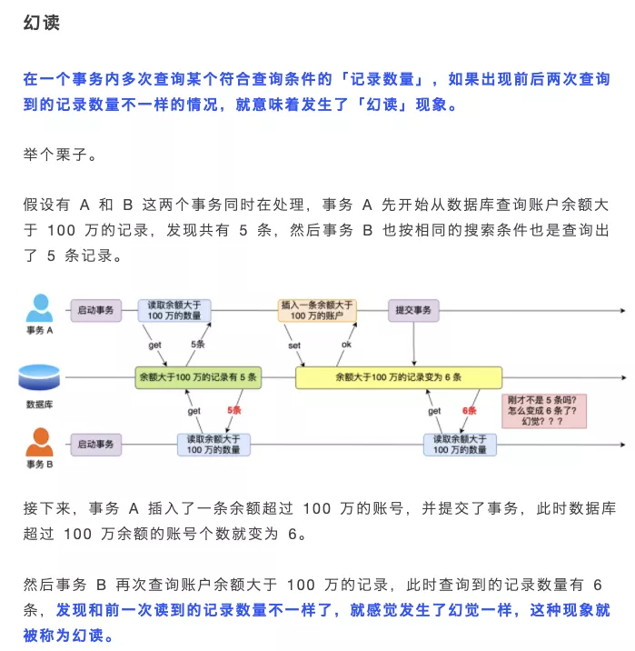
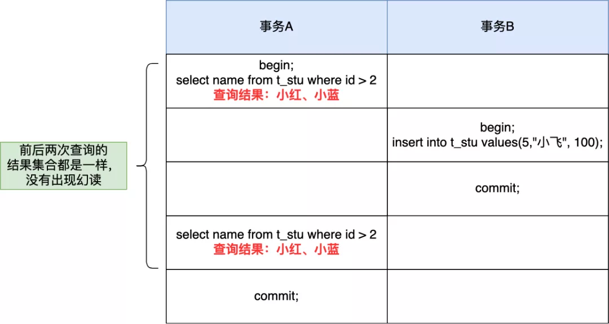
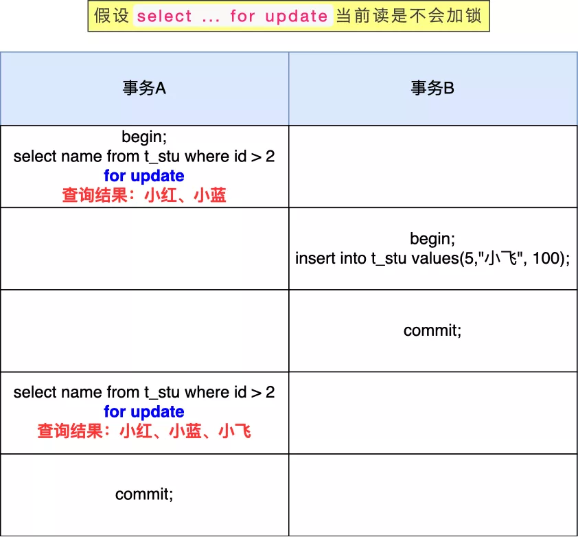
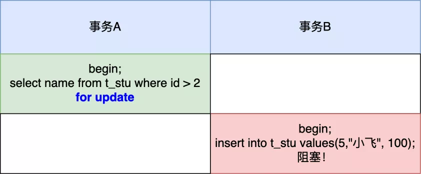

我之前写过一篇数据库事务的文章「 [事务、事务隔离级别和MVCC](https://mp.weixin.qq.com/s?__biz=MzUxODAzNDg4NQ==&mid=2247496769&idx=1&sn=30990d141185303fd0c7ecf63c125b30&scene=21#wechat_redirect)」，这篇我说过什么是幻读。

幻读的定义我这里还得补充一句，**幻读仅专指“新插入的行”**，中途通过 update 更新数据而出现同一个事务前后两次查询的「结果集合」不一样，这种不算幻读。

然后前几天有位读者跟我说，**这个幻读例子不是已经被「可重复读」隔离级别解决了吗？为什么还要有 next-key 呢？**

他有这个质疑，是因为他做了这个实验。

实验的数据库表 t_stu 如下，其中 id 为主键。

然后在可重复读隔离级别下，有两个事务的执行顺序如下：

从这个实验结果可以看到，即使事务 B 中途插入了一条记录，事务 A 前后两次查询的结果集都是一样的，并没有出现所谓的幻读现象。

读者做的实验之所以看不到幻读现象，是因为在可重复读隔离级别下，**普通的查询是快照读，是不会看到别的事务插入的数据的**。

可重复读隔离级是由 MVCC（多版本并发控制）实现的，实现的方式是启动事务后，在执行第一个查询语句后，会创建一个视图，然后后续的查询语句都用这个视图，「快照读」读的就是这个视图的数据，视图你可以理解为版本数据，这样就使得每次查询的数据都是一样的。

MySQL 里除了普通查询是快照度，其他都是**当前读**，比如update、insert、delete，这些语句执行前都会查询最新版本的数据，然后再做进一步的操作。

这很好理解，假设你要 update 一个记录，另一个事务已经 delete 这条记录并且 提交事务了，这样不是会产生冲突吗，所以 update 的时候肯定要知道最新的数据。

另外，`select ... for update` 这种查询语句是当前读，每次执行的时候都是读取最新的数据。 

**因此，要讨论「可重复读」隔离级别的幻读现象，是要建立在「当前读」的情况下。**

接下来，我们假设`select ... for update`当前读是不会加锁的（实际上是会加锁的），在做一遍读者那个实验。

这时候，事务 B 插入的记录，就会被事务 A 的第二条查询语句查询到（因为是当前读），这样就会出现前后两次查询的结果集合不一样，这就出现了幻读。

所以，**Innodb 引擎为了解决「可重复读」隔离级别使用「当前读」而造成的幻读问题，就引出了 next-key 锁**，就是记录锁和间隙锁的组合。

- 记录锁，锁的是记录本身；
- 间隙锁，锁的就是两个值之间的空隙，以防止其他事务在这个空隙间插入新的数据，从而避免幻读现象。

比如，下面事务 A 查询语句会锁住`(2, +∞]`范围的记录，然后期间如果有其他事务在这个锁住的范围插入数据就会被阻塞。

next-key 锁的加锁规则其实挺复杂的，在一些场景下会退化成记录锁或间隙锁，我之前也写一篇加锁规则，详细可以看这篇「[我做了一天的实验！](https://mp.weixin.qq.com/s?__biz=MzUxODAzNDg4NQ==&mid=2247497197&idx=1&sn=9f82f73d876636944fb75348ef568c01&scene=21#wechat_redirect)」

需要注意的是，next-key lock 锁的是索引，而不是数据本身，所以如果 update 语句的 where 条件没有用到索引列，那么就会全表扫描，在一行行扫描的过程中，不仅给行加上了行锁，还给行两边的空隙也加上了间隙锁，相当于锁住整个表，然后直到事务结束才会释放锁。

所以在线上千万不要执行没有带索引条件的 update 语句，不然会造成业务停滞，我有个读者就因为干了这个事情，然后被老板教育了一波，详细可以看这篇「[完蛋，公司被一条 update 语句干趴了！](https://mp.weixin.qq.com/s?__biz=MzUxODAzNDg4NQ==&mid=2247497844&idx=1&sn=256a70fb347ed23b0e116d7cc208d426&scene=21#wechat_redirect)」