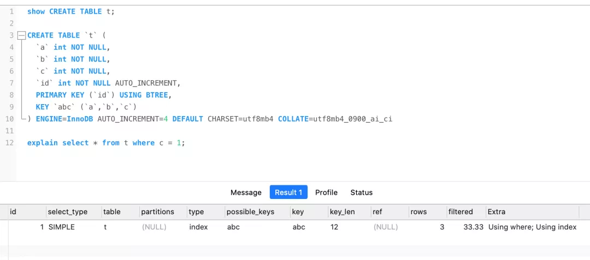
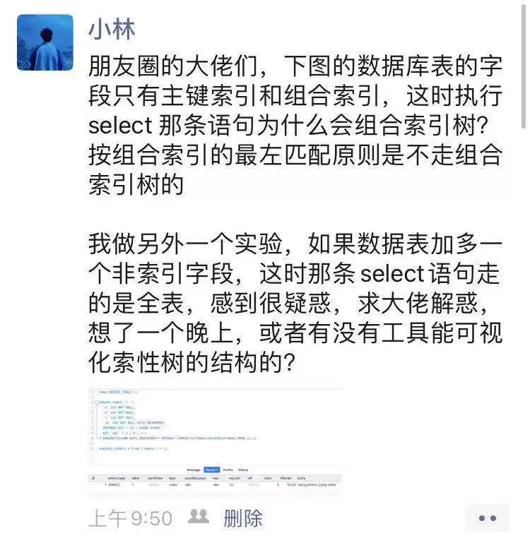

大家好，我是小林。

昨晚有位读者问了我这个问题：

他创建了一张数据库表，表里的字段只有主键索引（`id`）和联合索引（`a，b，c`），然后他执行的 `select * from t where c = 0;` 这条语句发现走的是索引，他就感觉很困惑，困惑在于两点：

- 第一点， **where c 这个条件并不符合联合索引的最左匹配原则，怎么就查询的时候走了索引呢？**
- 第二点，**在这个数据表加了非索引字段，执行同样的查询语句后，怎么变成走的是全表扫描呢？**

我先跟大家解释下，**什么是最左匹配原则？**

这个数据库表创建了（a，b，c）这个联合索引，要能使其生效必须保证 where 条件里最左边是 a 字段，比如以下这几种情况：

- where a = 0;
- where a = 0 and b = 0;
- where a = 0 and c = 0;
- where a = 0 and b = 0 and c = 0;
- where a = 0 and c = 0 and b = 0;

而如果 where 条件里最左边的字段不是 a 时，就无法使用到联合索引，比如以下这种情况，就是不符合最左匹配规则：

- where b = 0;
- where c = 0;
- where b = 0 and c =0;
- where c = 0 and b = 0;

知道了联合索引的最左匹配原则后，再来看看第一个问题。

*为什么  `select \* from t where c = 0;` 这条不符合联合索引的最左匹配原则的查询语句走了索引查询呢？*

刚开始看到这个问题的时候，我一时也想不到原因，只能大概猜测这条语句可以覆盖索引，所以就走了索引查询。

今早我就发了个朋友圈，因为我朋友圈有差不多 1W 人，觉得朋友圈肯定有大佬能解答这个问题。

果然朋友圈大佬真的多，一个上午就有 `50` 多个人留言解答了这个问题，我看完后思路也清晰了。

我也把解答思路整理了下，这里贴出来。

首先，这张表的字段没有「非索引」字段，所以 `select *` 相当于 `select id,a,b,c`，然后**这个查询的内容和条件 都在联合索引树里，因为联合索引树的叶子节点包含「索引列+主键」，所以查联合索引树就能查到全部结果了，这个就是覆盖索引。**

但是执行计划里的 type 是 `index`，这代表着是通过全扫描联合索引树的方式查询到数据的，这是因为 `where c` 并不符合联合索引最左匹配原则。

那么，如果写了个符合最左原则的 select 语句，那么 type 就是 `ref`，这个效率就比 index 全扫描要高一些。

那为什么选择全扫描联合索引树，而不扫描全表（聚集索引树）呢？

因为联合索引树的记录比要小的多，而且这个 select * 不用执行回表操作，所以直接遍历联合索引树要比遍历聚集索引树要小的多，因此 MySQL 选择了全扫描联合索引树。

再来回答第二个问题。

*为什么这个数据表加了非索引字段，执行同样的查询语句后，怎么变成走的是全表扫描呢？*

因为加了其他字段后，`select * from t where c = 0;` 查询的内容就不能在联合索引树里找到了，而且条件也不符合最左匹配原则，这样既不能覆盖索引也不能执行回表操作，所以这时只能通过扫描全表来查询到所有的数据。

------

好了，问题就说完了，不知道大家 get 到了吗？

这篇说的比较粗略，没有详细介绍一些索引的概念，比如聚集索引、联合表索引、覆盖索引、回表操作这些东西。

可能没有点索引基础的同学看的有点懵逼，小林后面在出一篇更详细的。