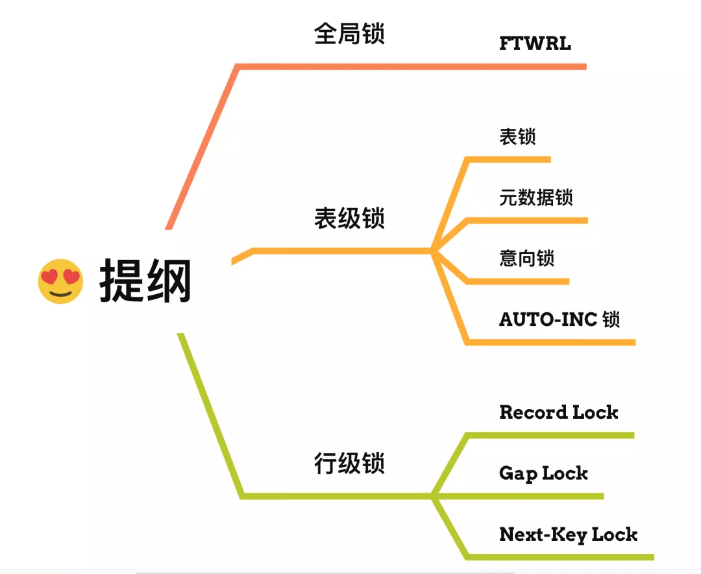
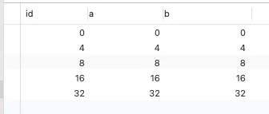
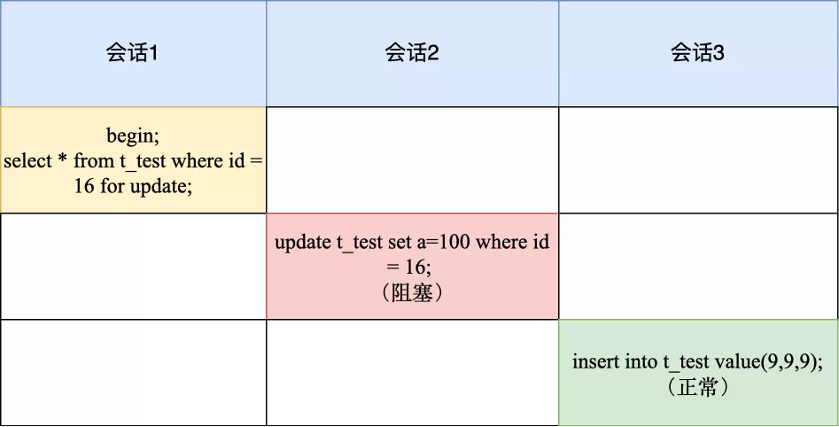
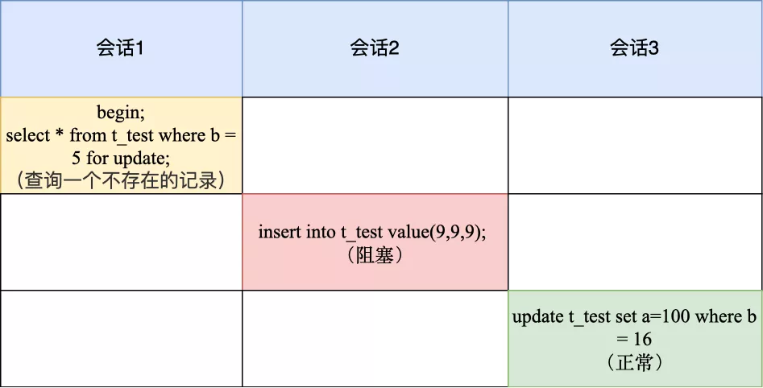

这次，来说说 **MySQL 的锁**，主要是 Q&A 的形式，看起来会比较轻松。


在 MySQL 里，根据加锁的范围，可以分为**全局锁、表级锁和行锁**三类。

不多 BB 了，**发车！**



### 全局锁

> 全局锁是怎么用的？

要使用全局锁，则要执行这条命：

```
flush tables with read lock
```

执行后，**整个数据库就处于只读状态了**，这时其他线程执行以下操作，都会被阻塞：

- 对数据的增删查改操作，比如 select、insert、delete、update等语句；
- 对表结构的更改操作，比如 alter table、drop table 等语句。

如果要释放全局锁，则要执行这条命令：

```
unlock tables
```

当然，当会话断开了，全局锁会被自动释放。

> 全局锁应用场景是什么？

全局锁主要应用于做**全库逻辑备份**，这样在备份数据库期间，不会因为数据或表结构的更新，而出现备份文件的数据与预期的不一样。

举个例子大家就知道了。

在全库逻辑备份期间，假设不加全局锁的场景，看看会出现什么意外的情况。

如果在全库逻辑备份期间，有用户购买了一件商品，一般购买商品的业务逻辑是会涉及到多张数据库表的更细，比如在用户表更新该用户的余额，然后在商品表更新被购买的商品的库存。

那么，有可能出现这样的顺序：

1. 先备份了用户表的数据；
2. 然后有用户发起了购买商品的操作；
3. 接着再备份商品表的数据。

也就是在备份用户表和商品表之间，有用户购买了商品。

这种情况下，备份的结果是用户表中该用户的余额并没有扣除，反而商品表中该商品的库存被减少了，如果后面用这个备份文件恢复数据库数据的话，用户钱没少，而库存少了，等于用户白嫖了一件商品。

所以，在全库逻辑备份期间，加上全局锁，就不会出现上面这种情况了。

> 加全局锁又会带来什么缺点呢？

加上全局锁，意味着整个数据库都是只读状态。

那么如果数据库里有很多数据，备份就会花费很多的时间，关键是备份期间，业务只能读数据，而不能更新数据，这样会造成业务停滞。

> 既然备份数据库数据的时候，使用全局锁会影响业务，那有什么其他方式可以避免？

有的，如果数据库的引擎支持的事务支持**可重复读的隔离级别**，那么在备份数据库之前先开启事务，会先创建 Read View，然后整个事务执行期间都在用这个 Read View，而且由于 MVCC 的支持，备份期间业务依然可以对数据进行更新操作。

因为在可重复读的隔离级别下，即使其他事务更新了表的数据，也不会影响备份数据库时的 Read View，这就是事务四大特性中的隔离性，这样备份期间备份的数据一直是在开启事务时的数据。

备份数据库的工具是 mysqldump，在使用 mysqldump 时加上 `–single-transaction` 参数的时候，就会在备份数据库之前先开启事务。这种方法只适用于支持「可重复读隔离级别的事务」的存储引擎。

InnoDB 存储引擎默认的事务隔离级别正是可重复读，因此可以采用这种方式来备份数据库。

但是，对于 MyISAM 这种不支持事务的引擎，在备份数据库时就要使用全局锁的方法。

### 表级锁

> MySQL 表级锁有哪些？具体怎么用的。

MySQL 里面表级别的锁有这几种：

- 表锁；
- 元数据锁（MDL）;
- 意向锁；
- AUTO-INC 锁；

#### 表锁

先来说说***表锁\***。

如果我们想对学生表（t_student）加表锁，可以使用下面的命令：

```
//表级别的共享锁，也就是读锁；
lock tables t_student read;

//表级别的独占锁，也就是写锁；
lock tables t_stuent wirte;
```

需要注意的是，表锁除了会限制别的线程的读写外，也会限制本线程接下来的读写操作。

也就是说如果本线程对学生表加了「共享表锁」，那么本线程接下来如果要对学生表执行写操作的语句，是会被阻塞的，当然其他线程对学生表进行写操作时也会被阻塞，直到锁被释放。

要释放表锁，可以使用下面这条命令，会释放当前会话的所有表锁：

```
unlock tables
```

另外，当会话退出后，也会释放所有表锁。

不过尽量避免在使用 InnoDB 引擎的表使用表锁，因为表锁的颗粒度太大，会影响并发性能，**InnoDB 牛逼的地方在于实现了颗粒度更细的行级锁**。

#### 元数据锁

再来说说***元数据锁（MDL）\***。

我们不需要显示的使用 MDL，因为当我们对数据库表进行操作时，会自动给这个表加上 MDL：

- 对一张表进行 CRUD 操作时，加的是 **MDL 读锁**；
- 对一张表做结构变更操作的时候，加的是 **MDL 写锁**；

MDL 是为了保证当用户对表执行 CRUD 操作时，防止其他线程对这个表结构做了变更。

当有线程在执行 select 语句（ 加 MDL 读锁）的期间，如果有其他线程要更改该表的结构（ 申请 MDL 写锁），那么将会被阻塞，直到执行完 select 语句（ 释放 MDL 读锁）。

反之，当有线程对表结构进行变更（ 加 MDL 写锁）的期间，如果有其他线程执行了 CRUD 操作（ 申请 MDL 读锁），那么就会被阻塞，直到表结构变更完成（ 释放 MDL 写锁）。

> MDL 不需要显示调用，那它是在什么时候释放的?

MDL 是在事务提交后才会释放，这意味着**事务执行期间，MDL 是一直持有的**。

那如果数据库有一个长事务（所谓的长事务，就是开启了事务，但是一直还没提交），那在对表结构做变更操作的时候，可能会发生意想不到的事情，比如下面这个顺序的场景：

1. 首先，线程 A 先启用了事务（但是一直不提交），然后执行一条 select 语句，此时就先对该表加上 MDL 读锁；
2. 然后，线程 B 也执行了同样的 select 语句，此时并不会阻塞，因为「读读」并不冲突；
3. 接着，线程 C 修改了表字段，此时由于线程 A 的事务并没有提交，也就是 MDL 读锁还在占用着，这时线程 C 就无法申请到 MDL 写锁，就会被阻塞，

那么在线程 C 阻塞后，后续有对该表的 select 语句，就都会被阻塞，如果此时有大量该表的 select 语句的请求到来，就会有大量的线程被阻塞住，这时数据库的线程很快就会爆满了。

> 为什么线程 C 因为申请不到 MDL 写锁，而导致后续的申请读锁的查询操作也会被阻塞？

这是因为申请 MDL 锁的操作会形成一个队列，队列中**写锁获取优先级高于读锁**，一旦出现 MDL 写锁等待，会阻塞后续该表的所有 CRUD 操作。

所以为了能安全的对表结构进行变更，在对表结构变更前，先要看看数据库中的长事务，是否有事务已经对表加上了 MDL 读锁，如果可以考虑 kill 掉这个长事务，然后再做表结构的变更。

#### 意向锁

接着，说说***意向锁\***。

- 在使用 InnoDB 引擎的表里对某些记录加上「共享锁」之前，需要先在表级别加上一个「意向共享锁」；
- 在使用 InnoDB 引擎的表里对某些纪录加上「独占锁」之前，需要先在表级别加上一个「意向独占锁」；

也就是，当执行插入、更新、删除操作，需要先对表加上「意向共享锁」，然后对该记录加独占锁。

而普通的 select 是不会加行级锁的，普通的 select 语句是利用 MVCC 实现一致性读，是无锁的。

不过，select 也是可以对记录加共享锁和独占锁的，具体方式如下：

```
//先在表上加上意向共享锁，然后对读取的记录加独占锁
select ... lock in share mode;

//先表上加上意向独占锁，然后对读取的记录加独占锁
select ... for update;
```

**意向共享锁和意向独占锁是表级锁，不会和行级的共享锁和独占锁发生冲突，而且意向锁之间也不会发生冲突，只会和共享表锁（\*lock tables … read\*）和独占表锁（\*lock tables … write\*）发生冲突。**

表锁和行锁是满足读读共享、读写互斥、写写互斥的。

如果没有「意向锁」，那么加「独占表锁」时，就需要遍历表里所有记录，查看是否有记录存在独占锁，这样效率会很慢。

那么有了「意向锁」，由于在对记录加独占锁前，先会加上表级别的意向独占锁，那么在加「独占表锁」时，直接查该表是否有意向独占锁，如果有就意味着表里已经有记录被加了独占锁，这样就不用去遍历表里的记录。

所以，**意向锁的目的是为了快速判断表里是否有记录被加锁**。

#### AUTO-INC 锁

最后，说说 ***AUTO-INC 锁\***。

在为某个字段声明 `AUTO_INCREMENT` 属性时，之后可以在插入数据时，可以不指定该字段的值，数据库会自动给该字段赋值递增的值，这主要是通过 AUTO-INC 锁实现的。

AUTO-INC 锁是特殊的表锁机制，锁**不是再一个事务提交后才释放，而是再执行完插入语句后就会立即释放**。

**在插入数据时，会加一个表级别的 AUTO-INC 锁**，然后为被 `AUTO_INCREMENT` 修饰的字段赋值递增的值，等插入语句执行完成后，才会把 AUTO-INC 锁释放掉。

那么，一个事务在持有 AUTO-INC 锁的过程中，其他事务的如果要向该表插入语句都会被阻塞，从而保证插入数据时，被 `AUTO_INCREMENT` 修饰的字段的值是连续递增的。

但是， AUTO-INC 锁再对大量数据进行插入的时候，会影响插入性能，因为另一个事务中的插入会被阻塞。

因此， 在 MySQL 5.1.22 版本开始，InnoDB 存储引擎提供了一种**轻量级的锁**来实现自增。

一样也是在插入数据的时候，会为被 `AUTO_INCREMENT` 修饰的字段加上轻量级锁，**然后给该字段赋值一个自增的值，就把这个轻量级锁释放了，而不需要等待整个插入语句执行完后才释放锁**。

InnoDB 存储引擎提供了个 innodb_autoinc_lock_mode 的系统变量，是用来控制选择用 AUTO-INC 锁，还是轻量级的锁。

- 当 innodb_autoinc_lock_mode = 0，就采用 AUTO-INC 锁；
- 当 innodb_autoinc_lock_mode = 2，就采用轻量级锁；
- 当 innodb_autoinc_lock_mode = 1，这个是默认值，两种锁混着用，如果能够确定插入记录的数量就采用轻量级锁，不确定时就采用 AUTO-INC 锁。

不过，当 innodb_autoinc_lock_mode = 2 是性能最高的方式，但是会带来一定的问题。因为并发插入的存在，在每次插入时，自增长的值可能不是连续的，**这在有主从赋值的场景中是不安全的**。

> 行级锁有哪些？

InnoDB 引擎是支持行级锁的，而 MyISAM 引擎并不支持行级锁。

行级锁的类型主要有三类：

- Record Lock，记录锁，也就是仅仅把一条记录锁上；
- Gap Lock，间隙锁，锁定一个范围，但是不包含记录本身；
- Next-Key Lock：Record Lock + Gap Lock 的组合，锁定一个范围，并且锁定记录本身。

前面也提到，普通的 select 语句是不会对记录加锁的，如果要在查询时对记录加行锁，可以使用下面这两个方式：

```
//对读取的记录加共享锁
select ... lock in share mode;

//对读取的记录加独占锁
select ... for update;
```

上面这两条语句必须再一个事务中，当事务提交了，锁就会被释放，因此在使用这两条语句的时候，要加上 begin、start transaction 或者 set autocommit = 0。

那具体跟在哪些纪录上加锁，就跟具体的 select 语句有关系了，比较复杂，这个留到下篇再讲啦。

------

大家好，我是小林。

在前一篇文章我讲了下 MySQL 的全局锁、表记锁和行级别锁，其中行级锁只提了概念，并没有具体说。

因为行级锁加锁规则比较复杂，不同的场景，加锁的形式还不同，所以这次就来好好介绍下行级锁。

对记录加锁时，**加锁的基本单位是 next-key lock**，它是由记录锁和间隙锁组合而成的，**next-key lock 是前开后闭区间，而间隙锁是前开后开区间**。

但是，next-key lock 在一些场景下会退化成记录锁或间隙锁。

那到底是什么场景呢？今天，我们就以下面这个表来进行实验说明。



其中，id 是主键索引（唯一索引），b 是普通索引（非唯一索引），a 是普通的列。

注意，**我的 MySQL 的版本是 8.0.26，不同版本的加锁规则可能是不同的**。


### 唯一索引等值查询

当我们用唯一索引进行等值查询的时候，查询的记录存不存在，加锁的规则也会不同：

- **当查询的记录是存在的，在用「唯一索引进行等值查询」时，next-key lock 会退化成「记录锁」**。
- **当查询的记录是不存在的，在用「唯一索引进行等值查询」时，next-key lock 会退化成「间隙锁」**。

接下里用两个案例来说明。

> 先看看记录是存在的。

来看下面这个例子：



会话1加锁变化过程如下：

1. 加锁的基本单位是 next-key lock，因此会话1的加锁范围是(8, 16];
2. 但是由于是用唯一索引进行等值查询，且查询的记录存在，所以 **next-key lock 退化成记录锁，因此最终加锁的范围是 id = 16 这一行**。

所以，会话 2 在修改 id=16 的记录时会被锁住，而会话 3 插入 id=9 的记录可以被正常执行。

> 接下来，看看记录不存在的情况

来看看，下面这个例子：


会话1加锁变化过程如下：

1. 加锁的基本单位是 next-key lock，因此主键索引 id 的加锁范围是(8, 16];
2. 但是由于查询记录不存在，next-key lock 退化成间隙锁，因此最终加锁的范围是 (8,16)。

所以，会话 2 要往这个间隙里面插入 id=9 的记录会被锁住，但是会话 3 修改 id =16 是可以正常执行的，因为 id = 16 这条记录并没有加锁。

### 唯一索引范围查询

范围查询和等值查询的加锁规则是不同的。

举个例子，下面这两条查询语句，查询的结果虽然是一样的，但是加锁的范围是不一样的。

```
select * from t_test where id=8 for update;
select * from t_test where id>=8 and id<9 for update;
```

做个实验就知道了。


会话 1 加锁变化过程如下：

1. 最开始要找的第一行是 id = 8，因此 next-key lock(4,8]，但是由于 id 是唯一索引，且该记录是存在的，因此会退化成记录锁，也就是只会对 id = 8 这一行加锁；
2. 由于是范围查找，就会继续往后找存在的记录，也就是会找到 id = 16 这一行停下来，然后加 next-key lock (8, 16]，但由于 id = 16 不满足 id < 9，所以会退化成间隙锁，加锁范围变为 (8, 16)。

所以，会话 1 这时候主键索引的锁是记录锁 id=8 和间隙锁(8, 16)。

会话 2 由于往间隙锁里插入了 id = 9 的记录，所以会被锁住了，而 id = 8 是被加锁的，因此会话 3 的语句也会被阻塞。

由于 id = 16 并没有加锁，所以会话 4 是可以正常被执行。

### 非唯一索引等值查询

当我们用非唯一索引进行等值查询的时候，查询的记录存不存在，加锁的规则也会不同：

- **当查询的记录存在时，除了会加 next-key lock 外，还额外加间隙锁，也就是会加两把锁**。
- **当查询的记录不存在时，只会加 next-key lock，然后会退化为间隙锁，也就是只会加一把锁。**

接下里用两个案例来说明。

> 我们先来看看查询的值存在的情况。

比如下面这个例子：


会话 1 加锁变化过程如下：

1. 先会对普通索引 b 加上 next-key lock，范围是(4,8];
2. 然后因为是非唯一索引，且查询的记录是存在的，所以还会加上间隙锁，规则是向下遍历到第一个不符合条件的值才能停止，因此间隙锁的范围是(8,16)。

所以，会话1的普通索引 b 上共有两个锁，分别是 next-key lock (4,8] 和间隙锁 (8,16) 。

那么，当会话 2 往间隙锁里插入 id = 9 的记录就会被锁住，而会话 3 和会话 4 是因为更改了 next-key lock 范围里的记录而被锁住的。

然后因为 b = 16 这条记录没有加锁，所以会话 5 是可以正常执行的。

> 接下来，我们看看查询的值不存在的情况

直接看案例：



会话 1 加锁变化过程如下：

1. 先会对普通索引 b 加上 next-key lock，范围是(8,16];
2. 但是由于查询的记录是不存在的，所以不会再额外加个间隙锁，但是 next-key lock 会退化为间隙锁，最终加锁范围是 (8,16)。

会话 2 因为往间隙锁里插入了 b = 9 的记录，所以会被锁住，而 b = 16 是没有被加锁的，因此会话 3 的语句可以正常执行。

### 非唯一索引范围查询

非唯一索引和主键索引的范围查询的加锁也有所不同，不同之处在于**普通索引范围查询，next-key lock 不会退化为间隙锁和记录锁**。

来看下面这个案例：


会话 1 加锁变化过程如下：

1. 最开始要找的第一行是 b = 8，因此 next-key lock(4,8]，但是由于 b 不是唯一索引，并不会退化成记录锁。
2. 但是由于是范围查找，就会继续往后找存在的记录，也就是会找到 b = 16 这一行停下来，然后加 next-key lock (8, 16]，因为是普通索引查询，所以并不会退化成间隙锁。

所以，会话 1 的普通索引 b 有两个 next-key lock，分别是 (4,8] 和(8, 16]。这样，你就明白为什么会话 2 、会话 3 、会话 4 的语句都会被锁住了。

### 总结

这次我以 ***MySQL 8.0.26\*** 版本做了几个实验，让大家了解了唯一索引和非唯一索引的行级锁的加锁规则。

这里需要注意的是，不同的版本加锁规则可能会有所不同。我这里总结下， 我这个 MySQL 版本的行级锁的加锁规则。

唯一索引等值查询：

- 当查询的记录是存在的，next-key lock 会退化成「记录锁」。
- 当查询的记录是不存在的，next-key lock 会退化成「间隙锁」。

非唯一索引等值查询：

- 当查询的记录存在时，除了会加 next-key lock 外，还额外加间隙锁，也就是会加两把锁。
- 当查询的记录不存在时，只会加 next-key lock，然后会退化为间隙锁，也就是只会加一把锁。

非唯一索引和主键索引的范围查询的加锁规则不同之处在于：

- 唯一索引在满足一些条件的时候，next-key lock 退化为间隙锁和记录锁。
- 非唯一索引范围查询，next-key lock 不会退化为间隙锁和记录锁。

这些加锁规则其实很好总结的，大家自己可以用我文中的案例测试一遍，看一下你的 MySQL 版本和我的 MySQL 版本的加锁规则有什么不同。

就说到这啦， 我们下次见啦！