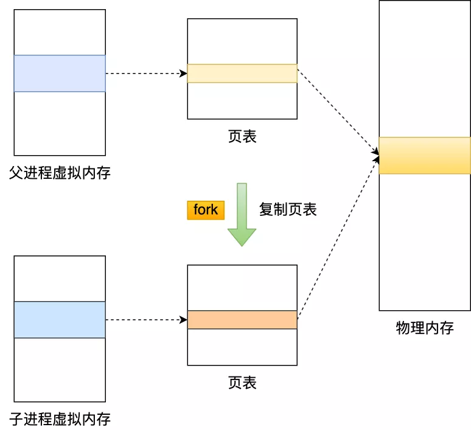
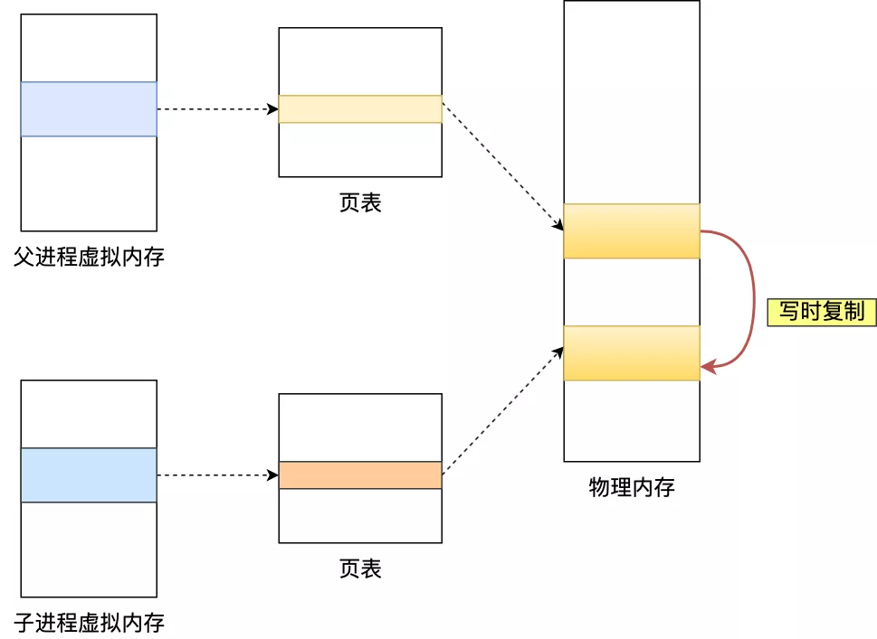
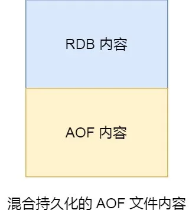
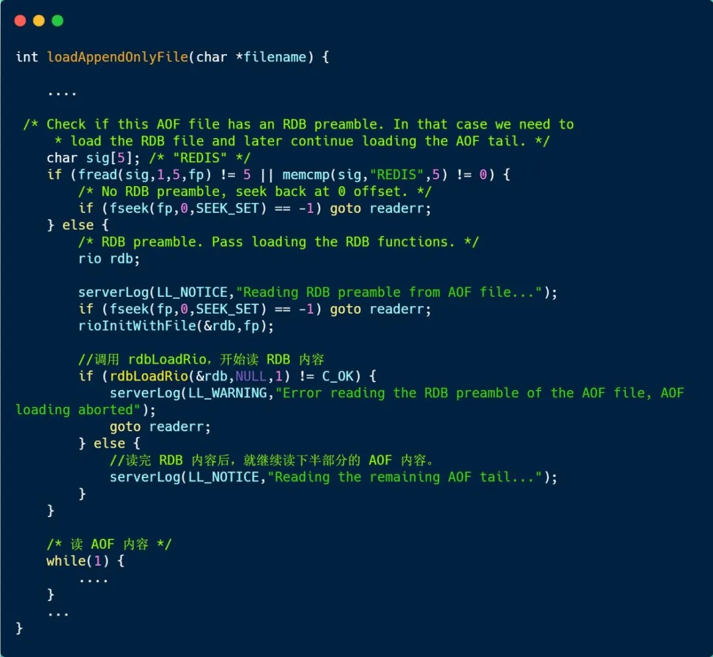
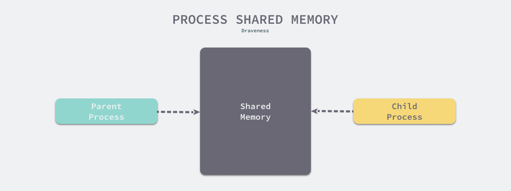

大家好，我是小林哥。

虽说 Redis 是内存数据库，但是它为数据的持久化提供了两个技术。

分别是「 AOF 日志和 RDB 快照」。

这两种技术都会用各用一个日志文件来记录信息，但是记录的内容是不同的。

- AOF 文件的内容是操作命令；
- RDB 文件的内容是二进制数据。

关于 AOF 持久化的原理我在上一篇已经介绍了，今天主要讲下 **RDB 快照**。

所谓的快照，就是记录某一个瞬间东西，比如当我们给风景拍照时，那一个瞬间的画面和信息就记录到了一张照片。

所以，RDB 快照就是记录某一个瞬间的内存数据，记录的是实际数据，而 AOF 文件记录的是命令操作的日志，而不是实际的数据。

因此在 Redis 恢复数据时， RDB 恢复数据的效率会比 AOF 高些，因为直接将 RDB 文件读入内存就可以，不需要像 AOF 那样还需要额外执行操作命令的步骤才能恢复数据。

接下来，就来具体聊聊 RDB 快照 。

### 快照怎么用？

要熟悉一个东西，先看看怎么用是比较好的方式。

Redis 提供了两个命令来生成 RDB 文件，分别是 `save` 和 `bgsave`，他们的区别就在于是否在「主线程」里执行：

- 执行了 save 命令，就会在主线程生成 RDB 文件，由于和执行操作命令在同一个线程，所以如果写入 RDB 文件的时间太长，**会阻塞主线程**；
- 执行了 bgsava 命令，会创建一个子进程来生成 RDB 文件，这样可以**避免主线程的阻塞**；

RDB 文件的加载工作是在服务器启动时自动执行的，Redis 并没有提供专门用于加载 RDB 文件的命令。

Redis 还可以通过配置文件的选项来实现每隔一段时间自动执行一次 bgsava 命令，默认会提供以下配置：

```
save 900 1
save 300 10
save 60 10000
```

别看选项名叫 sava，实际上执行的是 bgsava 命令，也就是会创建子进程来生成 RDB 快照文件。

只要满足上面条件的任意一个，就会执行 bgsava，它们的意思分别是：

- 900 秒之内，对数据库进行了至少 1 次修改；
- 300 秒之内，对数据库进行了至少 10 次修改；
- 60 秒之内，对数据库进行了至少 10000 次修改。

这里提一点，Redis 的快照是**全量快照**，也就是说每次执行快照，都是把内存中的「所有数据」都记录到磁盘中。

所以可以认为，执行快照是一个比较重的操作，如果频率太频繁，可能会对 Redis 性能产生影响。如果频率太低，服务器故障时，丢失的数据会更多。

通常可能设置至少 5 分钟才保存一次快照，这时如果 Redis 出现宕机等情况，则意味着最多可能丢失 5 分钟数据。

这就是 RDB 快照的缺点，在服务器发生故障时，丢失的数据会比 AOF 持久化的方式更多，因为 RDB 快照是全量快照的方式，因此执行的频率不能太频繁，否则会影响 Redis 性能，而 AOF 日志可以以秒级的方式记录操作命令，所以丢失的数据就相对更少。

### 执行快照时，数据能被修改吗？

那问题来了，执行 bgsava 过程中，由于是交给子进程来构建 RDB 文件，主线程还是可以继续工作的，此时主线程可以修改数据吗？

如果不可以修改数据的话，那这样性能一下就降低了很多。如果可以修改数据，又是如何做到到呢？

直接说结论吧，执行 bgsava 过程中，Redis 依然**可以继续处理操作命令**的，也就是数据是能被修改的。

那具体如何做到到呢？关键的技术就在于**写时复制技术（\*Copy-On-Write, COW\*）。**

执行 bgsava 命令的时候，会通过 `fork()` 创建子进程，此时子进程和父进程是共享同一片内存数据的，因为创建子进程的时候，会复制父进程的页表，但是页表指向的物理内存还是一个。



只有在发生修改内存数据的情况时，物理内存才会被复制一份。



这样的目的是为了减少创建子进程时的性能损耗，从而加快创建子进程的速度，毕竟创建子进程的过程中，是会阻塞主线程的。

所以，创建 bgsave 子进程后，由于共享父进程的所有内存数据，于是就可以直接读取主线程里的内存数据，并将数据写入到 RDB 文件。

当主线程对这些共享的内存数据也都是只读操作，那么，主线程和 bgsave 子进程相互不影响。

但是，如果主线程要**修改共享数据里的某一块数据**（比如键值对 `A`）时，就会发生写时复制，于是这块数据的**物理内存就会被复制一份（键值对 `A'`）**，然后**主线程在这个数据副本（键值对 `A'`）进行修改操作**。与此同时，**bgsave 子进程可以继续把原来的数据（键值对 `A`）写入到 RDB 文件**。

就是这样，Redis 使用 bgsave 对当前内存中的所有数据做快照，这个操作是由 bgsave 子进程在后台完成的，执行时不会阻塞主线程，这就使得主线程同时可以修改数据。

细心的同学，肯定发现了，bgsave 快照过程中，如果主线程修改了共享数据，**发生了写时复制后，RDB 快照保存的是原本的内存数据**，而主线程刚修改的数据，是被办法在这一时间写入 RDB 文件的，只能交由下一次的 bgsave 快照。

所以 Redis 在使用 bgsave 快照过程中，如果主线程修改了内存数据，不管是否是共享的内存数据，RDB 快照都无法写入主线程刚修改的数据，因为此时主线程的内存数据和子线程的内存数据已经分离了，子线程写入到 RDB 文件的内存数据只能是原本的内存数据。

如果系统恰好在 RDB 快照文件创建完毕后崩溃了，那么 Redis 将会丢失主线程在快照期间修改的数据。

另外，写时复制的时候会出现这么个极端的情况。

在 Redis 执行 RDB 持久化期间，刚 fork 时，主进程和子进程共享同一物理内存，但是途中主进程处理了写操作，修改了共享内存，于是当前被修改的数据的物理内存就会被复制一份。

那么极端情况下，**如果所有的共享内存都被修改，则此时的内存占用是原先的 2 倍。**

所以，针对写操作多的场景，我们要留意下快照过程中内存的变化，防止内存被占满了。

### RDB 和 AOF 合体

尽管 RDB 比 AOF 的数据恢复速度快，但是快照的频率不好把握：

- 如果频率太低，两次快照间一旦服务器发生宕机，就可能会比较多的数据丢失；
- 如果频率太高，频繁写入磁盘和创建子进程会带来额外的性能开销。

那有没有什么方法不仅有 RDB 恢复速度快的优点和，又有 AOF 丢失数据少的优点呢？

当然有，那就是将 RDB 和 AOF 合体使用，这个方法是在 Redis 4.0 提出的，该方法叫**混合使用 AOF 日志和内存快照**，也叫混合持久化。

如果想要开启混合持久化功能，可以在 Redis 配置文件将下面这个配置项设置成 yes：

```
aof-use-rdb-preamble yes
```

混合持久化工作在 **AOF 日志重写过程**。

当开启了混合持久化时，在 AOF 重写日志时，`fork` 出来的重写子进程会先将与主线程共享的内存数据以 RDB 方式写入到 AOF 文件，然后主线程处理的操作命令会被记录在重写缓冲区里，重写缓冲区里的增量命令会以 AOF 方式写入到 AOF 文件，写入完成后通知主进程将新的含有 RDB 格式和 AOF 格式的 AOF 文件替换旧的的 AOF 文件。

也就是说，使用了混合持久化，AOF 文件的**前半部分是 RDB 格式的全量数据，后半部分是 AOF 格式的增量数据**。



这样的好处在于，重启 Redis 加载数据的时候，由于前半部分是 RDB 内容，这样**加载的时候速度会很快**。

加载完 RDB 的内容后，才会加载后半部分的 AOF 内容，这里的内容是 Redis 后台子进程重写 AOF 期间，主线程处理的操作命令，可以使得**数据更少的丢失**。


------

### RDB 日志篇的问题

#### 问题一


这位读者的意思是，为什么执行 bgsave  命令来生成快照文件的时候，是创建子进程而不是线程。

AOF 重写日志和 bgsave 快照生成都是通过创建子进程来负责的，这里使用子进程而不是线程，是**因为如果是使用线程，多线程之间会共享内存，那么在修改共享内存数据的时候，需要通过加锁来保证数据的安全，而这样就会降低性能**。

而使用子进程，创建子进程时，父子进程是共享内存数据的，不过这个共享的内存只能以只读的方式，而当父子进程任意一方修改了该共享内存，就会发生「写时复制」，于是**父子进程就有了各自独立的数据副本，就不用加锁来保证数据安全，减少了锁的开销和避免死锁的发生**。

#### 问二


bgsave 和 save 的区别就在于：

- bgsave 会使用  fork() 系统调用创建子进程，创建快照的工作在子进程里；
- save 不会创建子进程，创建快照的工作在主线程里。

创建子进程时，有两个阶段会导致阻塞父进程：

- 创建子进程的途中，由于要复制父进程的页表等数据结构，阻塞的时间跟页表的大小有关，页表越大，阻塞的时间也越长；
- 创建完子进程后，如果子进程或者父进程修改了共享数据，就会发生写时复制，这期间会拷贝物理内存，如果内存越大，自然阻塞的时间也越长；

那么当 Redis 内存数据高达几十 G，甚至上百 G 的时候，**如果用 bgsave  进行 RDB 快照的话，在创建子进程的时候，会因为复制太大的页表而导致 Redis 阻塞在 `fork()` 函数，主线程无法继续执行，相当于停顿了**。

所以针对这种情况建议用 sava。

虽然 save 会一直阻塞 Redis 直到快照生成完毕，但是它这个阻塞并不是意味着停顿了，而是在执行生成快照的程序，只是期间主线程无法处理接下来的读写命令。

并且因为不需要创建子进程，所以不会像 bgsave  一样因为创建子进程而导致 Redis 停顿，并且因为没有子进程在争抢资源，所以 sava 创建快照的速度比 bgsave 创建快照的速度要快一些。

#### 问题三


这两个看一下源码就知道了呀。

先看回答第一个问题，我们直接看 Redis 加载 AOF 文件函数实现：



打开 AOF 文件之后，首先读取 5 个字符如果是「REDIS」，那么就说明这是一个混合持久化的 AOF 文件，因为 RDB  格式一定是以「REDIS」开头，而纯 AOF 格式则一定以「*」开头。

所以如果开头的 5 个字符是 「REDIS」 会先进入 `rdbLoadRio()` 函数来加载 RDB 内容。

rdbLoadRio() 函数就不详细展开了，就是按约定好的格式解析文件内容直到遇到 `RDB_OPCODE_EOF` 结束标记后返回。

接着 `loadAppendOnlyFile()` 函数继续以 AOF 格式解析文件直到结束整个加载过程完成。

再来看第二个问题，是通过什么方法将内存写入文件的？

很简单的，就是通过大家都知道的 `write()` 系统调用将内存数据写入到文件呀。

------

# 为什么 Redis 快照使用子进程

2019-12-17 [为什么这么设计](https://draveness.me/tags/为什么这么设计) [系统设计](https://draveness.me/tags/系统设计) [Redis](https://draveness.me/tags/redis) [fork](https://draveness.me/tags/fork) [操作系统](https://draveness.me/tags/操作系统) [写时拷贝](https://draveness.me/tags/写时拷贝) [CoW](https://draveness.me/tags/cow)

> 为什么这么设计（Why’s THE Design）是一系列关于计算机领域中程序设计决策的文章，我们在这个系列的每一篇文章中都会提出一个具体的问题并从不同的角度讨论这种设计的优缺点、对具体实现造成的影响。如果你有想要了解的问题，可以在文章下面留言。

虽然我们经常将 Redis 看做一个纯内存的键值存储系统，但是我们也会用到它的持久化功能，RDB 和 AOF 就是 Redis 为我们提供的两种持久化工具，其中 RDB 就是 Redis 的数据快照，我们在这篇文章想要分析 Redis 为什么在对数据进行快照持久化时会需要使用子进程，而不是将内存中的数据结构直接导出到磁盘上进行存储。

## 概述

在具体分析今天的问题之前，我们首先需要了解 Redis 的持久化存储机制 RDB 究竟是什么，RDB 会每隔一段时间中对 Redis 服务中当下的数据集进行快照，除了 Redis 的配置文件可以对快照的间隔进行设置之外，Redis 客户端还同时提供两个命令来生成 RDB 存储文件，也就是 `SAVE` 和 `BGSAVE`，通过命令的名字我们就能猜出这两个命令的区别。


其中 `SAVE` 命令在执行时会直接阻塞当前的线程，由于 Redis 是 [单线程](https://draveness.me/whys-the-design-redis-single-thread) 的，所以 `SAVE` 命令会直接阻塞来自客户端的所有其他请求，这在很多时候对于需要提供较强可用性保证的 Redis 服务都是无法接受的。

我们往往需要 `BGSAVE` 命令在后台生成 Redis 全部数据对应的 RDB 文件，当我们使用 `BGSAVE` 命令时，Redis 会立刻 `fork` 出一个子进程，子进程会执行『将内存中的数据以 RDB 格式保存到磁盘中』这一过程，而 Redis 服务在 `BGSAVE` 工作期间仍然可以处理来自客户端的请求。

[`rdbSaveBackground`](https://github.com/antirez/redis/blob/e916058f0ba59e964f5de3dee17f46ae08f1d385/src/rdb.c#L1343-L1378) 就是用来处理在后台将数据保存到磁盘上的函数：

```c
int rdbSaveBackground(char *filename, rdbSaveInfo *rsi) {
    pid_t childpid;

    if (hasActiveChildProcess()) return C_ERR;
    ...

    if ((childpid = redisFork()) == 0) {
        int retval;

        /* Child */
        redisSetProcTitle("redis-rdb-bgsave");
        retval = rdbSave(filename,rsi);
        if (retval == C_OK) {
            sendChildCOWInfo(CHILD_INFO_TYPE_RDB, "RDB");
        }
        exitFromChild((retval == C_OK) ? 0 : 1);
    } else {
        /* Parent */
        ...
    }
    ...
}
```

C

Redis 服务器会在触发 `BGSAVE` 时调用 `redisFork` 函数来创建子进程并调用 `rdbSave` 在子进程中对数据进行持久化，我们在这里虽然省略了函数中的一些内容，但是整体的结构还是非常清晰的，感兴趣的读者可以在点击上面的链接了解整个函数的实现。

使用 `fork` 的目的最终一定是为了不阻塞主进程来提升 Redis 服务的可用性，但是到了这里我们其实能够发现两个问题：

1. 为什么 `fork` 之后的子进程能够获取父进程内存中的数据？
2. `fork` 函数是否会带来额外的性能开销，这些开销我们怎么样才可以避免？

既然 Redis 选择使用了 `fork` 的方式来解决快照持久化的问题，那就说明这两个问题已经有了答案，首先 `fork` 之后的子进程是可以获取父进程内存中的数据的，而 `fork` 带来的额外性能开销相比阻塞主线程也一定是可以接受的，只有同时具备这两点，Redis 最终才会选择这样的方案。

## 设计

为了分析上一节提出的两个问题，我们在这里需要了解以下的这些内容，这些内容是 Redis 服务器使用 `fork` 函数的前提条件，也是最终促使它选择这种实现方式的关键：

1. 通过 `fork` 生成的父子进程会共享包括内存空间在内的资源；
2. `fork` 函数并不会带来明显的性能开销，尤其是对内存进行大量的拷贝，它能通过写时拷贝将拷贝内存这一工作推迟到真正需要的时候；

### 子进程

在计算机编程领域，尤其是 Unix 和类 Unix 系统中，`fork` 都是一个进程用于创建自己拷贝的操作，它往往都是被操作系统内核实现的系统调用，也是操作系统在 *nix 系统中创建新进程的主要方法。


当程序调用了 `fork` 方法之后，我们就可以通过 `fork` 的返回值确定父子进程，以此来执行不同的操作：

- `fork` 函数返回 0 时，意味着当前进程是子进程；
- `fork` 函数返回非 0 时，意味着当前进程是父进程，返回值是子进程的 `pid`；

```c
int main() {
    if (fork() == 0) {
        // child process
    } else {
        // parent process
    }
}
```

C

在 `fork` 的 [手册](http://man7.org/linux/man-pages/man2/fork.2.html) 中，我们会发现调用 `fork` 后的父子进程会运行在不同的内存空间中，当 `fork` 发生时两者的内存空间有着完全相同的内容，对内存的写入和修改、文件的映射都是独立的，两个进程不会相互影响。

> The child process and the parent process run in separate memory spaces. At the time of fork() both memory spaces have the same content. Memory writes, file mappings (mmap(2)), and unmappings (munmap(2)) performed by one of the processes do not affect other.

除此之外，子进程几乎是父进程的完整副本（Exact duplicate），然而这两个进程在以下的一些方面会有较小的区别：

- 子进程用于独立且唯一的进程 ID；
- 子进程的父进程 ID 与父进程 ID 完全相同；
- 子进程不会继承父进程的内存锁；
- 子进程会重新设置进程资源利用率和 CPU 计时器；
- …

最关键的点在于父子进程的内存在 `fork` 时是完全相同的，在 `fork` 之后进行写入和修改也不会相互影响，这其实就完美的解决了快照这个场景的问题 —— 只需要某个时间点下内存中的数据，而父进程可以继续对自己的内存进行修改，这既不会被阻塞，也不会影响生成的快照。

### 写时拷贝

既然父进程和子进程拥有完全相同的内存空间并且两者对内存的写入都不会相互影响，那么是否意味着子进程在 `fork` 时需要对父进程的内存进行全量的拷贝呢？假设子进程需要对父进程的内存进行拷贝，这对于 Redis 服务来说基本都是灾难性的，尤其是在以下的两个场景中：

1. 内存中存储大量的数据，`fork` 时拷贝内存空间会消耗大量的时间和资源，会导致程序一段时间的不可用；
2. Redis 占用了 10G 的内存，而物理机或者虚拟机的资源上限只有 16G，在这时我们就无法对 Redis 中的数据进行持久化，也就是说 Redis 对机器上内存资源的最大利用率不能超过 50%；

如果无法解决上面的两个问题，使用 `fork` 来生成内存镜像的方式也无法真正落地，不是一个工程中真正可以使用的方法。

> 就算脱离了 Redis 的场景，`fork` 时全量拷贝内存也是难以接受的，假设我们需要在命令行中执行一个命令，我们需要先通过 `fork` 创建一个新的进程再通过 `exec` 来执行程序，`fork` 拷贝的大量内存空间对于子进程来说可能完全没有任何作用的，但是却引入了巨大的额外开销。

写时拷贝（Copy-on-Write）的出现就是为了解决这一问题，就像我们在这一节开头介绍的，写时拷贝的主要作用就是**将拷贝推迟到写操作真正发生时**，这也就避免了大量无意义的拷贝操作。在一些早期的 *nix 系统上，系统调用 `fork` 确实会立刻对父进程的内存空间进行复制，但是在今天的多数系统中，`fork` 并不会立刻触发这一过程：



在 `fork` 函数调用时，父进程和子进程会被 Kernel 分配到不同的虚拟内存空间中，所以在两个进程看来它们访问的是不同的内存：

- 在真正访问虚拟内存空间时，Kernel 会将虚拟内存映射到物理内存上，所以父子进程共享了物理上的内存空间；
- 当父进程或者子进程对共享的内存进行修改时，共享的内存才会**以页为单位进行拷贝**，父进程会保留原有的物理空间，而子进程会使用拷贝后的新物理空间；

在 Redis 服务中，子进程只会读取共享内存中的数据，它并不会执行任何写操作，只有父进程会在写入时才会触发这一机制，而对于大多数的 Redis 服务或者数据库，写请求往往都是远小于读请求的，所以使用 `fork` 加上写时拷贝这一机制能够带来非常好的性能，也让 `BGSAVE` 这一操作的实现变得非常简单。

## 总结

Redis 实现后台快照的方式非常巧妙，通过操作系统提供的 `fork` 和写时拷贝的特性轻而易举的就实现了这个功能，从这里我们就能看出作者对于操作系统知识的掌握还是非常扎实的，大多人在面对类似的场景时，想到的方法可能就是手动实现类似『写时拷贝』的特性，然而这不仅增加了工作量，还增加了程序出现问题的可能性。

到这里，我们简单总结一下 Redis 为什么在使用 RDB 进行快照时会通过子进程的方式进行实现：

1. 通过 `fork` 创建的子进程能够获得和父进程完全相同的内存空间，父进程对内存的修改对于子进程是不可见的，两者不会相互影响；
2. 通过 `fork` 创建子进程时不会立刻触发大量内存的拷贝，内存在被修改时会以页为单位进行拷贝，这也就避免了大量拷贝内存而带来的性能问题；

上述两个原因中，一个为子进程访问父进程提供了支撑，另一个为减少额外开销做了支持，这两者缺一不可，共同成为了 Redis 使用子进程实现快照持久化的原因。到最后，我们还是来看一些比较开放的相关问题，有兴趣的读者可以仔细思考一下下面的问题：

- Nginx 的主进程会在运行时 `fork` 一组子进程，这些子进程可以分别处理请求，还有哪些服务会使用这一特性？
- 写时拷贝其实是一个比较常见的机制，在 Redis 之外还有哪里会用到它？

> 如果对文章中的内容有疑问或者想要了解更多软件工程上一些设计决策背后的原因，可以在博客下面留言，作者会及时回复本文相关的疑问并选择其中合适的主题作为后续的内容。

## Reference

- [Redis Persistence](https://redis.io/topics/persistence)
- [Understanding Redis Background Memory Usage](https://jobs.zalando.com/tech/blog/understanding-redis-background-memory-usage/?gh_src=4n3gxh1)
- [FAQ · Redis](https://redis.io/topics/faq)
- [Copy-on-write](https://en.wikipedia.org/wiki/Copy-on-write)
- [rdbSaveBackground · Redis](https://github.com/antirez/redis/blob/e916058f0ba59e964f5de3dee17f46ae08f1d385/src/rdb.c#L1343-L1378)
- [Fork (system call)](https://en.wikipedia.org/wiki/Fork_(system_call))
- [Which file in kernel specifies fork(), vfork()… to use sys_clone() system call](https://unix.stackexchange.com/questions/87551/which-file-in-kernel-specifies-fork-vfork-to-use-sys-clone-system-call)
- [Trying to understand fork() and Copy-on-Write (COW)](https://www.reddit.com/r/compsci/comments/31szui/trying_to_understand_fork_and_copyonwrite_cow/)

