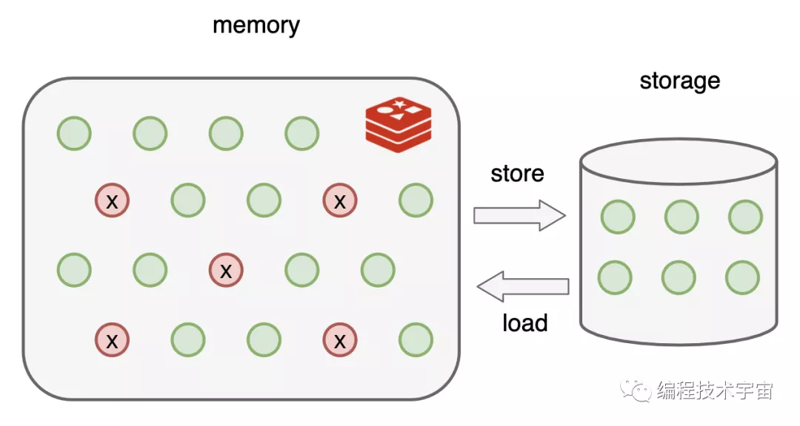
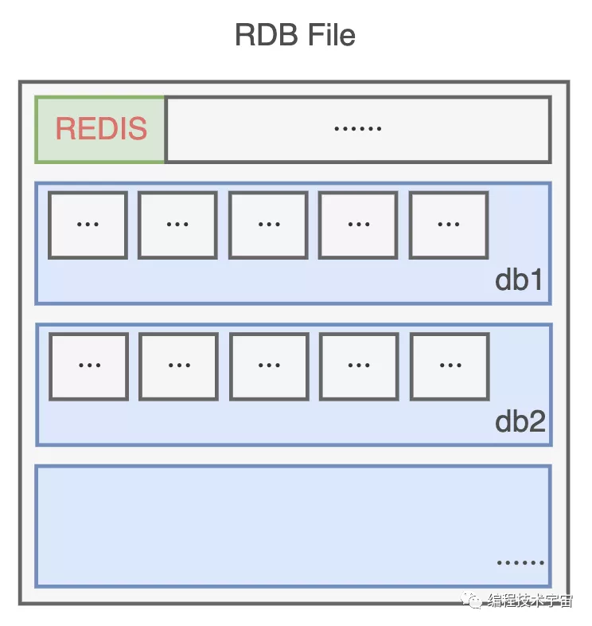
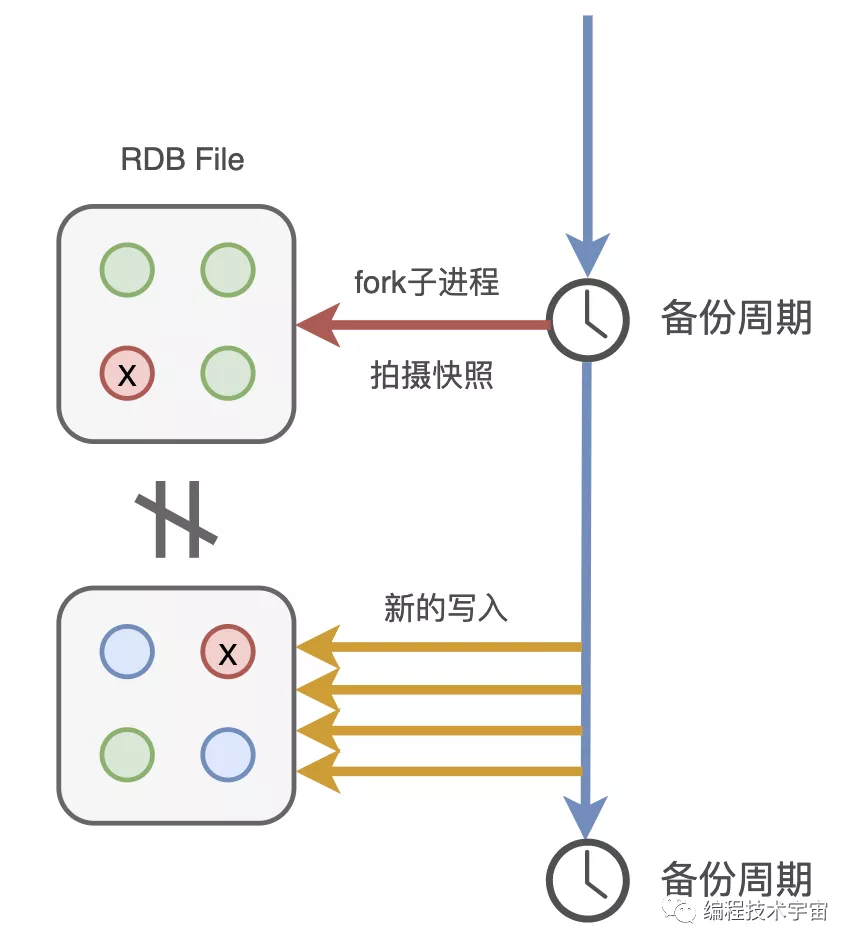
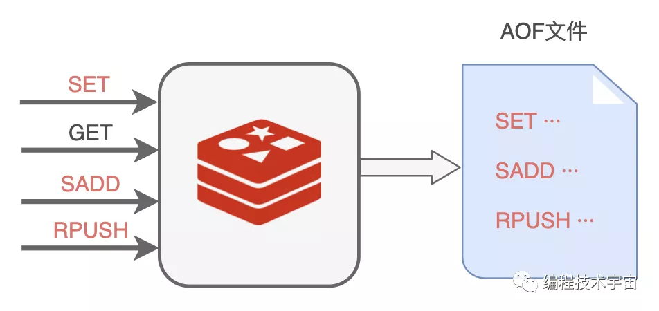
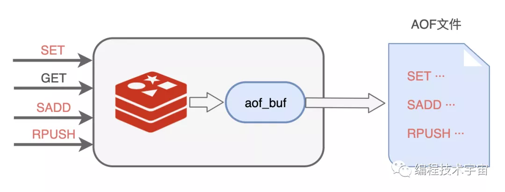
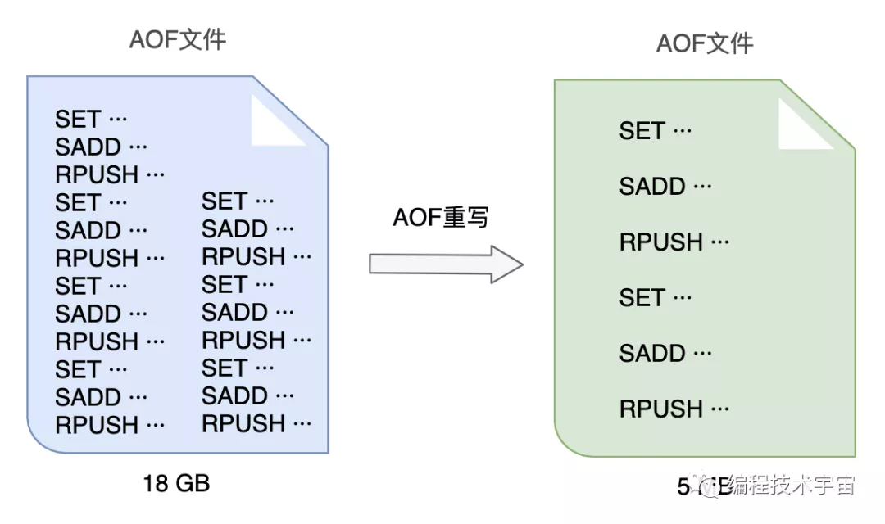
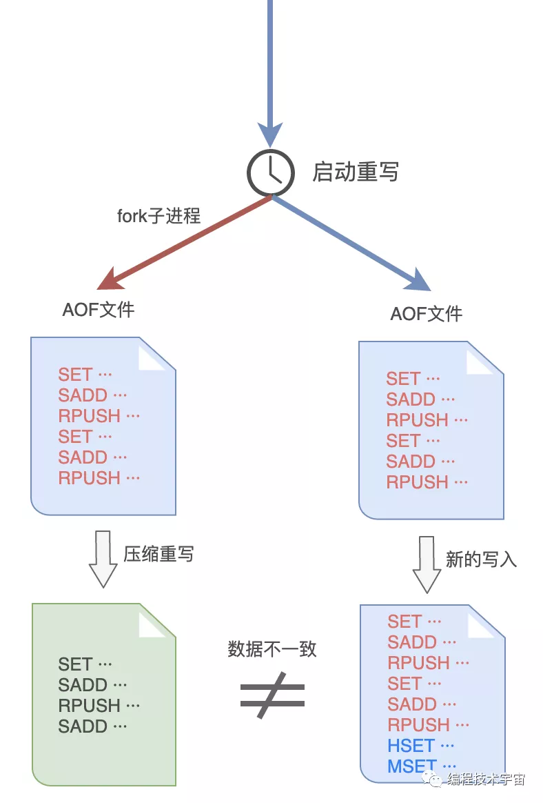
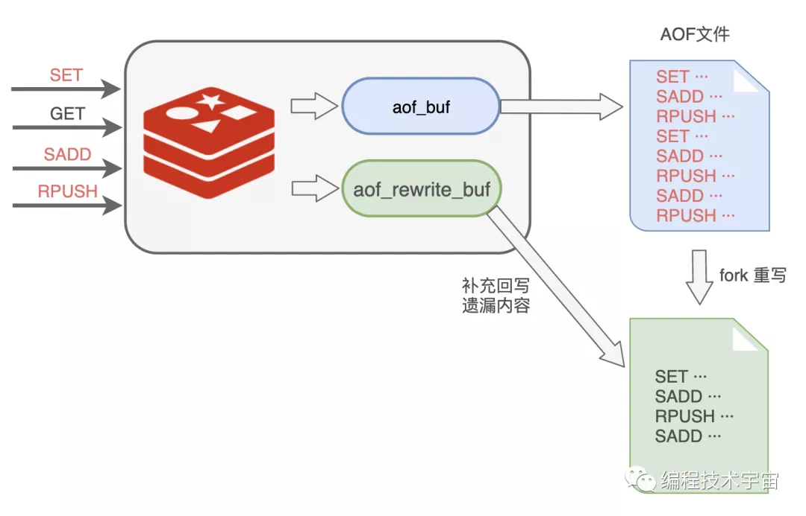

我是**Redis**，一个叫**Antirez**的男人把我带到了这个世界上。

“快醒醒！快醒醒！”，隐隐约约，我听到有人在叫我。

慢慢睁开眼睛，原来旁边是MySQL大哥。

“我怎么睡着了？”

“嗨，你刚才是不是出现了错误，整个进程都崩溃了！害得一大堆查询请求都给我怼过来了！”，MySQL说到。

刚刚醒来，脑子还有点懵，MySQL大哥扶我起来继续工作。

“糟了！我之前缓存的数据全都不见了！”

“WTF？你没有做**持久化**吗？”，MySQL大哥一听脸色都变了。

我尴尬的摇了摇头，“我都是保存在内存中的，所以才那么快啊”

“那也可以在硬盘上保存一下啊，遇到这种情况全部从头再来建立缓存，这不浪费时间嘛！”

我点了点头，“让我琢磨一下，看看怎么做这个持久化”。

## **RDB持久化**

没几天，我就拿出了一套方案：**RDB**

既然我的数据都在内存中存放着，最简单的就是遍历一遍把它们全都写入文件中。

为了节约空间，我定义了一个二进制的格式，把数据一条一条码在一起，生成了一个RDB文件。

不过我的数据量有点大，要是全部备份一次得花不少时间，所以不能太频繁的去做这事，要不然我不用干正事了，光花时间去备份了。

还有啊，要是一直没有写入操作，都是读取操作，那我也不用重复备份，浪费时间。

思来想去，我决定提供一个配置参数，既可以支持周期性备份，也可以避免做无用功。

就像这样：

> - save 900 1   # 900秒（15分钟）内有1个写入
> - save 300 10   # 300秒（5分钟）内有10个写入
> - save 60 10000  # 60秒（1分钟）内有10000个写入

多个条件可以组合使用，只要上面一个条件满足，我就会去进行备份。

后来我又想了一下，这样还是不行，我得**fork**出一个子进程去做这件事，不能浪费我的时间。

有了备份文件，下次我再遇到崩溃退出，甚至服务器断电罢工了，只要我的备份文件还在，我就能在启动的时候读取，快速恢复之前的状态啦！

## **MySQL:binlog**

我带着这套方案，兴冲冲的拿给了MySQL大哥看了，期待他给我一些鼓励。

“老弟，你这个方案有点问题啊”，没想到，他竟给我浇了一盆冷水。

“问题？有什么问题？”

“你看啊，你这个周期性去备份，周期还是分钟级别的，你可知道咱们这服务每秒钟都要响应多少请求，像你这样不得丢失多少数据？”，MySQL语重心长的说到。

我一下有些气短了，“可是，这个备份一次要遍历全部数据，开销还是挺大的，不适合高频执行啊”

“谁叫你一次遍历全部数据了？来来来，我给你看个东西”，MySQL大哥把我带到了一个文件目录下：

> - mysql-bin.000001
> - mysql-bin.000002
> - mysql-bin.000003
> - ···

“看，这些是我的**二进制日志binlog**，你猜猜看里面都装了些什么？”，MySQL大哥指着这一堆文件说到。

我看了一眼，全是一堆二进制数据，这哪看得懂，我摇了摇头。

“这里面呀记录了我对数据执行更改的所有操作，像是**INSERT**，**UPDATE**、**DELETE**等等动作，等我要进行数据恢复的时候就可以派上大用场了”

听他这么一说，我一下来了灵感！告别了MySQL大哥，回去研究起新的方案来了。

## **AOF持久化**

你们也知道，我也是基于命令式的，每天的工作就是响应业务程序发来的命令请求。

回来以后，我决定照葫芦画瓢，学着MySQL大哥的样子，把我执行的所有写入命令都记录下来，专门写入了一个文件，并给这种持久化方式也取了一个名字：**AOF（Append Only File）**。

不过我遇到了RDB方案同样的问题，我该多久写一次文件呢？

我肯定不能每执行一条写入命令就记录到文件中，那会严重拖垮我的性能！我决定准备一个缓冲区，然后把要记录的命令先临时保存在这里，然后再择机写入文件，我把这个临时缓冲区叫做**aof_buf**。

说干就干，我试了一下，竟然发现数据没有写入到文件中去。多方打听才知道，原来操作系统也有个缓存区，我写的数据被他缓存起来了，没有给我写入到文件中去，这不是坑爹呢嘛！

看来，我写完了还得要去刷新一下，把数据真正给写下去，思来想去，我还是提供一个参数，让业务程序去设置什么时候刷新吧。

> `appendfsync`参数，三个取值：
>
> - always: 每个事件周期都同步刷新一次
> - everysec: 每一秒都同步刷新一次
> - no: 我只管写，让操作系统自己决定什么时候真正写入吧

## **AOF重写**

这一次我不像之前那么冲动，我决定先试运行一段时间再去告诉MySQL大哥，免得又被他戳到软肋。

试用了一段时间，各方面都运行良好，不过我发现随着时间的推移，我写的这个AOF备份文件越来越大，越来越大！不仅非常占硬盘空间，复制移动，加载分析都非常的麻烦耗时。

我得想个办法把文件给**压缩**一下，我把这个过程叫做**AOF重写**。

一开始，我打算去分析原来的AOF文件，然后将其中的冗余指令去掉，来给AOF文件瘦瘦身，不过我很快放弃了这个想法，这工作量实在太大了，分析起来也颇为麻烦，浪费很多精力跟时间。

原来的一条条记录这种方式实在是太笨了，数据改来改去，有很多中间状态都没用，我何不就把最终都数据状态记录下来就好了？

比如：

> - RPUSH name_list **'编程技术宇宙'**
> - RPUSH name_list **'帅地玩编程'**
> - RPUSH name_list **'后端技术学堂'**
>
> 可以合并成一条搞定：
>
> - RPUSH name_list **'编程技术宇宙'** **'帅地玩编程'** **'后端技术学堂'**

AOF文件重写的思路我是有了，不过这件事干起来还是很耗时间，我决定和RDB方式一样，fork出一个子进程来做这件事情。

谨慎如我，发现这样做之后，子进程在重写期间，我要是修改了数据，就会出现和重写的内容不一致的情况！MySQL大哥肯定会挑刺儿，我还得把这个漏洞给补上。

于是，我在之前的**aof_buf**之外，又准备了一个缓冲区：**AOF重写缓冲区**。

从创建重写子进程开始的那一刻起，我把后面来的写入命令也copy一份写到这个重写缓冲区中，等到子进程重写AOF文件结束之后，我再把这个缓冲区中的命令写入到新的AOF文件中。

最后再重命名新的AOF文件，替换掉原来的那个臃肿不堪的大文件，终于大功告成！

再三确定我的思路没有问题之后，我带着新的方案再次找到了MySQL大哥，我都做到这份儿上了，这一次，想必他应该无话可说了吧？

MySQL大哥看了我的方案露出了满意的笑容，只是问了一个问题：

> 这AOF方案这么好了，RDB方案是不是可以不要了呢？

万万没想到，他居然问我这个问题，我竟陷入了沉思，你觉得我该怎么回答好呢？

## **彩蛋**

> “你怎么又崩溃了？”
>
> “不好意思，又遇到bug了，不过不用担心，我现在可以快速恢复了！”
>
> “那老崩溃也不是事儿啊，你只有一个实例太不可靠了，去找几个帮手吧！”
>
> *预知详情，请关注后续精彩···*