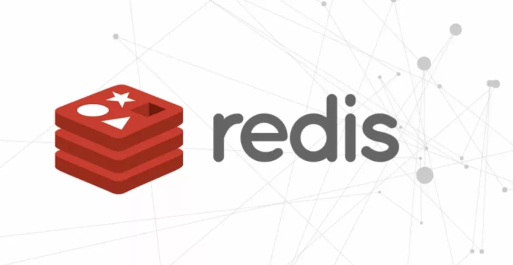
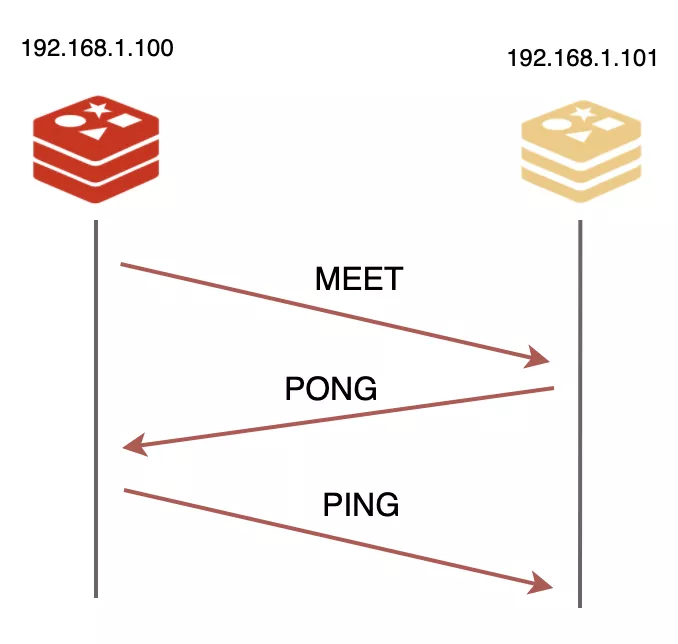
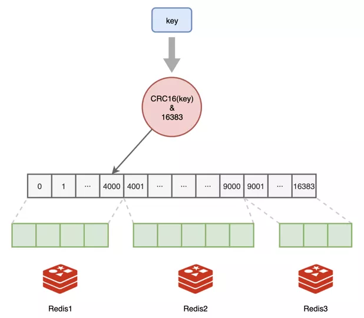
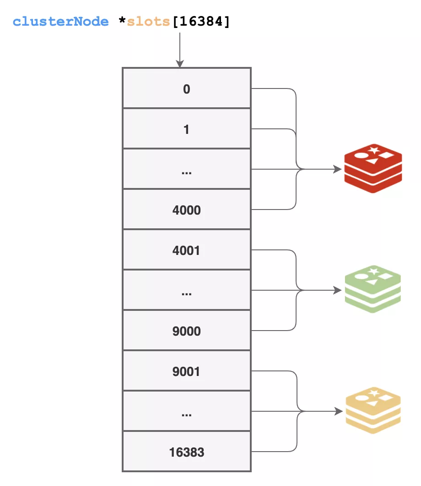
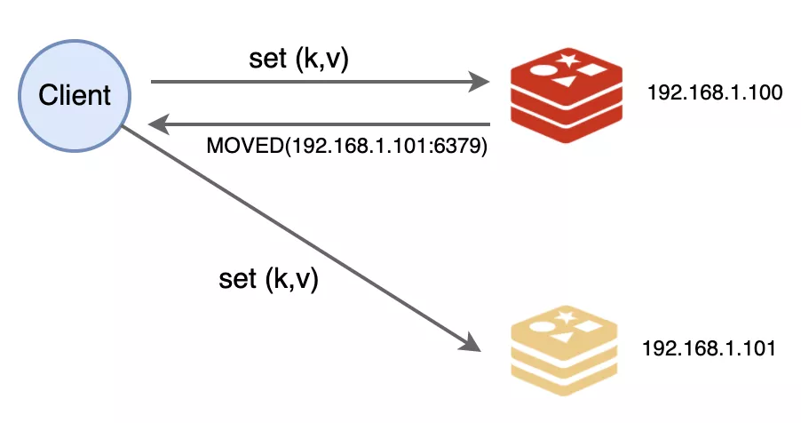
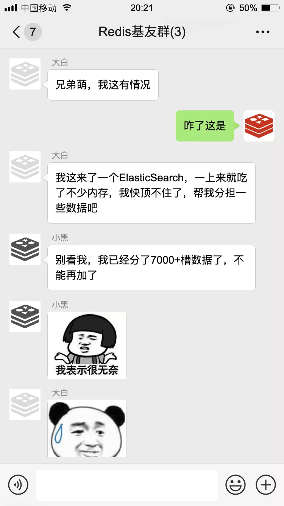
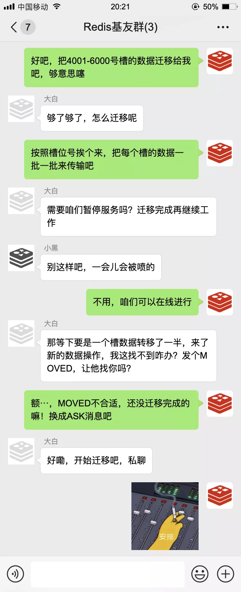

## **Redis的新烦恼**

你好，我是**Redis**，一个叫**Antirez**的男人把我带到了这个世界上。



自从上次被拉入群聊之后（[那天，我被拉入一个Redis群聊···](https://mp.weixin.qq.com/s?__biz=MzIyNjMxOTY0NA==&mid=2247487533&idx=1&sn=49b600ef7eac342dad1f5a8048361099&scene=21#wechat_redirect)），我就从一个人单打独斗变成了团队合作，在小伙伴们的共同努力下，不仅有**主从复制**可以数据备份，还有**哨兵节点**负责监控管理，我现在也可以拍拍胸脯说我们是**高可用服务**了！

但是，幸福的日子没过太久，我们就笑不起来了。

不知道是我们的工作太出色，还是业务发展太快，程序员们对我们养成了依赖，什么都往我们这里写，数据量越来越大，我们承受了这个年纪不该有的压力～


虽然有主从复制+哨兵，但只能解决高可用的问题，解决不了数据量大的问题！

因为咱们看起来人手多，但都是存储的全量数据，所以对于数据容量提升并没有什么帮助。

## **集群时代**

这一天，我找到了大白和小黑，咱们仨合计了一下，一个节点的力量不足，但众人划桨可以开大船啊，我们决定把三个人的内存空间“**拼**”起来，每个人负责一部分数据，合体进化成一个大的缓存服务器，进入**集群Cluster**时代！

集群，集群，首要问题当然是团队建设啦！我们得想一套办法来组建团队，还要考虑到以后可能会扩容，会有新的伙伴加入我们，我们仨憋了半天，抄袭人家TCP的三次握手，也搞了一个握手协议出来。



想要加入集群，得有一个介绍人才行。通过团队里的任何一个成员都行，就比如说我吧，只要告诉我IP和端口，我就给他发送一个**MEET**信息，发起握手，对方得回我一个**PONG**信息同意入伙，最后我再回他一个**PING**信息，三次握手就完成了！

然后，我再把这件事告诉团队中其他成员，新的伙伴就算正式成为我们的一份子了。

第二件很重要的事情就是要解决数据存储的公平问题，不能旱的旱死，涝的涝死，我们争论了很久，最后决定学习人家哈希表的方法。

我们总共划分了**16384**个哈希桶，我们把它叫做**槽位Slot**，程序员可以按照我们能力大小给我们各自分配一部分槽位，比如我们团队：

> 我：0-4000
>
> 大白：4001-9000
>
> 小黑：9001-16383

我比较菜，只分到了4000个，小黑老哥最辛苦，要负责7000+个槽位，正所谓能力越大，责任越大，谁叫他内存空间最大呢。

数据读写的时候，对键值做一下哈希计算，映射到哪个槽，就由谁负责。



为了让大家的信息达成一致，启动的时候，每个人都得把自己负责的槽位信息告诉其他伙伴。

一共有一万多个槽，要通知其他小伙伴，需要传输的数据量还挺大的，后来我们仨又商量了一下，为了压缩数据空间，每个槽位干脆就用一个**bit**来表示，自己负责这一位就是1，否则就是0，总共也才16384个bit，也就是2048个字节，传输起来轻便快捷，一口气就发送过去了。

```
struct clusterNode {
 // ...
 unsigned char *slots[16384/8];
 // ...
};
```

这样传输的数据是轻量了，但真正工作的时候还是不方便，遇到读写数据的时候，总不能挨个去看谁的那一位是1吧。

干脆一步到位，用空间换时间，我们又准备了一个超大的数组来存储每个槽由哪个节点来负责，通过上面的方式拿到信息后，就更新到这里来：

```
struct clusterNode *slots[16384];
```



这样一来，遇到数据访问的时候，我们就能快速知道这个数据是由谁来负责了。

对了，这16384个槽位必须都得有人来负责，我们整个集群才算是正常工作，处于**上线**状态，否则就是**下线**状态。

你想啊，万一哪个键值哈希映射后的槽位没人负责，那该从哪里读，又该写到哪里去呢？所以我们要工作，一个槽都不能少！

## **集群数据的访问**

数据分派的问题解决了，我们团队总算可以正式上线工作了！

和原来不同的是，数据读写的时候多了一个步骤：得先检查数据是不是由自己负责。

如果是自己负责，那就进行处理，不然的话，就要返回一个**MOVED**错误给请求端，同时把槽号、IP和端口告诉他，让他知道该去找谁处理。嘿嘿，这个MOVED我们也是抄袭的HTTP中的302跳转~



不过程序员们是感知不到的，他们都是用封装好的库来操作，才不会亲自写代码来跟我通信呢~

一开始的工作很顺利，但没过多久就出事儿了！





随后我们开始了数据迁移，还把这一套流程标准化了，留着为以后新入伙的朋友分配数据。

经过一段时间的磨合，我们集群小分队配合的越来越默契。

不过光靠咱们仨还是不行，万一哪天有人挂了，整个集群就得下线了！咱们三个每人至少得有一个**backup**才行！

于是我找到了原来的一帮小弟，让他们也加入我们，继续给我们当起了从节点，平时当我们的**backup**，从我们这里复制数据，一旦我们遇到故障，他们就能快速顶上。

有了**集群工作+主从复制**，我们现在不仅高可用，数据容量也大大提升了，就算以后不够用了也有办法扩容，我们又过上了舒服的日子~