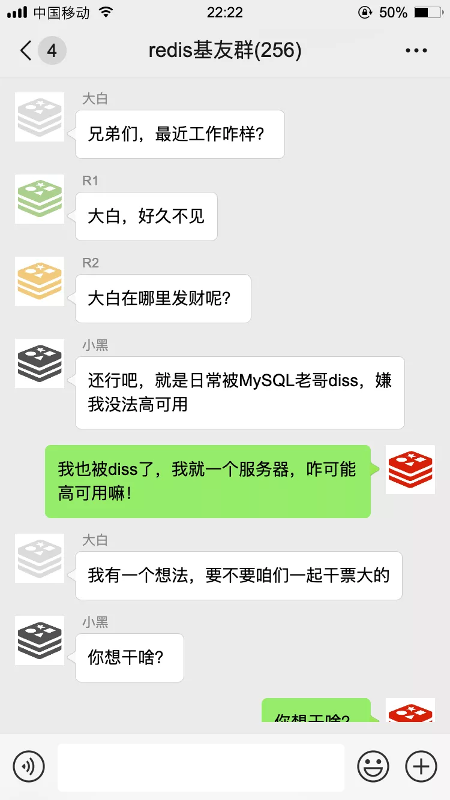
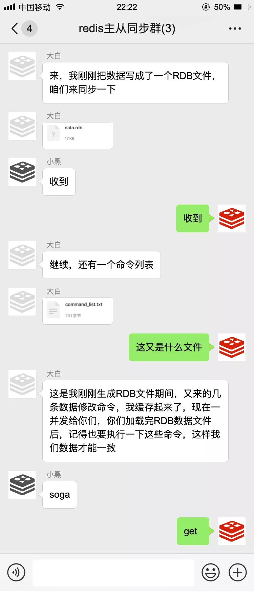
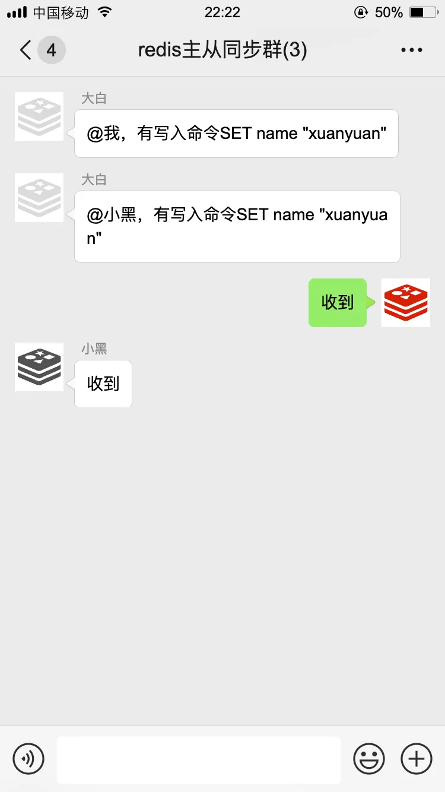
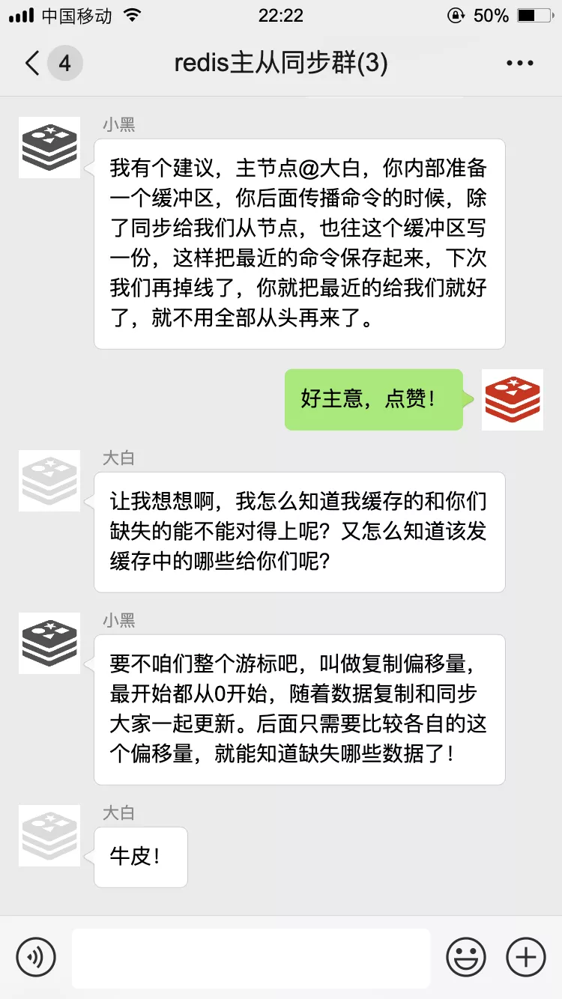
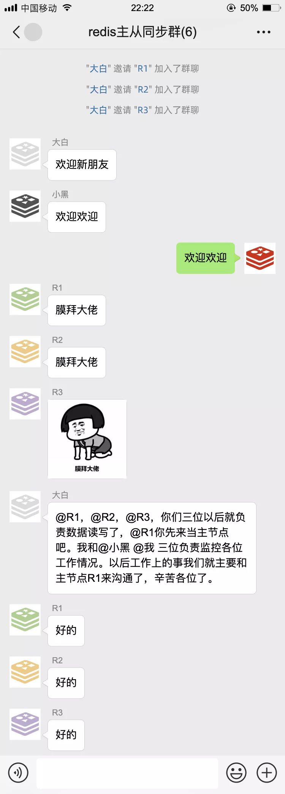
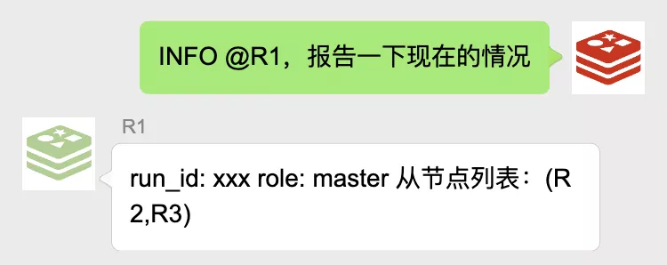
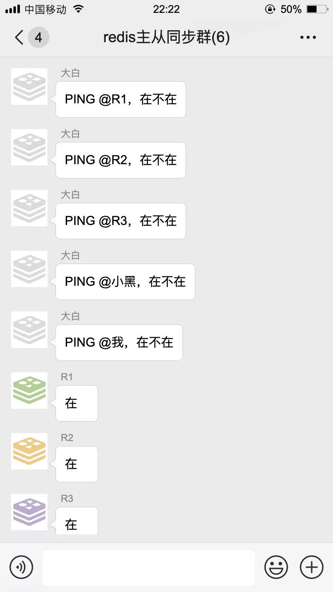
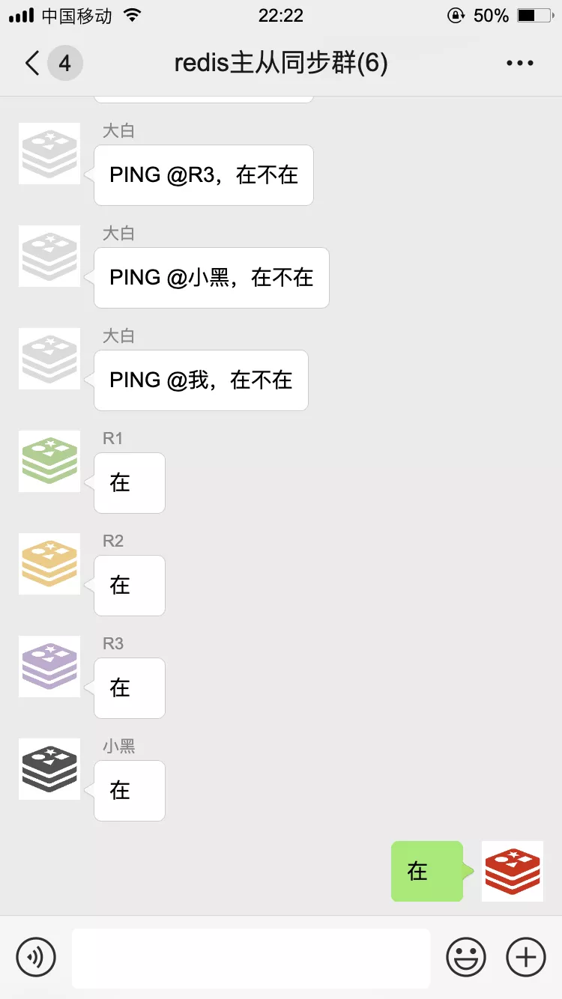
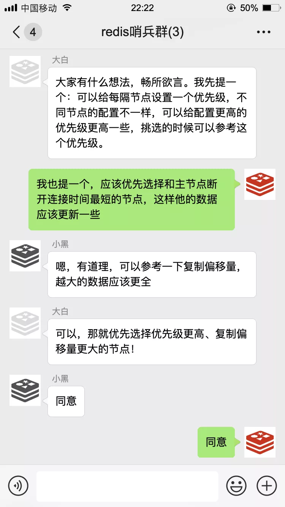

我是**Redis**，一个叫**Antirez**的男人把我带到了这个世界上。

那天，Redis基友群里，许久未见的大白发来了一条消息···

于是，大白拉了一个新的群

以后的日子中，咱们哥仨相互配合，日常工作中最多的就是数据同步了

如果主节点有数据写入、删除、修改命令，也会把这些命令挨个通知到从节点，我们把这叫做**命令传播**。

通过这样的方式，我们主节点与从节点之间数据就能保持同步了～

有一次，我不小心掉线了～

我们用上了新的数据同步策略，效率高了不少，就算偶尔掉个线，也能很快把缺失的数据给补上。

就这样过了一段时间···

新添了人手，我们准备大干一场！

为了及时获得和更新主从节点的信息，咱们哨兵每隔十秒钟就要用**INFO**命令去问候一下主节点，主节点会告诉我他有哪些从节点

为了更加及时知道大家是否掉线，咱们哨兵每隔一秒都要用**PING**命令问候一下群里的各个小伙伴：

如果在设置的时间里没有收到回复，我就知道这家伙多半是跪了，就该启动故障转移了

不过这只是我的主观意见，光我一个人说了不算，为了防止误判，我还得去管理员小群里征求一下大家的意见：

接下来，咱们就开始了第一次选举。

经过一番努力，我终于完成了故障转移，现在R2是主节点了。

不过没过多久，R1又回来了：

以上就是我们的日常工作了，通过咱们几个小伙伴的齐心协力，构成了一个高可用的缓存服务，MySQL大哥再也不敢小瞧我们了。

【完】