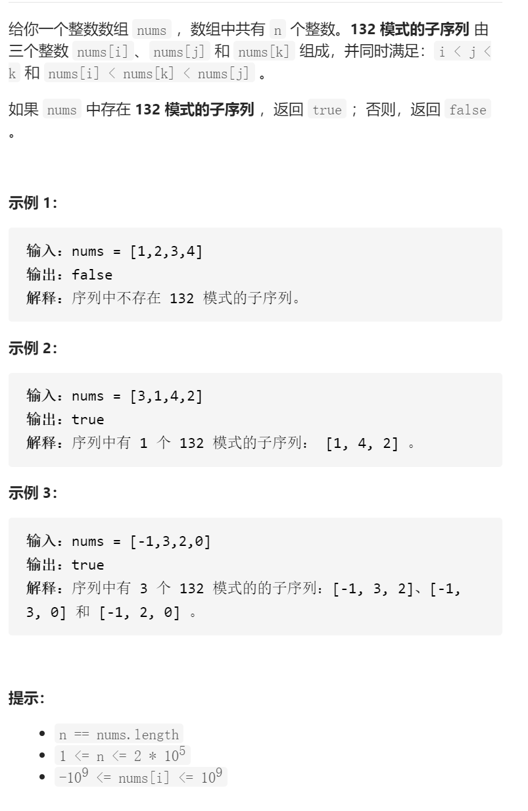

132模式



抽象固定维护寻找

132，固定中间i，维护左边最小值leftMin，向右寻找2

```c
class Solution {
public:
    bool find132pattern(vector<int>& nums) {
        int leftMin=nums[0];
        int n=nums.size();
        for(int i=1;i<n-1;i++){
            for(int j=i+1;j<n;j++){
                if(nums[j]>leftMin&&nums[j]<nums[i])return true;
            }
            leftMin=min(leftMin,nums[i]);
        }
        return false;
    }
};
```


抽象固定维护寻找


132，逆序，维护31这个单调栈，维护2second，second

```c
class Solution {
public:
    bool find132pattern(vector<int>& nums) {
        stack<int>stk;
        int n=nums.size();
        for(int i=n-1;i>=0;i--){
            while(!stk.empty()&&stk.top()<nums[i]){
                stk.pop();
            }
            stk.push(nums[i]);
        }
    }
};
```


看图是对数字的抽象，使其容易理解，维护second，second应在栈底左边，且尽可能大，

所以pop的时候更新second、

```c
class Solution {
public:
    bool find132pattern(vector<int>& nums) {
        stack<int>stk;
        int n=nums.size();
        int second=INT_MIN;
        for(int i=n-1;i>=0;i--){
            if(second>nums[i])return true;
            while(!stk.empty()&&stk.top()<nums[i]){
                second=max(second,stk.top());
                stk.pop();
            }
            stk.push(nums[i]);
        }
        return false;
    }
};

```


换一种更常规的思路

正序，维护32这个单调栈，递减，维护1first，first应该在栈底左边，尽可能小

所以pop的时候更新，实践证明first非常难以更新，需要考虑多种情况，不如前面的方法

我自己更新first失败了


```c
class Solution {
public:
    bool find132pattern(vector<int>& nums) {
        stack<int>stk;
        int n=nums.size();
        int first=INT_MAX;
        for(int i=0;i<n;i++){
            //cout<<first<<' '<<nums[i]<<endl;
            if(nums[i]>first&&nums[i]<stk.top())return true;
            while(!stk.empty()&&nums[i]>=stk.top()){
                //cout<<stk.top()<<endl;
                //int tmp=first;
                first=min(first,stk.top());
                stk.pop();
                //if(!stk.empty())first=tmp;
                if(!stk.empty()&&nums[i]>first&&nums[i]<stk.top())return true;
            }
            stk.push(nums[i]);
        }
        return false;
    }
};
```

