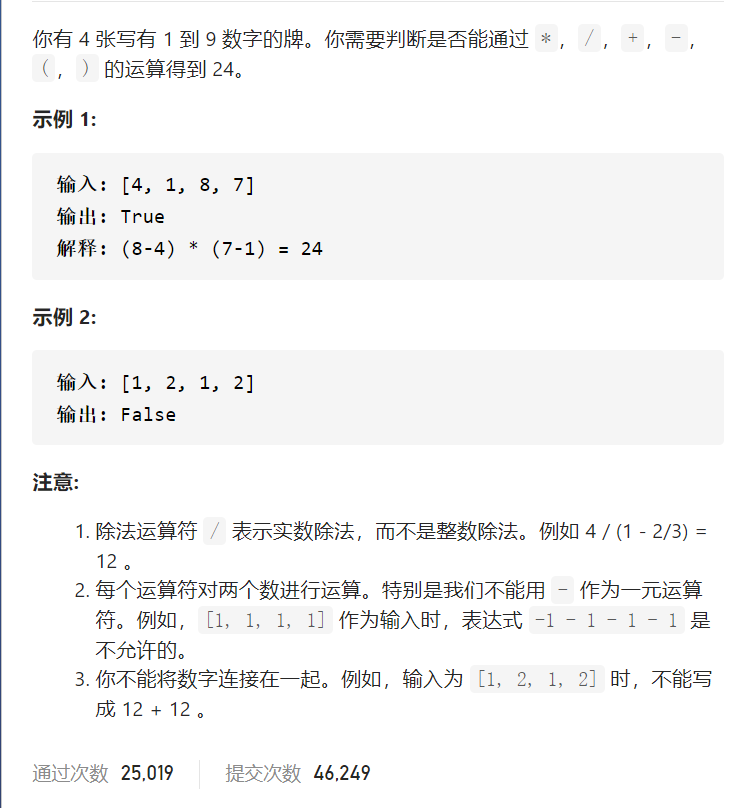
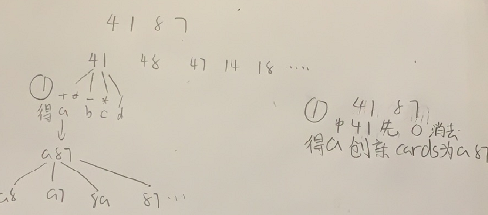

24点游戏



抽象图一二ij



```c
class Solution {
public:
    bool judgePoint24(vector<int>& cards) {
        vector<double>newCards(cards.begin(),cards.end());
        return dfs(newCards);
    }
    bool dfs(vector<double>cards){
        if(cards.size()==1){
            return fabs(cards[0]-24.0)<1e-6;
        }
        for(int i=0;i<cards.size();i++){
            for(int j=0;j<cards.size();j++){
                if(i==j)continue;
                vector<double>newCards;
                for(int k=0;k<cards.size();k++){
                    if(k==i||k==j)continue;
                    newCards.push_back(cards[k]);
                }
                for(int k=0;k<4;k++){
                    double curNum=get(cards[i],cards[j],k);
                    newCards.push_back(curNum);
                    if(dfs(newCards))return true;
                    newCards.pop_back();
                }
            }
        }
        return false;
    }
    double get(double curNum,double a,int flag){
        if(flag==0)return curNum+a;
        else if(flag==1)return curNum-a;
        else if(flag==2)return curNum*a;
        else if(flag==3)return curNum/a;
        return -1;
    }
};

```


踩过的坑

一般回溯是沿着从一堆数挑一个数，这道题是一次挑两个数，同时之前已经拿到的要先放回去，也就是4*8-(7+1)显然4*8和7+1一次挑两个数，弄完还有放回去

double 判断==用差值<1e-6