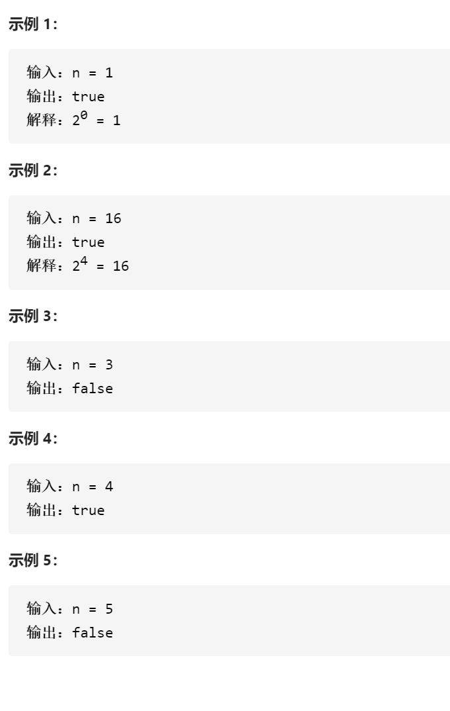

2的幂

变量简洁正确完整思路

k的幂，迭代

```c
class Solution {
public:
    bool isPowerOfTwo(int n) {
        int k=2;
        if(n<1)return false;
        while(n%k==0)n/=k;
        return n==1;
    }
};
```

2的幂，依旧是二进制只有1个1，n&(n-1)消去一个1后为0就是对的


```c
class Solution {
public:
    bool isPowerOfTwo(int n) {
        if(n<=0)return false;
        return (n&n-1)==0;
    }
};
```

超过的坑

&优先级很低，需要加括号

k的幂，取余，2的big可以<<31

```c
class Solution {
public:
    bool isPowerOfTwo(int n) {
        if(n<=0)return false;
        int big=1<<31;
        return big%n==0;
    }
};
```

