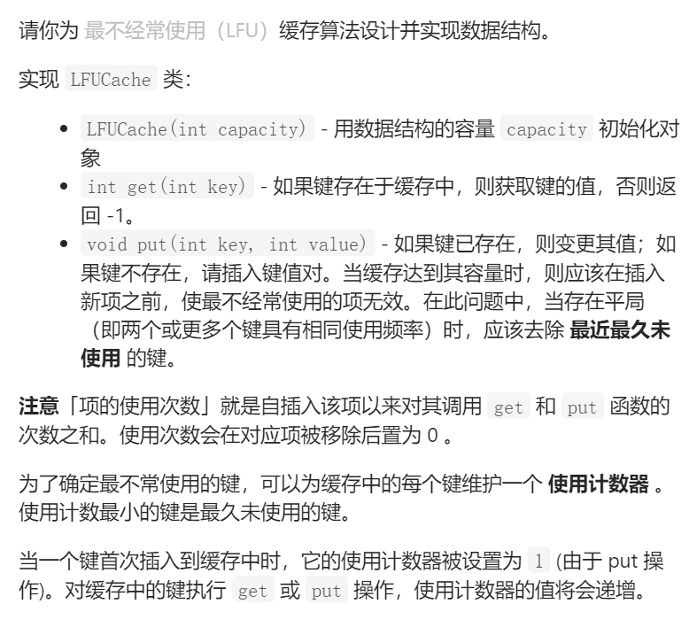
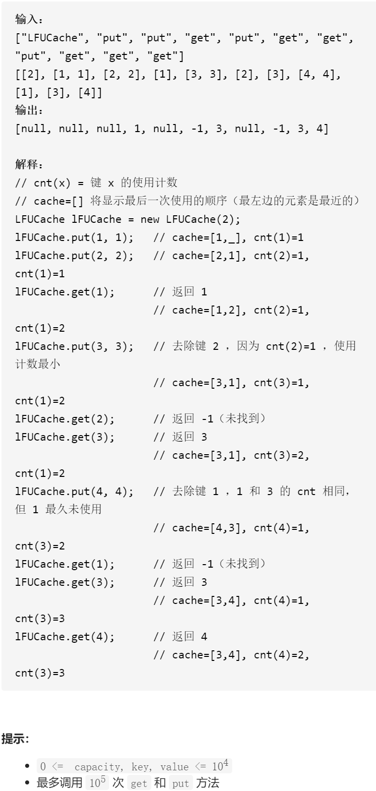
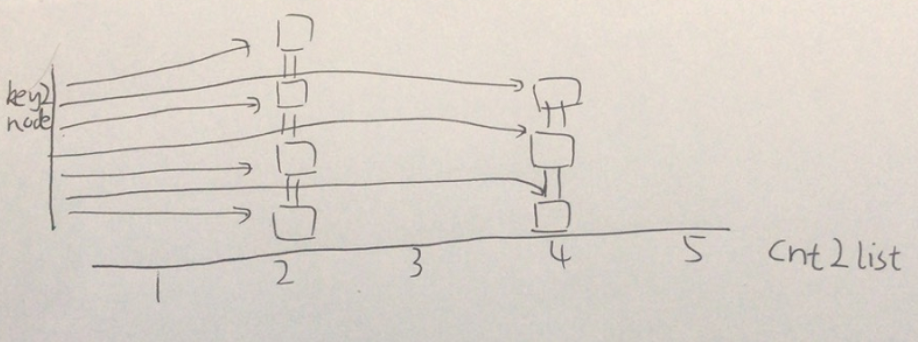

LFU缓存



抽象固定维护寻找

LRU是取出最近最久未使用，LFU是先取出使用频率最小的，如果频率相同再取出最近最久未使用，模仿LRU

```c
struct Node{
    Node(int k,int v):key(k),value(v),cnt(1),prev(nullptr),next(nullptr){}
    int key;
    int value;
    int cnt;
    Node*prev;
    Node*next;
};

class mylist{
public:
    mylist(){
        head=new Node(0,0);
        tail=new Node(0,0);
        head->next=tail;
        tail->prev=head;
    }
    ~mylist(){
        delete head;
        delete tail;
    }
    void erase(Node*node){
        node->prev->next=node->next;
        node->next->prev=node->prev;
    }
    void push_front(Node*node){
        node->prev=head;
        node->next=head->next;
        head->next->prev=node;
        head->next=node;
    }
    void pop_back(){
        if(tail->prev==head)return;
        Node*node=tail->prev;
        erase(node);
        return ;
    }
    Node*back(){
        if(tail->prev==head)return nullptr;
        return tail->prev;
    }
    bool empty(){
        return head->next==tail;
    }
private:
    Node*head;
    Node*tail;
};

class LFUCache {
public:
    LFUCache(int capacity):maxCapacity(capacity),totalSize(0),minCnt(0) {

    }
    
    int get(int key) {
        if(key2node.count(key)==0)return -1;
        push(key2node[key]);
        return key2node[key]->value;
    }
    
    void put(int key, int value) {
        if(key2node.count(key)){
            push(key2node[key]);
            key2node[key]->value=value;
        }else {
            if(maxCapacity==0)return;
            if(totalSize==maxCapacity)deleteLFU();
            //cnt为1的链表插头
            Node*node=new Node(key,value);
            mylist*&tmpList=cnt2list[node->cnt];
            if(!tmpList)tmpList=new mylist();
            tmpList->push_front(node);
            key2node.insert({key,node});
            minCnt=1;
            totalSize++;
        }
    }
    
    void push(Node*node){
        //cnt2list[node->cnt]的list删除掉node节点后，接到cnt2list[node->cnt+1]的链表
        mylist* oldList=cnt2list[node->cnt];
        oldList->erase(node);
        if(oldList->empty()&&minCnt==node->cnt)++minCnt;
        ++node->cnt;
        mylist*&newList=cnt2list[node->cnt];
        if(!newList)newList=new mylist();
        newList->push_front(node);
    }

    void deleteLFU(){
        //cnt2list[minCnt]中的最后一个节点删除，也就是LRU
        mylist*tmpList=cnt2list[minCnt];
        Node*node=tmpList->back();
        tmpList->pop_back();
        if(tmpList->empty())cnt2list.erase(node->cnt);
        key2node.erase(node->key);
        delete node;
        totalSize--;
    }
private:
    unordered_map<int,mylist*>cnt2list;
    unordered_map<int,Node*>key2node;
    int maxCapacity;
    int totalSize;
    int minCnt;
};
```


踩过的坑

mylist*&tmpList=cnt2list[node->cnt];

​      if(!tmpList)tmpList=new mylist();

超级大坑，如果不加&，修改指针的指向为new返回，是无法真正修改到cnt2list里面

真正的指针的，必须加指针的引用