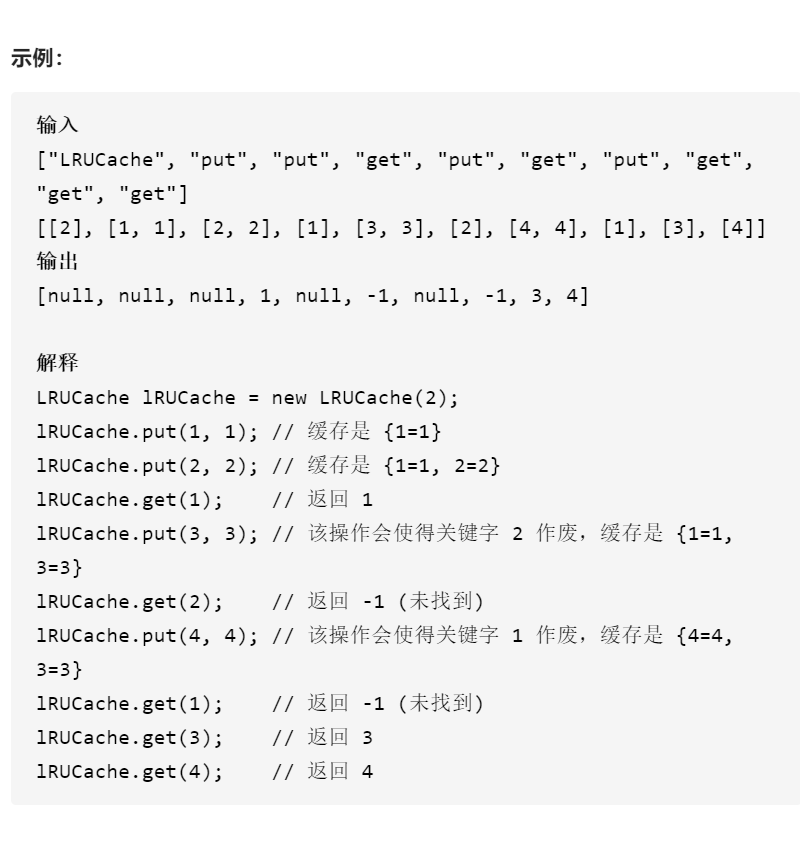
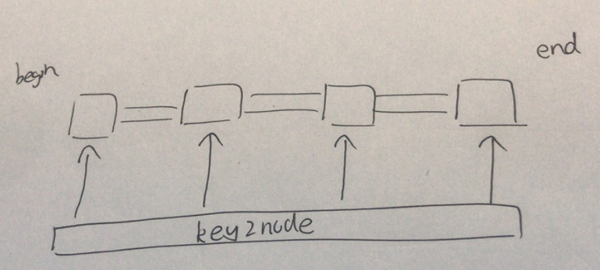

LRU缓存机制



变量简洁正确完整思路

哈希表key2node，双向队列cache存放pair，

对于put，如果key在key2ndoe中提前删除，如果cache等于最大容量maxCapacity提前删除key2node中的cache最后一个和删除cache最后一个，更新cache和key2node，{key,node}放入cache前面并更新key2node[key]

对于get，如果key2node找不到keyreturn-1，将{key,val}从key2node取出，更新cache，cache删除key2node[key]指向的节点并将该节点放到cache前面，更新key2node[key]，key2node[key]指向cache前面，返回val

精确定义

key2node哈希表，key映射一个迭代器，指向cache中{key,value}

cache双向链表，保存{key，value}



```c
class LRUCache {
public:
    LRUCache(int capacity) :maxCapacity(capacity){}
    
    int get(int key) {
        if(!key2node.count(key))return -1;
        cache.splice(cache.begin(),cache,key2node[key]);
        return key2node[key]->second;
    }
    
    void put(int key, int value) {
        if(key2node.count(key))cache.erase(key2node[key]);
        if(cache.size()==maxCapacity){
            key2node.erase(cache.back().first);
            cache.pop_back();
        }
        cache.push_front({key,value});
        key2node[key]=cache.begin();
    }
private:
    list<pair<int,int>>cache;
    unordered_map<int,list<pair<int,int>>::iterator>key2node;
    int maxCapacity;
};

```


踩过的坑

  list<pair<int,int>>cache;list小写

  cache.erase(key2node[key]);哈希表才能用val来删除，这个list用迭代器删除

  if(key2node.count(key))cache.erase(key2node[key]);哈希表查找，list需要迭代器才能删除

  key2node.erase(cache.back().first);删除key2node中cache最后一个

  cache.splice(cache.begin(),cache,key2node[key]);将cache的key2node[key]

指向的节点接到cache的cache.begin()迭代器指向的节点前面

实现mylist，接口使用类似stl list

```c
struct Node{
    Node(int k,int v):key(k),value(v),prev(nullptr),next(nullptr){}
    int key;
    int value;
    Node*prev;
    Node*next;
};

class mylist{
public:
    mylist(){
        head=new Node(0,0);
        tail=new Node(0,0);
        head->next=tail;
        tail->prev=head;
    }
    ~mylist(){
        delete head;
        delete tail;
    }
    void splice(Node*node){
        erase(node);
        push_front(node);
    }
    void erase(Node*node){
        node->prev->next=node->next;
        node->next->prev=node->prev;
    }
    void push_front(Node*node){
        node->prev=head;
        node->next=head->next;
        head->next->prev=node;
        head->next=node;
    }
    void pop_back(){
        if(tail->prev==head)return;
        Node*node=tail->prev;
        erase(node);
        return ;
    }
    Node*begin(){
        if(head->next==tail)return nullptr;
        return head->next;
    }
    Node*back(){
        if(tail->prev==head)return nullptr;
        return tail->prev;
    }
private:
    Node*head;
    Node*tail;

};
class LRUCache {
public:
    LRUCache(int capacity):maxCapacity(capacity),size(0){}
    
    int get(int key) {
        if(key2node.count(key)==0)return -1;
        cache.splice(key2node[key]);
        return key2node[key]->value;
    }
    
    void put(int key, int value) {
        if(key2node.count(key)){
            cache.erase(key2node[key]);
            size--;
        }
        if(size==maxCapacity){
            key2node.erase(cache.back()->key);
            cache.pop_back();
            size--;
        }
        Node* beg=new Node(key,value);
        cache.push_front(beg);
        size++;
        key2node[key]=cache.begin();
    }
private:
    unordered_map<int,Node*>key2node;
    mylist cache;
    int maxCapacity;
    int size;
};

```

------

模板

```c
#include <bits/stdc++.h>
using namespace std;
 
template <typename keyType, typename valueType>
class LRUCache {
private:
    struct Node {
        keyType key;
        valueType val;
        Node(){};
        Node(keyType key, valueType val) : key(key), val(val){};
    };
    int capacity;
    list<Node> cache;
    // 符号的结合性， 所以需要加上 typename::
    unordered_map<int, typename::list<Node>::iterator> cacheMap;
public:
    LRUCache(int N) : capacity(N) {}
 
    valueType get(keyType key) {
        auto it = cacheMap.find(key);
        if (it == cacheMap.end())
            return static_cast<valueType>(-1);
        // list 的一个快捷方法，参数分别为    位置，链表，要移动的节点（可以为一个范围）
        cache.splice(cache.begin(), cache, it->second);
        return it->second->val;
    }
 
    void put(keyType key, valueType value) {
        auto it = cacheMap.find(key);
        if (it == cacheMap.end()) {
            Node node = Node(key, value);
            cache.push_front(node);
            cacheMap.insert({ key, cache.begin() });
            // 删除末尾节点，并在 哈希表中删除
            if (cacheMap.size() > capacity) 
                cacheMap.erase(cache.back().key), cache.pop_back();
        } else {
            it->second->val = value;
            cache.splice(cache.begin(), cache, it->second);
        }
    }
};
 
int main() {
 
    LRUCache<int, int>* cache = new LRUCache<int, int>(2);
    int tem;
    cache->put(1, 1);
    cache->put(2, 2);
    tem = cache->get(1);       // 返回  1
    cout << tem << endl;
 
    cache->put(3, 3);    // 该操作会使得密钥 2 作废
    tem = cache->get(2);       // 返回 -1 (未找到)
    cout << tem << endl;
 
    cache->put(4, 4);    // 该操作会使得密钥 1 作废
    tem = cache->get(1);       // 返回 -1 (未找到)
    cout << tem << endl;
 
    tem = cache->get(3);       // 返回  3
    cout << tem << endl;
 
    tem = cache->get(4);       // 返回  4
    cout << tem << endl;
 
    system("pause");
    return 0;
}

```

------

线程安全

实习过程中遇到一个场景，在多线程下用到一个缓存当前分析的结果的map，当时只是用了一个map来解决这个问题，但是当时就觉得这个办法不是很好，因为分析结果基本上是很快就会被更新掉的，但是如果一个结果被用到，说明其很可能会被继续用到，分析了一下场景，我们就能很明了的想到，应该是用LRU来解决这个问题，LRU是一种被广泛使用的缓存算法，在操作系统以及一些开源的库中都能见到其身影，这里我们也对LRU也做出一个简单的拓展，实现一个模板LRUC_Cache类

实现代码

```c
#include <list>
#include <mutex>
#include <unordered_map>

template <typename T> using LISTT = std::list<T>;

template <typename T, typename Y>
using PAIRTL = std::pair<Y, typename LISTT<T>::iterator>;

template <typename T, typename Y>
using UMAPTP = std::unordered_map<T, PAIRTL<T, Y>>;

template <typename T, typename Y> class LRU_Cache {
public:
  LRU_Cache(const size_t &capacity) : capacity_(capacity) {}
  Y Get(const T &key) {
    std::lock_guard<std::mutex> lck(cache_mutex_);
    auto it = cache_.find(key);
    if (it == cache_.end()) {
      return Y();
    }
    touch(it);
    return it->second.first;
  }
  void Put(const T &key, const Y &value) {
    std::lock_guard<std::mutex> lck(cache_mutex_);
    auto it = cache_.find(key);
    if (it != cache_.end()) {
      touch(it);
    } else {
      if (cache_.size() == capacity_) {
        cache_.erase(elements_.back());
        elements_.pop_back();
      }
      elements_.push_front(key);
    }
    cache_[key] = {value, elements_.begin()};
  }

private:
  void touch(typename UMAPTP<T, Y>::iterator it) {
    ///注意这里不能加锁，否则就死锁了，因为这个函数不会被单独调用，总是在有锁的情况下
    ///被调用，所以函数本身不需要再加锁
    T key = it->first;
    elements_.erase(it->second.second);
    elements_.push_front(key);
    it->second.second = elements_.begin();
  }
  size_t capacity_;
  ///由于element_和cache_都是被同时访问，因此一个锁就够了
  std::mutex cache_mutex_;
  LISTT<T> elements_;
  UMAPTP<T, Y> cache_;
};

```

简单解释
不考虑多线程的情况下（其实考虑也没啥，只有一个锁哈哈），我们使用来一个list来储存所有的key，使用unorderedmap来保存key，然后value是一个pair，pair的首元素是value，次元素是指向key在list中的位置的迭代器，这里list的作用其实只是标示元素的顺序，因为lru算法要求每当一个元素被access，它就应该排到队列的最前端，当lru的缓存已经满了的时候，就应该删除队列中最后面的元素，因为这个元素是least_recently_used(lru),unorderedmap的作用也就很明显了，一方面储存value，一方面储存key在list中对应的迭代器，方便进行删除操作。

至于实现的话，这里有个小技巧，就是抽离出了一个touch函数，这个函数的作用是根据一个确定已经在缓存中的元素的key，访问一次，其目的就是改变元素在队列中的位置，同时unorderedmap中的迭代器也需要更新，本质上就是把元素挪到队列头。

其他的应该都比较直接，反而模板这一块由于自己不太熟，写那个using声明弄了蛮久，说起来还怪不好意思

总结
这个实现虽然简单，但是基本效果还是能达到的，我自己也做了简单的测试，可能不是很全面，但是基本还是能用的，毕竟代码也相对比较简单（笑），