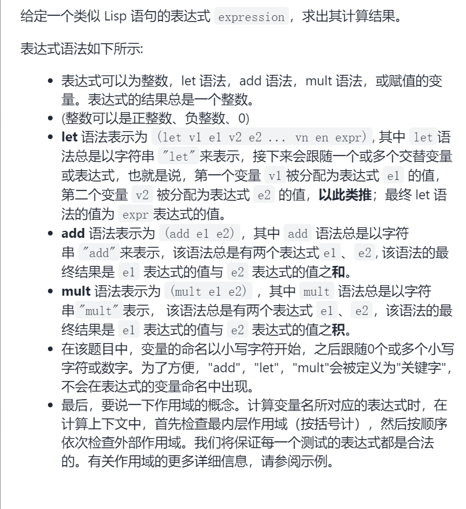
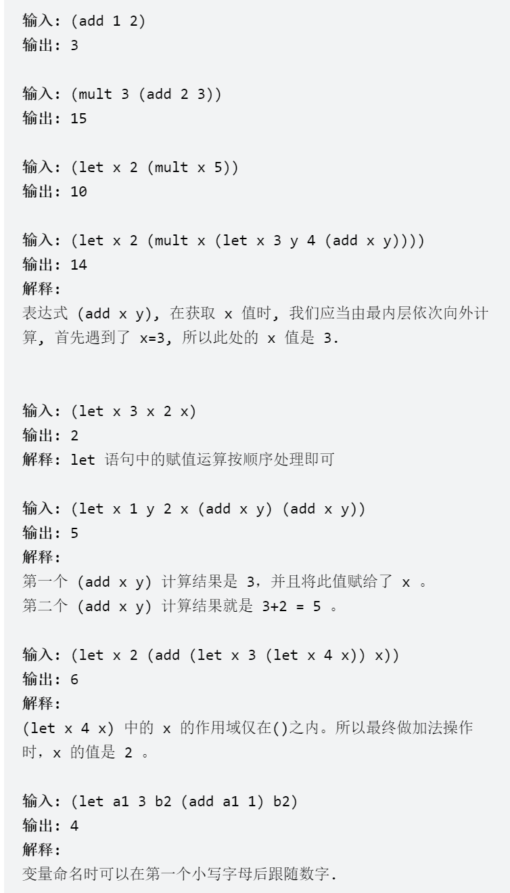
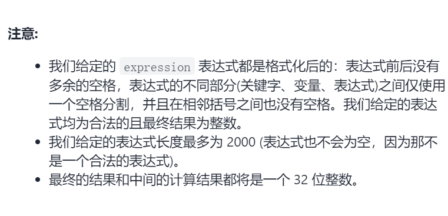
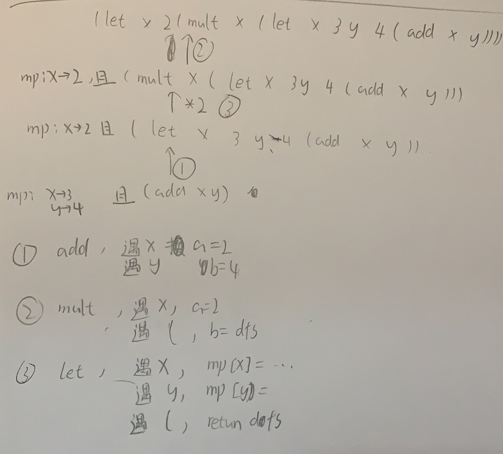

Lisp语法解析



抽象图一二ij




```c
class Solution {
public:
    int evaluate(string expression) {
        unordered_map<string,int>mp;
        int cur=0;
        return dfs(expression,cur,mp);
    }
    int dfs(string&expression,int &cur,unordered_map<string,int>mp){
        cur++;
        int ans=0;
        if(expression[cur]=='a'){
            cur+=3;
            cur++;
            int a=0;
            if(isdigit(expression[cur])||expression[cur]=='-'){
                int j=cur;
                cur++;
                while(isdigit(expression[cur]))cur++;
                a=atoi(expression.substr(j,cur-j).c_str());
                cur++;
            }
            else if(islower(expression[cur])){
                int j=cur;
                cur++;
                while(islower(expression[cur])||isdigit(expression[cur]))cur++;
                a=mp[expression.substr(j,cur-j)];
                cur++;
            }else if(expression[cur]=='('){
                a=dfs(expression,cur,mp);
                cur++;
            }
            int b=0;
            if(isdigit(expression[cur])||expression[cur]=='-'){
                int j=cur;
                cur++;
                while(isdigit(expression[cur]))cur++;
                b=atoi(expression.substr(j,cur-j).c_str());
                cur++;
            }else if(islower(expression[cur])){
                int j=cur;
                cur++;
                while(islower(expression[cur])||isdigit(expression[cur]))cur++;

                b=mp[expression.substr(j,cur-j)];
                cur++;
            }else if(expression[cur]=='('){
                b=dfs(expression,cur,mp);
                cur++;
            }
            ans=a+b;
        }else if(expression[cur]=='m'){
            cur+=4;
            cur++;
            int a=0;
            if(isdigit(expression[cur])||expression[cur]=='-'){
                int j=cur;
                cur++;
                while(isdigit(expression[cur]))cur++;
                a=atoi(expression.substr(j,cur-j).c_str());
                cur++;
            }
            else if(islower(expression[cur])){
                int j=cur;
                cur++;
                while(islower(expression[cur])||isdigit(expression[cur]))cur++;
                a=mp[expression.substr(j,cur-j)];
                cur++;
            }else if(expression[cur]=='('){
                a=dfs(expression,cur,mp);
                cur++;
            }
            int b=0;
            if(isdigit(expression[cur])||expression[cur]=='-'){
                int j=cur;
                cur++;
                while(isdigit(expression[cur]))cur++;
                b=atoi(expression.substr(j,cur-j).c_str());
                cur++;
            }else if(islower(expression[cur])){
                int j=cur;
                cur++;
                while(islower(expression[cur])||isdigit(expression[cur]))cur++;
                b=mp[expression.substr(j,cur-j)];
                cur++;
            }else if(expression[cur]=='('){
                b=dfs(expression,cur,mp);
                cur++;
            }
            ans=a*b;
        }else if(expression[cur]=='l'){
            cur+=3;
            cur++;
            string tmp;
            while(islower(expression[cur])){
                int j=cur;
                cur++;
                while(islower(expression[cur])||isdigit(expression[cur]))cur++;
                tmp=expression.substr(j,cur-j);
                if(expression[cur]==')')break;
                cur++;
                if(isdigit(expression[cur])||expression[cur]=='-'){
                    j=cur;
                    cur++;
                    while(isdigit(expression[cur]))cur++;
                    mp[tmp]=atoi(expression.substr(j,cur-j).c_str());
                    cur++;
                }else if(islower(expression[cur])){
                    int j=cur;
                    cur++;
                    while(islower(expression[cur])||isdigit(expression[cur]))cur++;
                    mp[tmp]=mp[expression.substr(j,cur-j)];
                    cur++;
                }else if(expression[cur]=='('){
                    mp[tmp]=dfs(expression,cur,mp);
                    cur++;
                }
            }
            if(expression[cur]==')'){
                ans=mp[tmp];
                cur++;
            }
            else if(expression[cur]=='('){
                ans=dfs(expression,cur,mp);
                cur++;
            }
            else if(isdigit(expression[cur])||expression[cur]=='-'){
                int j=cur;
                cur++;
                while(isdigit(expression[cur]))cur++;
                ans=atoi(expression.substr(j,cur-j).c_str());
                cur++;
            }
        }
        return ans;
    }
};
```


