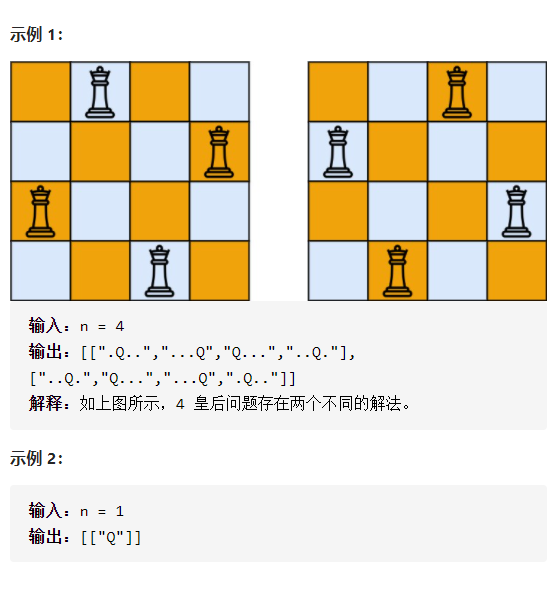
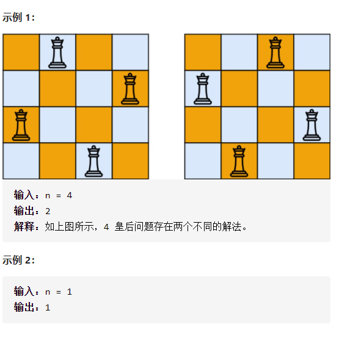

N皇后

详细思路

dfs进入某一行，如果行==n输出，枚举每一列，如果有效就放置并进入下一行，或者不要放置，如何检查有效，检查同一列、左上、右上有就错

精确定义

depth需要放置的行，也是递归深度

i需要尝试放置的列坐标

```c#
class Solution {
public:
    vector<vector<string>>ans;
    vector<vector<string>> solveNQueens(int n) {
        vector<string>ans1(n,string(n,'.'));
        dfs(n,ans1,0);
        return ans;
    }
    void dfs(int n,vector<string>&ans1,int depth){
        if(depth==n){
            ans.push_back(ans1);
            return;
        }
        for(int i=0;i<n;i++){
            if(isValid(depth,i,ans1,n)){
                ans1[depth][i]='Q';
                dfs(n,ans1,depth+1);
                ans1[depth][i]='.';
            }
        }
    }
    bool isValid(int row,int col,vector<string>&ans1,int n){
        for(int i=0;i<row;i++){
            if(ans1[i][col]=='Q')return false;
        }
        for(int i=row-1,j=col-1;i>=0&&j>=0;i--,j--){
            
            if(ans1[i][j]=='Q')return false;
        }
        for(int i=row-1,j=col+1;i>=0&&j<n;i--,j++){
            if(ans1[i][j]=='Q')return false;
        }
        return true;
    }
};
```


踩过的坑

​    vector<string>ans1(n,string(n,'.'));

​    for(int i=row-1,j=col+1;i>=0&&j<n;i--,j++){

------

#### [N皇后 II](https://leetcode-cn.com/problems/n-queens-ii/)

详细思路

dfs进入某一行，如果行==n输出，枚举每一列，如果有效就放置并进入下一行，或者不要放置，如何检查有效，检查同一列、左上、右上有就错

 

精确定义

depth需要放置的行，也是递归深度

i需要尝试放置的列坐标

```c
class Solution {
public:
    int ans=0;
    int totalNQueens(int n) {
        vector<string>ans1(n,string(n,'.'));
        dfs(n,ans1,0);
        return ans;
    }
    void dfs(int n,vector<string>&ans1,int depth){
        if(depth==n){
            ans++;
            return;
        }
        for(int i=0;i<n;i++){
            if(isValid(depth,i,ans1,n)){
                ans1[depth][i]='Q';
                dfs(n,ans1,depth+1);
                ans1[depth][i]='.';
            }
        }
    }
    bool isValid(int row,int col,vector<string>&ans1,int n){
        for(int i=0;i<row;i++){
            if(ans1[i][col]=='Q')return false;
        }
        for(int i=row-1,j=col-1;i>=0&&j>=0;i--,j--){
            
            if(ans1[i][j]=='Q')return false;
        }
        for(int i=row-1,j=col+1;i>=0&&j<n;i--,j++){
            if(ans1[i][j]=='Q')return false;
        }
        return true;
    }
};
```


