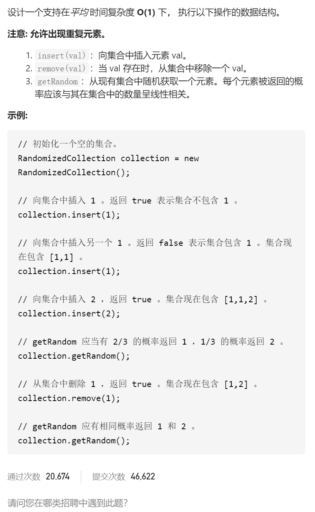

O(1)时间插入、删除和获取随机元素-允许重复



变量简洁正确完整思路

unordered_map<int下标,int值>index2num，insert(num)可以index2num[size]=num

remove(val)，可以维护unordered_map<int值,vector<int下标>>num2index，找到

num2index[val].back()popback()，getRandom()没有方法

vector<int值>nums，insert(val)可以，remove(val)可以维护unordered_map<int值,vector<int下标>>num2index, num2index[val].back()得到index, swap(nums[index]

,nums.back()]并pop_back()，同时更新num2index的原来的nums.back(),实际上无法更新，因为无法删除size索引

num2index改成unordered_map<int值,unordered_set<int下标>>num2index，就可以

删除size索引，同时，insert(val)可以，remove(val)可以获取下标

getRandom nums[rand()%size]

```c
class RandomizedCollection {
public:
    vector<int>nums;
    unordered_map<int,unordered_set<int>>num2index;

    RandomizedCollection() {

    }
    
    bool insert(int val) {
        bool flag=false;
        //cout<<num2index[val].count(0)<<endl;
        if(num2index.find(val)==num2index.end())flag=true;
        num2index[val].insert(nums.size());
        nums.push_back(val);
        return flag;
    }
    
    bool remove(int val) {
        //val不存在
        if(num2index.find(val)==num2index.end())return false;
        //获取beg的下标index
        int index=*num2index[val].begin();
        //交换index和back
        int tmpNum=nums.back();
        swap(nums[index],nums.back());

        //删除val和back的下标
        num2index[val].erase(index);
        num2index[tmpNum].erase(nums.size()-1);

        //添加back的新下标
        if(index<nums.size()-1)num2index[tmpNum].insert(index);

        //如果num2index[val]下标空了，应该清除
        if(num2index[val].size()==0)num2index.erase(val);

        nums.pop_back();
        return true;
    }
    
    int getRandom() {
        if(nums.size()==0)return 0;
        return nums[rand()%nums.size()];
    }
};


```


踩过的坑

​    //如果num2index[val]下标空了，应该清除

​    if(num2index[val].size()==0)num2index.erase(val);

不应该留着num2index[val]的unordered_set，如果这个set是空的