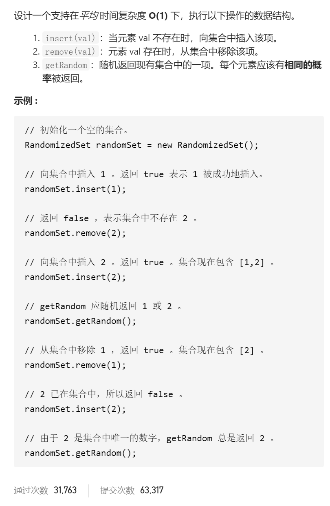

O(1)时间插入、删除和获取随机元素



变量简洁正确完整思路

unordered_map<int 值>num可以常数时间insert(val)和remove(val)，但是getRandom()应该随机返回num[i]，i是下标=rand()%size，所以unordered_map<int下标，int值>，insert(val)在val相同而下标不同时应该合并，无法实现插入，本质是因为unordered_map<int值>无法支持随机返回num[i]，

尝试vector<int值>num, getRandom()用num[rand()%size]，但是insert(val)无法知道是否已经存在，所以用unordered_set<int值>seen来判断是否val是否存在，但是remove(val)无法知道val下标，

所以unordered_set<int值>seen改成unordered_map<int值,int下标>num2index来判断是否存在（用于insert），获取val下标（用于remove），然后交换要删除的元素和最后一个元素并pop_back

```c
class RandomizedSet {
public:
    vector<int>nums;
    unordered_map<int,int>num2index;

    RandomizedSet() {

    }
    
    bool insert(int val) {
        if(num2index.count(val)==1)return false;
        num2index[val]=nums.size();
        nums.push_back(val);
        return true;
    }
    
    bool remove(int val) {
        if(num2index.count(val)==0)return false;
        int index=num2index[val];
        int tmp=nums.back();
        swap(nums[index],nums.back());
        num2index[tmp]=index;
        nums.pop_back();
        num2index.erase(val);
        return true;
    }

    int getRandom() {
        return nums[rand()%nums.size()];
    }
};

```


踩过的坑

​    num2index[tmp]=index;

back元素交换之后要更新num2index


