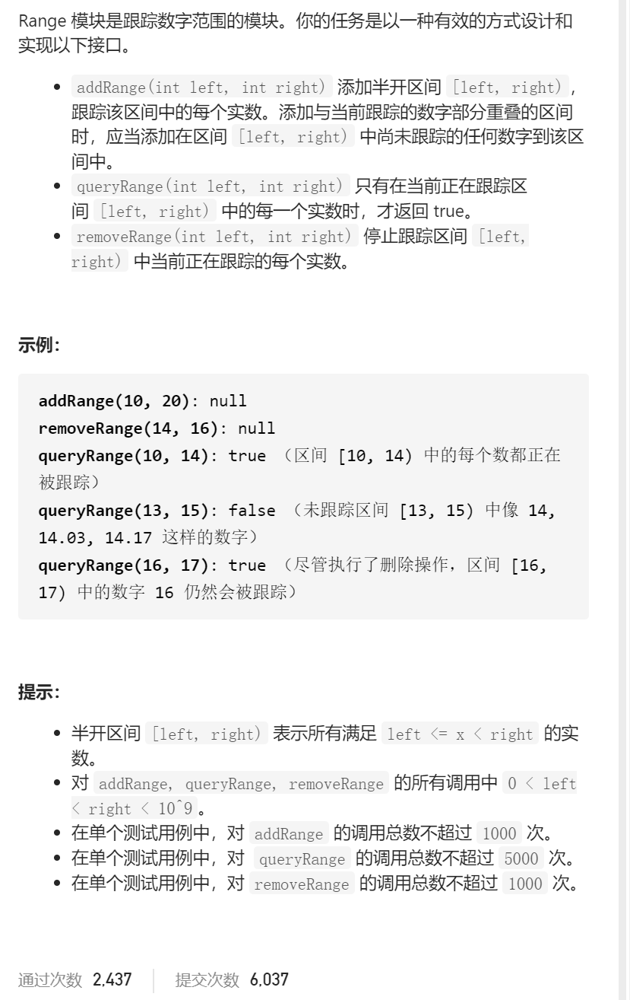
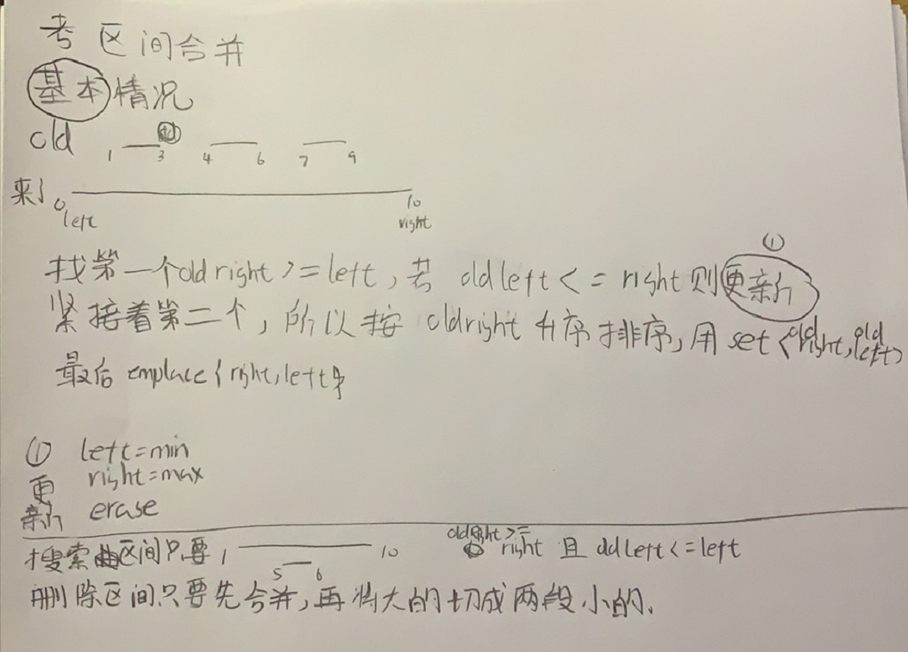

Range模块



抽象图一二ij

考察合并区间，区间合并，也就是addRange，有了合并区间后，无论是搜索区间还是删除区间都十分容易

```c
class RangeModule {
public:
    set<pair<int,int>>rightLeft;
    RangeModule() {
    }
    void addRange(int left, int right) {
        auto it=rightLeft.lower_bound({left,0});
        while(it!=rightLeft.end()&&right>=it->second){
            left=min(left,it->second);
            right=max(right,it->first);
            it=rightLeft.erase(it);
        }
        rightLeft.emplace(right,left);
    }
    bool queryRange(int left, int right) {
        auto it=rightLeft.lower_bound({right,0});
        if(it==rightLeft.end()||it->second>left)return false;
        return true;
    }
    void removeRange(int left, int right) {
        addRange(left,right);
        auto it=rightLeft.lower_bound({left,0});
        if(it==rightLeft.end())return;     
        int newLeft1=it->second,newRight1=left;
        if(newLeft1<newRight1)rightLeft.insert({newRight1,newLeft1});
        int newLeft2=right,newRight2=it->first;
        if(newLeft2<newRight2)rightLeft.insert({newRight2,newLeft2});
        rightLeft.erase(it);
    }
};
```

