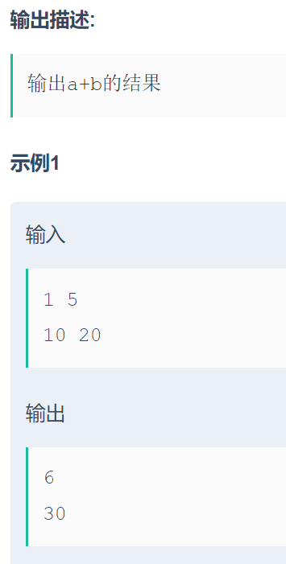

```c
#include<bits/stdc++.h>
using namespace std;

int main(){
    int a,b;
    while(cin>>a>>b){
        cout<<a+b<<endl;
    }
}
```

------

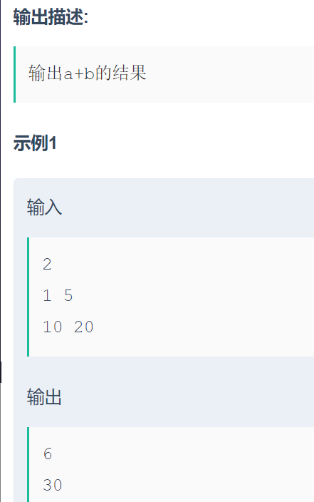

```c
#include <bits/stdc++.h>

using namespace std;

int main(){
    int cnt,a,b;
    cin>>cnt;
    while(cnt--){
        cin>>a>>b;
        cout<<a+b<<endl;
    }
}
```

------

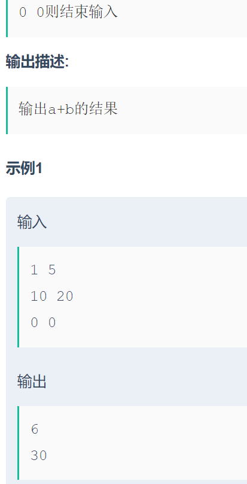

```c
#include <bits/stdc++.h>

using namespace std;

int main(){
    int a,b;
    while((cin>>a>>b)&&!(a==0&&b==0)){
        cout<<a+b<<endl;
    }
}
```

------

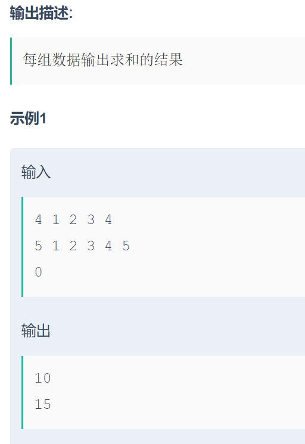

```c
#include <bits/stdc++.h>
using namespace std;
int nums[105];

int main(){
    int n;
    while(1){
        cin>>n;
        if(n==0)break;
        int res=0;
        while(n--){
            int a;
            cin>>a;
            res+=a;
        }
        cout<<res<<endl;
    }
}
```

------

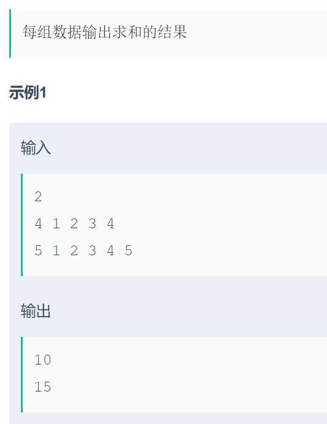

```c
#include <bits/stdc++.h>
using namespace std;

int main(){
    int n1;
    cin>>n1;
    while(n1--){
        int n2;
        cin>>n2;
        int res=0;
        while(n2--){
            int num;
            cin>>num;
            res+=num;
        }
        cout<<res<<endl;
    }
}
```

------

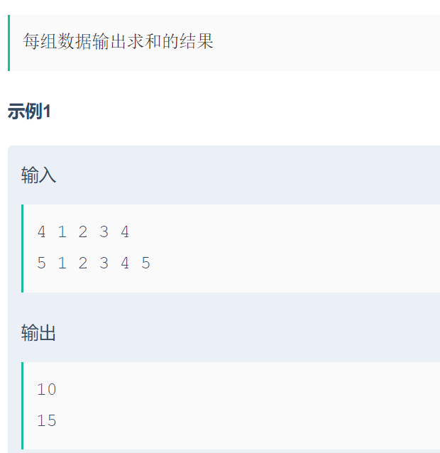

```c
#include <bits/stdc++.h>
using namespace std;

int main(){
    int n1;
    while(cin>>n1){
        int res=0;
        while(n1--){
            int num;
            cin>>num;
            res+=num;
        }
        cout<<res<<endl;
    }
}
```

------

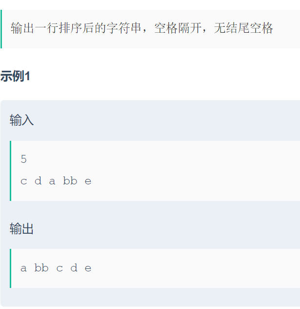

```c
#include <bits/stdc++.h>
using namespace std;

int main(){
    int n;
    cin>>n;
    vector<string>strs(n);
    for(int i=0;i<n;i++){
        cin>>strs[i];
    }
    sort(strs.begin(),strs.end());
    for(int i=0;i<n;i++)cout<<strs[i]<<' ';
}
```

------

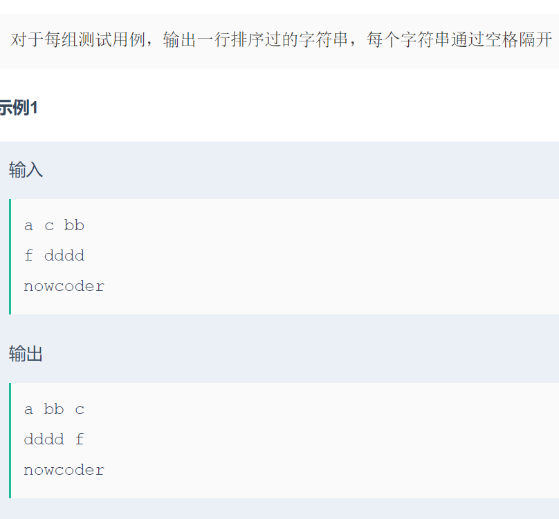

```c
#include <bits/stdc++.h>
using namespace std;

int main(){
    vector<string>strs;
    string str;
    while(cin>>str){
        strs.push_back(str);
        if(cin.get()=='\n'){
            sort(strs.begin(),strs.end());
            for(int i=0;i<strs.size();i++)cout<<strs[i]<<' ';
            cout<<endl;
            strs.clear();
        }
    }
}
```

------

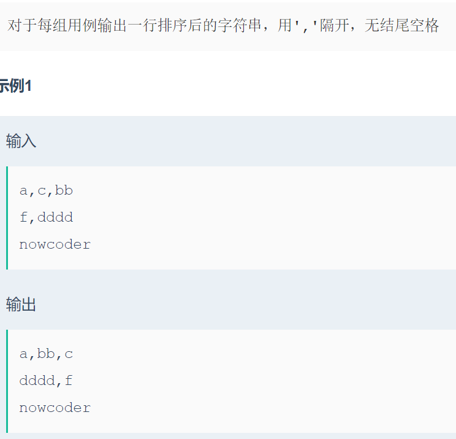

```c
#include <bits/stdc++.h>
using namespace std;

int main(){
    vector<string>strs;
    string str;
    string line;
    while(getline(cin,line)){
        stringstream ss(line);
        while(getline(ss,str,',')){
            strs.push_back(str);
        }
        sort(strs.begin(),strs.end());
        for(int i=0;i<strs.size();i++){
            cout<<strs[i];
            if(i!=strs.size()-1)cout<<',';
        }
        cout<<endl;
        strs.clear();
    }

}
```

------

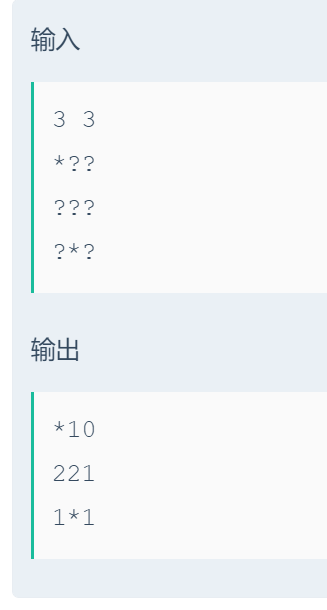

```c
#include<iostream>
using namespace std;
int m,n;
char a[101][101];
int main() {
    cin >> m >> n;
    for (int i = 0; i < m; i++) {
        for (int j = 0; j < n; j++) {
            cin >> a[i][j];
        }
    }
    for (int i = 0; i < m; i++) {
        for (int j = 0; j < n; j++) {
            cout << a[i][j];
        }
        cout << endl;
    }
    return 0;
}
```

------

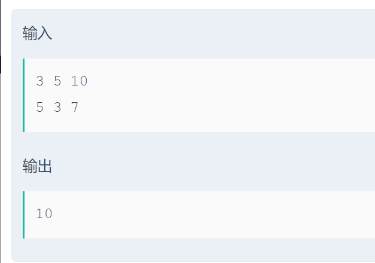

```c
#include<iostream>
using namespace std;
const int N = 1010;
const int M = 60;
bool f[M][N];
int n, st, maxl;
int main()
{
    cin >> n >> st >> maxl;
    f[0][st] = true;
    for(int i = 1;i<= n;i++)
    {
        int x;
        cin >> x;
    }
    for(int i = maxl;i >= 0;i--) if(f[n][i] == true)
    {
        cout << i << endl;
        return 0;
    }
    return 0;
}
```

------

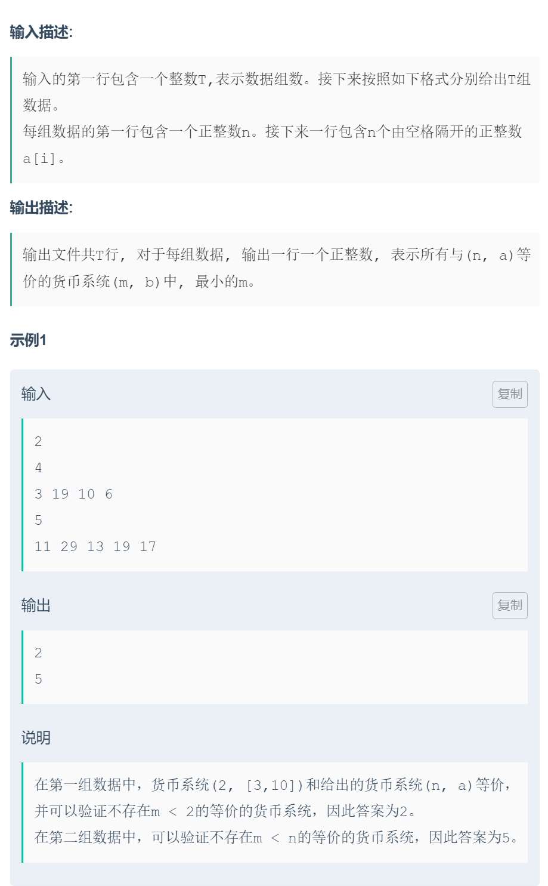

```c
#include <bits/stdc++.h>
using namespace std;
int a[30020];
int f[30020];
int t;
int n,m;
int ans;
int main(){
    cin>>t;
    while(t--){
     	ans=0;
        cin>>n;
        m=0;
        memset(f,0,sizeof f);
        for(int i=1;i<=n;i++){
            cin>>a[i];
            m=max(m,a[i]);
        }
		cout<<ans<<endl;
    }
}
```

------

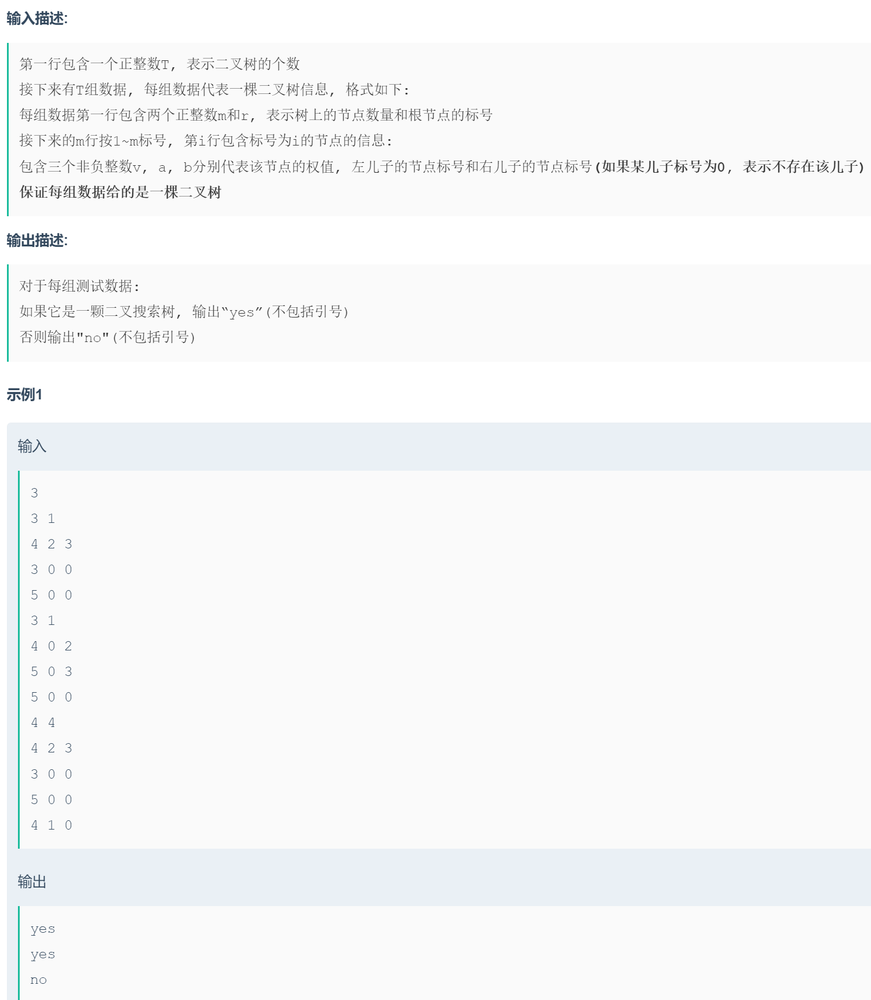

```c
#include<bits/stdc++.h>
using namespace std;
 
int T,n,root;
int l[80010], r[80010], w[80010];
vector<int>vec;
void dfs(int rt)
{
    if (!rt) return;
    dfs(l[rt]);
    vec.push_back(w[rt]);
    dfs(r[rt]);
}
int main()
{
    cin >> T;
    while (T--)
    {
        cin >> n >> root;
        vec.clear();
        for (int i=1;i<=n;i++) cin >> w[i] >> l[i] >> r[i];
        dfs(root);
        bool flag=0;
        for (int i=1;i<vec.size();i++) if (vec[i]<vec[i-1]) {flag=1;break;}
        if (flag==1) cout<<"no"<<endl;
        else cout<<"yes"<<endl;
    }
    return 0;
}
```

------

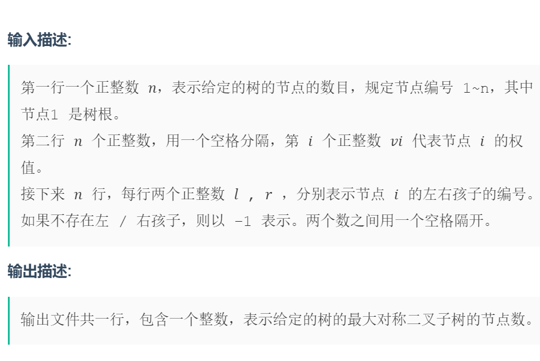

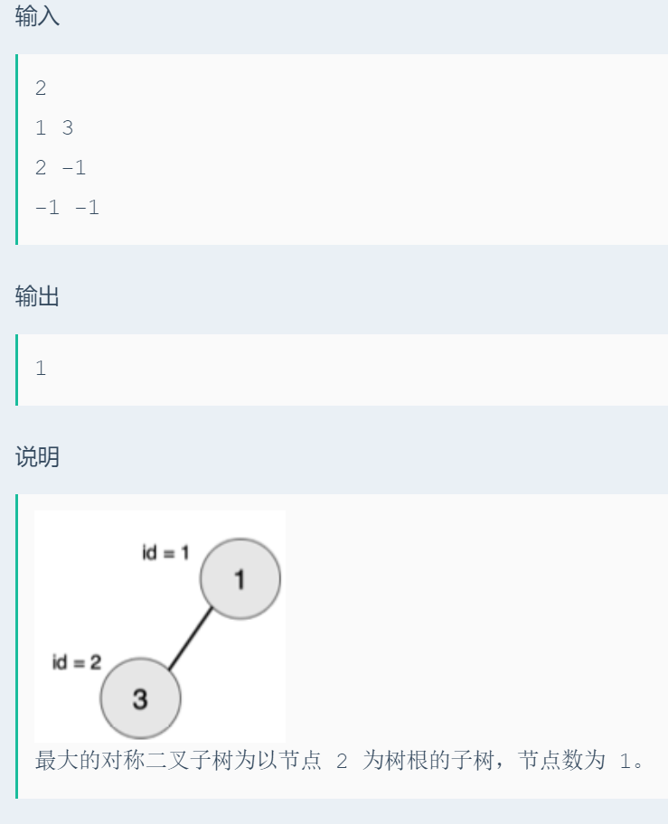

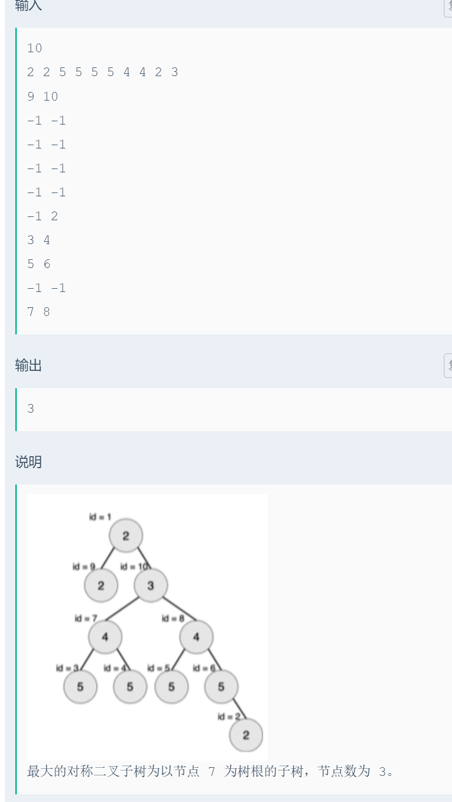

```c
#include<iostream>
using namespace std;
const int SIZE=1000001;
int l[SIZE],r[SIZE],val[SIZE],maxn=1,sum=1;
bool tree(int x,int y)
{
    if(x==-1&&y==-1)
    return 1;
    if(x==-1||y==-1||val[x]!=val[y])
    return 0;
    sum+=2;
    return (tree(l[x],r[y])&&tree(l[y],r[x]));
}
int main()
{
    int n;
    cin>>n;
    for(int i=1;i<=n;i++)
    cin>>val[i];
    for(int i=1;i<=n;i++)
    cin>>l[i]>>r[i];
    for(int i=1;i<=n;i++)
    {
        sum=1;
        if(tree(l[i],r[i])&&sum>maxn)
        maxn=sum;
    }
    cout<<maxn;
    return 0;
}
```

------

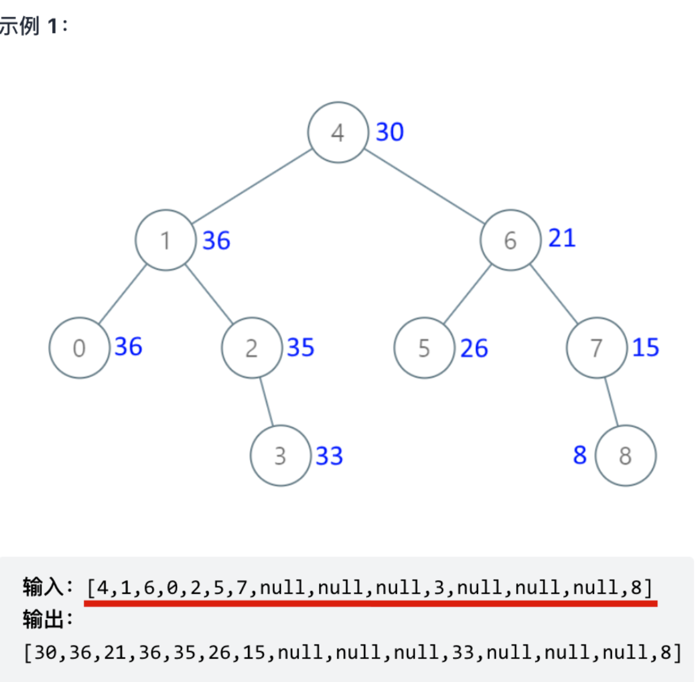

```c
#include <bits/stdc++.h>
using namespace std;

struct TreeNode
{
    int val;
    TreeNode *left;
    TreeNode *right;
    TreeNode(int x) : val(x), left(nullptr), right(nullptr) {}
};

TreeNode *build(vector<int> &vec)
{
    int n=vec.size();
    vector<TreeNode*>vecTree(n,nullptr);
    TreeNode*root;
    for(int i=0;i<n;i++){
        TreeNode*cur=nullptr;
        if(vec[i]!=-1)cur=new TreeNode(vec[i]);
        vecTree[i]=cur;
        if(i==0)root=cur;
    }
    for(int i=0;i*2+2<n;i++){
        if(vecTree[i]!=nullptr){
            vecTree[i]->left=vecTree[i*2+1];
            vecTree[i]->right=vecTree[i*2+2];
        }
    }
    return root;
}

void print(TreeNode*root){
    queue<TreeNode*>que;
    if(root)que.push(root);
    while(que.empty()==false){
        for(int i=que.size();i>0;i--){
            TreeNode*cur=que.front();que.pop();
            cout<<cur->val<<' ';
            if(cur->left)que.push(cur->left);
            if(cur->right)que.push(cur->right);
        }
        cout<<endl;
    }
}

int main()
{
    // 注意本代码没有考虑输入异常数据的情况
    // 用 -1 来表示null
    vector<int> vec = {4, 1, 6, 0, 2, 5, 7, -1, -1, -1, 3, -1, -1, -1, 8};
    TreeNode *root = build(vec);
    print(root);
}
```

------

```c
#include <bits/stdc++.h>
using namespace std;

struct ListNode
{
    int val;
    ListNode *next;
    ListNode(int x) : val(x), next(nullptr) {}
};

ListNode *build(vector<int>&vec){
    int n=vec.size();
    ListNode*dummy=new ListNode(-1);
    ListNode*cur=dummy;
    for(int i=0;i<n;i++){
        cur->next=new ListNode(vec[i]);
        cur=cur->next;
    }
    ListNode*head=dummy->next;
    delete dummy;
    return head;
}

void print(ListNode *head){
    while(head){
        cout<<head->val<<' ';
        head=head->next;
    }
}

int main(){
    vector<int>vec={1,2,3,4};
    ListNode*head=build(vec);
    print(head);
}
```

