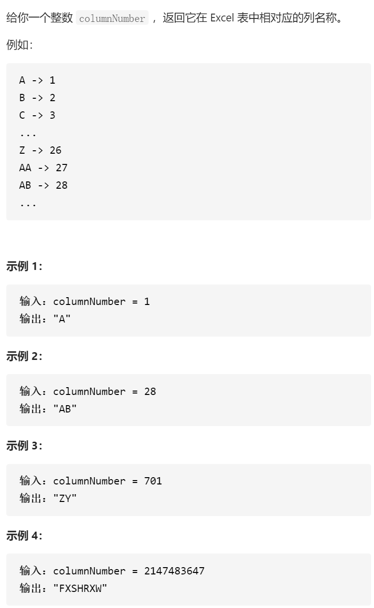

Excel表列名称



变量简洁正确完整思路

26进制，先不管[1,26]，%26更新答案/26直到为0

```c
class Solution {
public:
    string convertToTitle(int columnNumber) {
        string ans;
        while(columnNumber){
            --columnNumber;
            ans.push_back(columnNumber%26+'A');
            columnNumber/=26;
        }
        reverse(ans.begin(),ans.end());
        return ans;
    }
};
```

