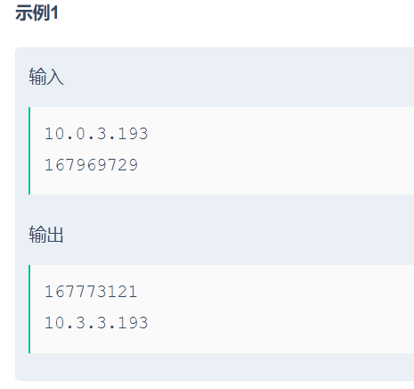

```c

//膜拜顶楼位运算大佬
#include<bits/stdc++.h>
using namespace std;
int main()
{
    string str;
    while(cin>>str)
    {
        //integer
       if(str.find('.')==-1)
       {
           long long num = stoll(str,0,10);
           cout<<num/256/256/256<<"."<<(num%(256*256*256))/256/256
               <<"."<<(num%(256*256))/256<<"."<<num%256<<endl;
       }
        //a.b.c.d
        else 
        {
            long long a,temp=0;
            vector<int> nums;
            while(str.find('.')!=-1)
            {
                int pos0 = str.find('.');
                nums.push_back(stoi(str.substr(0,pos0),0,10));
                str = str.substr(pos0+1);
            }
            nums.push_back(stoi(str,0,10));
            for(int i:nums)
                temp=temp*256+i;
            cout<<temp<<endl;
        }
    }
    return 0;
}
```

