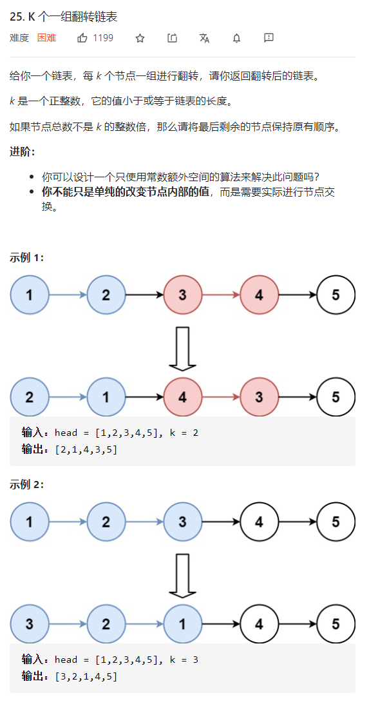
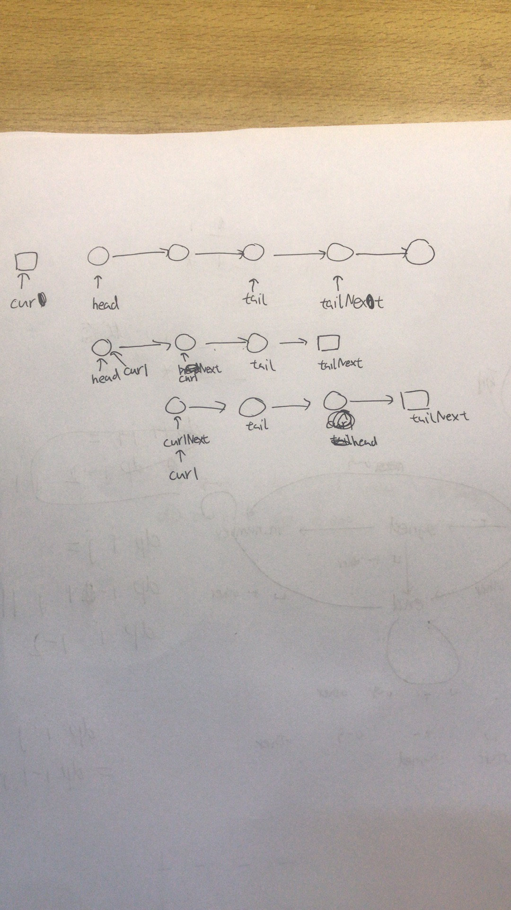

K个一组翻转链表

答案

详细思路遍历当前节点，找出尾节点头结点，翻转，接上翻转后的链表，移动当前节点，怎么翻转，保存cur1Next，建立tailNext节点，cur1指向tail->next，tail指向cur1，cur1回到cur1Next，重复直到cur1指向tail，
精确定义cur已经翻转好的节点head cur之后一个tail最后一个翻转节点tailNextdummycur1正在翻转的节点
画图

```cc

class Solution {
public:
    ListNode* reverseKGroup(ListNode* head, int k) {
        ListNode*dummy=new ListNode(0,head);
        ListNode*cur=dummy;
        while(1){
            ListNode*tail=cur;
            for(int i=0;i<k;i++){
                tail=tail->next;
                if(!tail)return dummy->next;
            }
            ListNode*head=cur->next;
            ListNode*tailNext=tail->next;
            tie(head,tail)=myReverse(head,tail);
            cur->next=head;
            tail->next=tailNext;
            cur=tail;
        }
        return dummy->next;
    }
    pair<ListNode*,ListNode*>myReverse(ListNode*head,ListNode*tail){
        ListNode*tailNext=new ListNode(0);
        tail->next=tailNext;
        ListNode*cur1=head;
        while(cur1!=tail){
            ListNode*cur1Next=cur1->next;
            cur1->next=tail->next;
            tail->next=cur1;
            cur1=cur1Next;
        }
        return {tail,head};
    }
};
```

踩过的坑

链表一定要画图