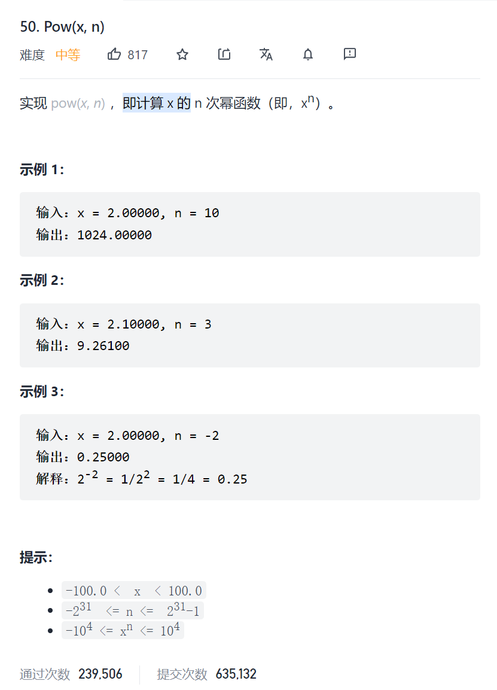

```c
class Solution {
public:
    double myPow(double x, int n) {
        bool isNegative=false;
        if(n==INT_MIN){
            n++;
            x*=x;
        }
        if(n<0){
            isNegative=true;
            n=-n;
        }
        if(x<0&&n%2==0)x=-x;
        double ans=dfs(x,n);
        if(isNegative)return 1.0/ans;
        else return ans;
    }
    double dfs(double x,int n){
        if(n==0)return 1;
        double ansX=x,nowN=1;
        while(nowN+nowN<=n){
            ansX*=ansX;
            nowN*=2;
        }
        return ansX*dfs(x,n-nowN);
    }
};
```

