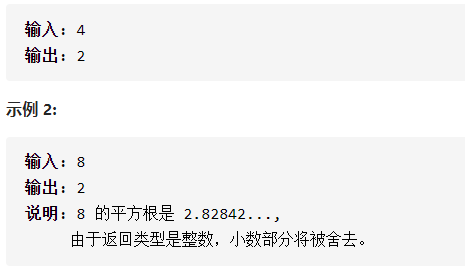
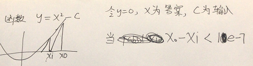

x的平方根详细思路

二分，找到中间，比较mid*mid和x，如果mid*mid<=x并且mid+1*mid+1>x答案，退出

精确定义

left第一个数

right最后一个数

mid需要判断

```c

class Solution {
public:
    int mySqrt(int x) {
        int left=1,right=x,ans=0;
        while(left<=right){
            int mid=left+(right-left)/2;
            if(mid<=x/mid&&(mid+1)>x/(mid+1)){
                ans=mid;
                break;
            }
            else if(mid<x/mid)left=mid+1;
            else right=mid-1;
        }
        return ans;
    }
};
```


踩过的坑，要么longlong要么乘法变成除法

x/mid

```c
class Solution {
public:
    int mySqrt(int x) {
        int left=1,right=x,ans=0;
        while(left<=right){
            int mid=left+(right-left)/2;
            if((long long)mid*mid<=x&&(long long)(mid+1)*(mid+1)>x){
                ans=mid;
                break;
            }
            else if((long long)mid*mid<x)left=mid+1;
            else right=mid-1;
        }
        return ans;
    }
};

```

fabs求浮点绝对值，abs求整数绝对值

牛顿迭代法是二次收敛的

画图



详细定义

xi为当前需要判断，x0为上一个接近的点，通过切线算出xi，如果x0-xi<1e-7（一个极小的非负数），就可以认为x0的整数部分就是答案

```c
class Solution {
public:
    int mySqrt(int x) {
        if(x==0)return 0;
        double x0=x,c=x;
        while(1){
            double xi=(c/x0+x0)/2.0;
            if(x0-xi<1e-7)break;
            x0=xi;
        }
        return (int)x0;
    }
};
```

