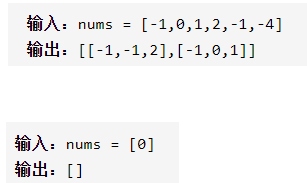

三数之和

输入数组找到三个整数和为0输出



详细思路

sort，找到第一个数，从右边两边往中间找第二第三个数，大了right减一小了left加一，去重+剪枝

精确定义

i第一个元素

left第二个元素

right第三个元素

ans所有满足的数组


```c

class Solution {
public:
    vector<vector<int>> threeSum(vector<int>& nums) {
        vector<vector<int>>ans;
        if(nums.size()<3)return ans;
        sort(nums.begin(),nums.end());
        for(int i=0;i<nums.size()-2;i++){
            if(i-1>=0&&nums[i]==nums[i-1])continue;
            if(nums[i]+nums[i+1]+nums[i+2]>0)continue;
            if(nums[i]+nums[nums.size()-2]+nums[nums.size()-1]<0)continue;
            int left=i+1,right=nums.size()-1;
            while(left<right){
                if(left-1>=i+1&&nums[left]==nums[left-1]){
                    left++;
                    continue;
                }
                else if(right+1<=nums.size()-1&&nums[right]==nums[right+1]){
                    right--;
                    continue;
                }
                if(nums[left]+nums[right]+nums[i]==0){
                    ans.push_back({nums[i],nums[left],nums[right]});
                    left++;
                    right--;
                }
                else if(nums[left]+nums[right]+nums[i]<0)left++;
                else if(nums[left]+nums[right]+nums[i]>0)right--;
            }
        }
        return ans;
    }
};
```


