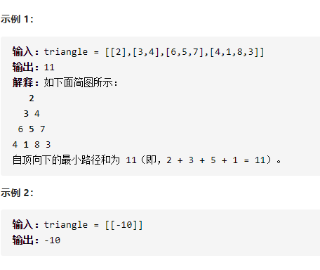

三角形最小路径和



详细思路

具有某种递推关系，如果可以的话直接在原三角形上修改，问面试官

精确定义

dpij 从最底层到达下标ij的最小值，dpn-1 n-1是最底层dp00是第一层

转移

2

3 4

6 5 7 

4 1 8 3

dpij=val+min(dpi+1 j, dp i+1 j+1)

初始化

dp n-1 i=val

```c
class Solution {
public:
    int minimumTotal(vector<vector<int>>& triangle) {
        int n=triangle.size();
        for(int i=n-2;i>=0;i--){
            for(int j=0;j<=i;j++){
                triangle[i][j]+=min(triangle[i+1][j],triangle[i+1][j+1]);
            }
        }
        return triangle[0][0];
    }
};
```

