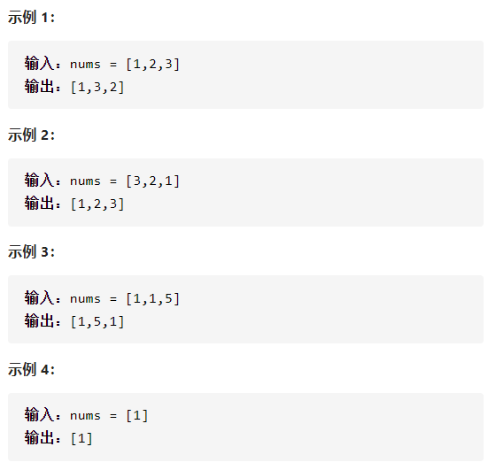

下一个排列

实现next_permutation



详细思路

就是找到一个大于当前序列，且变大幅度最小，也就是左边的较小数尽可能靠右，右边的较大数尽可能小，从后往前找到第一个顺序对，为i，i+1，这样i后面都是递减的，从后往前找到一个第一个比i大的数，交换，让数组变大，对原来i之后的元素翻转，让数组变大幅度最小，如果找不到顺序对，说明已经是递减的，最大的序列，直接翻转

精确定义

i从右往左第一个升序需要判断

j从右往左第一个大于i

left 需要翻转子串的第一个元素

```c
class Solution {
public:
    void nextPermutation(vector<int>& nums) {
        if(nums.size()<2)return;
        int i=nums.size()-2;
        while(i>=0&&nums[i]>=nums[i+1]){
            i--;
            if(i<0){
                reverse(nums.begin(),nums.end());
                return ;
            }
        }
        int j=nums.size()-1;
        while(nums[j]<=nums[i])j--;
        int temp=nums[i];
        nums[i]=nums[j];
        nums[j]=temp;
        int left=i+1,right=nums.size()-1;
        reverse(nums.begin()+i+1,nums.end());
    }
};
```

踩过的坑

​    while(i>=0&&nums[i]>=nums[i+1]){

第一个顺序对不能是相同如1221找12而不是22