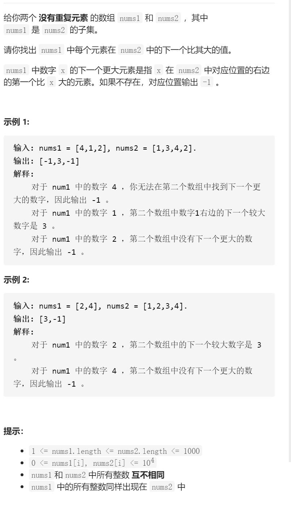
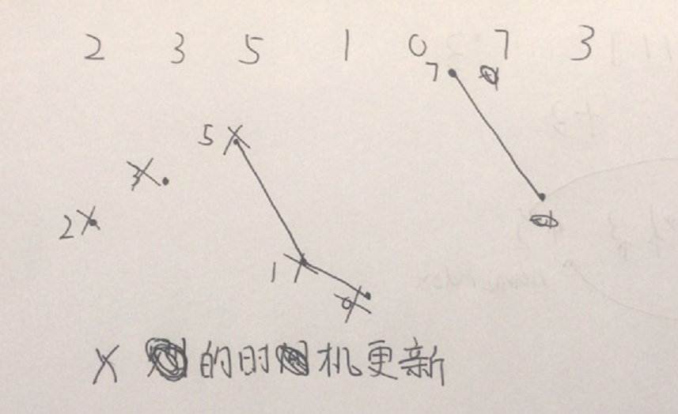

下一个更大元素I

抽象图固定维护寻找

单调栈，单调递减，遇到小的先push等到遇见大的了pop的时机就是更新答案的时机，



```c
class Solution {
public:
    vector<int> nextGreaterElement(vector<int>& nums1, vector<int>& nums2) {   
        int n=nums1.size();
        unordered_map<int,int>num2index;
        for(int i=0;i<n;i++)num2index[nums1[i]]=i;
        vector<int>ans(n,-1);
        stack<int>stk;
        int m=nums2.size();
        for(int i=0;i<m;i++){
            while(!stk.empty()&&stk.top()<nums2[i]){
                int num=stk.top();stk.pop();
                if(num2index.count(num)){
                    ans[num2index[num]]=nums2[i];
                }
            }
            stk.push(nums2[i]);
        }
        return ans;
    }
};
```

