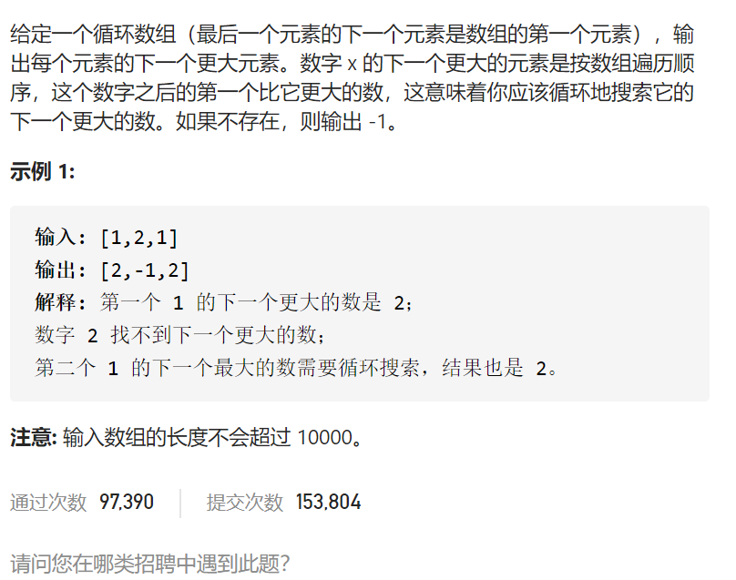
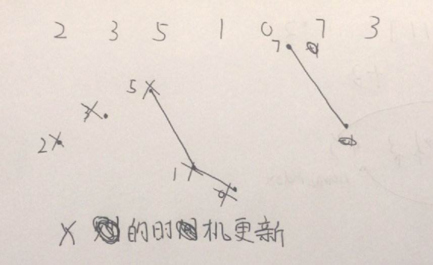
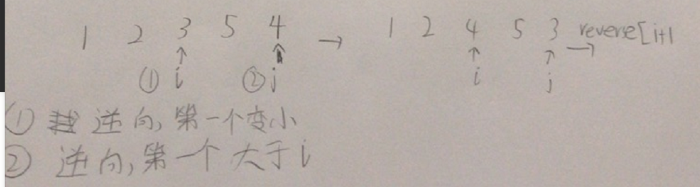

下一个更大元素II

抽象图固定维护寻找

单调栈，单调递减，遇到小的先push等到遇见大的了pop的时机就是更新答案的时机，循环数组应该多遍历一遍i<2*n-1



```c
class Solution {
public:
    vector<int> nextGreaterElements(vector<int>& nums) {
        int n=nums.size();
        vector<int>ans(n,-1);
        stack<int>indexs;
        int cnt=0;
        for(int i=0;i<2*n-1;i++){
            while(!indexs.empty()&&nums[indexs.top()]<nums[i%n]){
                int index=indexs.top();indexs.pop();
                ans[index]=nums[i%n];
            }
            indexs.push(i%n);
        }
        return ans;
    }
};
```

踩过的坑

单调栈存储下标要好过值，下标可以找到对应值，值可能会重复而且需要哈希映射下标

抽象图一二ij

就是找到一个大于当前序列，且变大幅度最小，也就是左边的较小数尽可能靠右，右边的较大数尽可能小，从后往前找到第一个顺序对，为i，i+1，这样i后面都是递减的，从后往前找到一个第一个比i大的数，交换，让数组变大，对原来i之后的元素翻转，让数组变大幅度最小

```c
class Solution {
public:
    int nextGreaterElement(int n) {
        string num=to_string(n);
        int size=num.size();
        int i=size-2;
        while(i>=0&&num[i]>=num[i+1])i--;
        if(i==-1)return -1;
        int j=size-1;
        while(j>i&&num[j]<=num[i])j--;
        swap(num[i],num[j]);
        reverse(num.begin()+i+1,num.end());
        long tmpNum=stol(num);
        if(tmpNum>INT_MAX)return -1;
        return stoi(num);
    }
};

```

