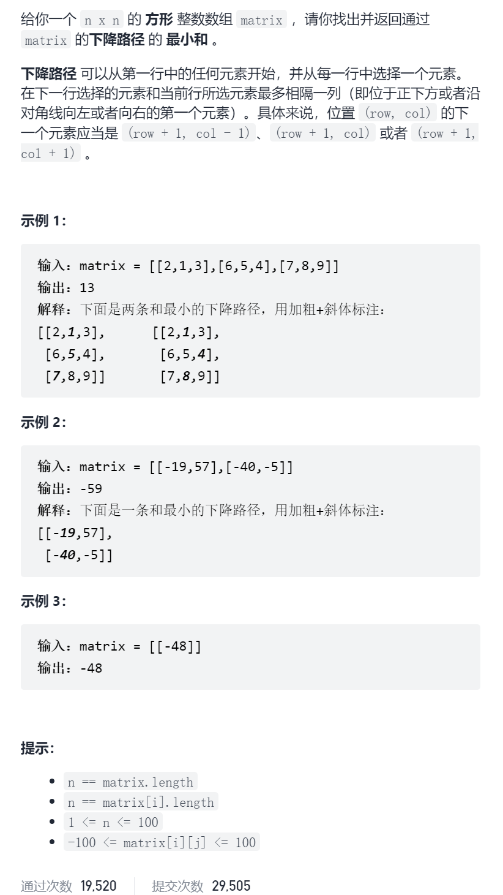
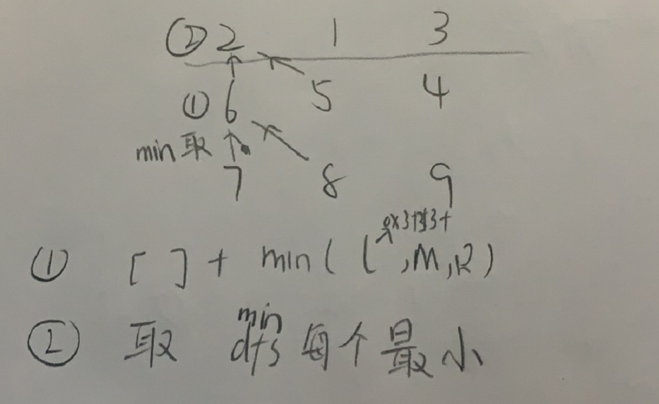

下降路径最小和

抽象图一二ij



```c
class Solution {
public:
    int minFallingPathSum(vector<vector<int>>& matrix) {
        unordered_map<int,int>memo;
        int ans=INT_MAX;
        for(int i=0;i<matrix[0].size();i++){
            ans=min(ans,dfs(0,i,matrix,memo));
        }
        return ans;
    }
    int dfs(int x,int y,vector<vector<int>>&matrix,unordered_map<int,int>&memo){
        if(x==matrix.size())return 0;
        if(memo.count(process(x,y)))return memo[process(x,y)];
        int n=matrix[0].size();
        int ans=matrix[x][y];
        int left=0x3f3f3f3f,right=left,mid=left;
        if(y-1>=0)left=dfs(x+1,y-1,matrix,memo);
        mid=dfs(x+1,y,matrix,memo);
        if(y+1<n)right=dfs(x+1,y+1,matrix,memo);
        ans+=min(min(left,mid),right);
        memo[process(x,y)]=ans;
        return ans;
    }
    int process(int x,int y){
        return (1<<15)*x+y;
    }
};


class Solution {
public:
    int minFallingPathSum(vector<vector<int>>& matrix) {
        int n=matrix.size(),m=matrix[0].size();
        vector<vector<int>>dp(n+1,vector<int>(m,0));
        for(int i=n-1;i>=0;i--){
            for(int j=0;j<m;j++){
                int ans=matrix[i][j];
                int left=0x3f3f3f3f,right=left,mid=left;
                if(j-1>=0)left=dp[i+1][j-1];
                mid=dp[i+1][j];
                if(j+1<m)right=dp[i+1][j+1];
                ans+=min(min(left,mid),right);
                dp[i][j]=ans;
            }
        }
        int ans=INT_MAX;
        for(int i=0;i<m;i++){
            ans=min(ans,dp[0][i]);
        }
        return ans;
    }
};
```

