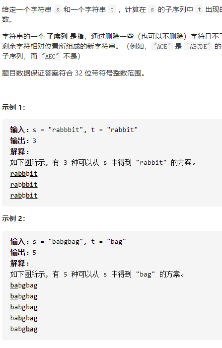

不同的子序列



详细思路

dpij具有某种递推关系

精确定义

dpij s前i个和t前j个，t的前j个在s的前i个有多少种方案，dp00是空字符，dp11是第一个

转移

\- - - a

\- - a dpij=dpi-1 j不适用这个a来匹配下面的a，方案数取决于前面 + dpi-1 j-1使用a来匹配a，方案数取决于前面

\- - - a

\- - b dpij =dp i-1 j 不使用a来匹配b，方案数取决于前面

初始化

dp 00空=1

a

a b

dp 12=dp 02=0  dp0i=0

a a

a

dp 2 1=dp 1 0+dp1 1=1+1   dpi 0=1

```c
class Solution {
public:
    int numDistinct(string s, string t) {
        int n=s.size(),m=t.size();
        vector<vector<long long>>dp(n+1,vector<long long>(m+1,0));
        for(int i=0;i<=n;i++)dp[i][0]=1;
        for(int i=1;i<=n;i++){
            for(int j=1;j<=m;j++){
                if(s[i-1]==t[j-1]){
                    dp[i][j]=dp[i-1][j]+dp[i-1][j-1];
                    if(dp[i][j]>INT_MAX)dp[i][j]=0;
                }
                else if(s[i-1]!=t[j-1])dp[i][j]=dp[i-1][j];
            }
        }
        return dp[n][m];
    }
};
```


踩过的坑

leetcode上sizeof(long)=sizeof(long long)=8

