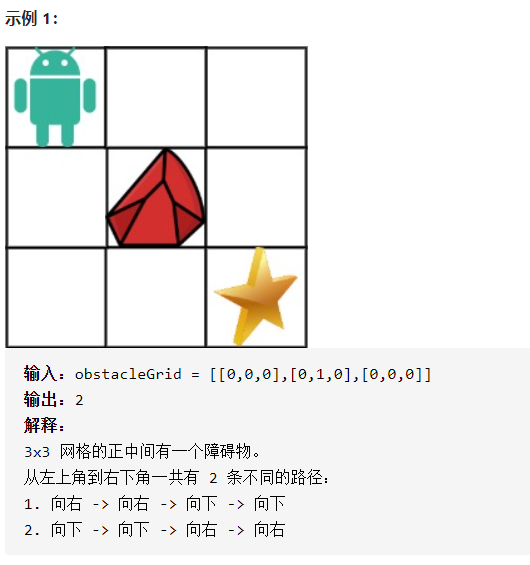

不同路径II



详细思路

dpij具有某种递推关系

精确定义

dp ij dp00为第一行第一列，从下标00到下标ij路线数

递推

0 0 0

0 1 0

0 0 0  dp[i][j]=0（如果1） dp[i][j]=dp[i-1][j]+dp[i][j-1]

初始化 

如果为0，dp0 0=1 dpi 0=1 dp0 i=1 

```c
class Solution {
public:
    int uniquePathsWithObstacles(vector<vector<int>>& obstacleGrid) {
        if(obstacleGrid[0][0]==1)return 0;
        int n=obstacleGrid.size(),m=obstacleGrid[0].size();
        vector<vector<int>>dp(n,vector<int>(m,0));
        for(int i=0;i<n;i++){
            if(obstacleGrid[i][0]==0)dp[i][0]=1;
            else break;
        }
        for(int i=1;i<m;i++){
            if(obstacleGrid[0][i]==0)dp[0][i]=1;
            else break;
        }
        for(int i=1;i<n;i++){
            for(int j=1;j<m;j++){
                if(obstacleGrid[i][j]==0)dp[i][j]=dp[i-1][j]+dp[i][j-1];
            }
        }
        return dp[n-1][m-1];
    }
};
```

