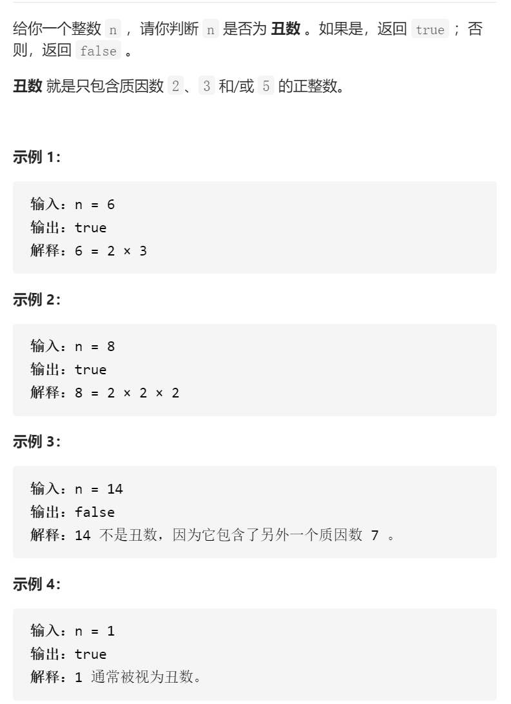

丑数

变量简洁正确完整思路

《0返回，n%==0就n/= 先5，直到不行了换个3

```c
class Solution {
public:
    bool isUgly(int n) {
        if(n<=0)return false;
        int nums[3]={5,3,2};
        for(int i=0;i<3;i++){
            while(n%nums[i]==0)n/=nums[i];
        }
        if(n==1)return true;
        else return false;
    }
};
```

