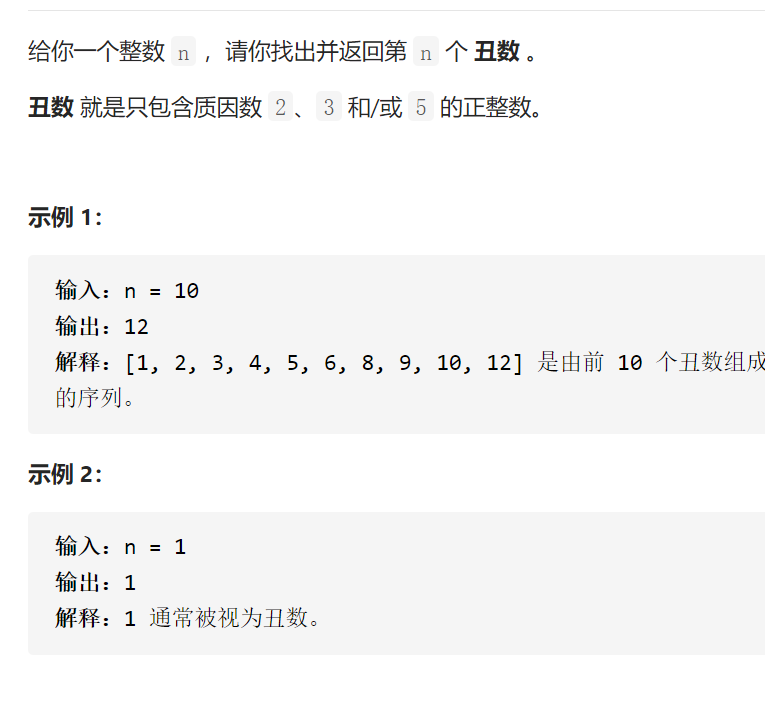

丑数II



变量简洁正确完整思路

最小堆，放入1，取出n次，每取出一次num放入num*235插入，哈希集与最小堆同步防止重

```c
class Solution {
public:
    int nthUglyNumber(int n) {
        priority_queue<int,vector<int>,greater<int>>q;
        unordered_set<int>seen;
        vector<int>nums({2,3,5});
        q.push(1);
        seen.insert(1);
        int ans=0;
        for(int i=0;i<n;i++){
            ans=q.top();q.pop();
            for(int num:nums){
                if(ans<=INT_MAX/num&&!seen.count(ans*num)){
                    q.push(ans*num);
                    seen.insert(ans*num);
                }
            }
        }
        return ans;
    }
};

```


踩过的坑

   priority_queue<int,vector<int>,greater<int>>q;

ans<=INT_MAX/num&&!seen.count(ans*num)

变量简洁正确完整思路

dp i是第i个最小的丑树，dp0是1

p2 p3 p5是i之前，还没被i用过的丑树，dpp2*2 dpp3*3 dpp5*5是一定会被用到的，

一旦被dpi用到，p++

转移

1 2 3 4 5 6 8 9 10 12

dp i=min  dpp2*2  dpp3*3  dpp5*5

初始化

dp0=1 

p2p3p5=0

```c
class Solution {
public:
    int nthUglyNumber(int n) {
        vector<int>dp(n,0);
        dp[0]=1;
        int p2=0,p3=0,p5=0;
        for(int i=1;i<n;i++){
            int num2=dp[p2]*2,num3=dp[p3]*3,num5=dp[p5]*5;
            dp[i]=min(min(num2,num3),num5);
            if(dp[i]==num2)p2++;
            if(dp[i]==num3)p3++;
            if(dp[i]==num5)p5++;
        }
        return dp[n-1];
    }
};
```

