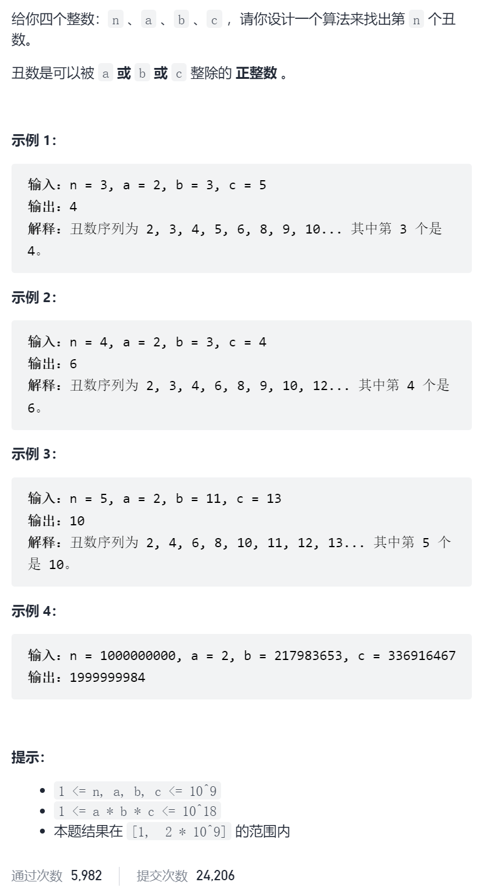
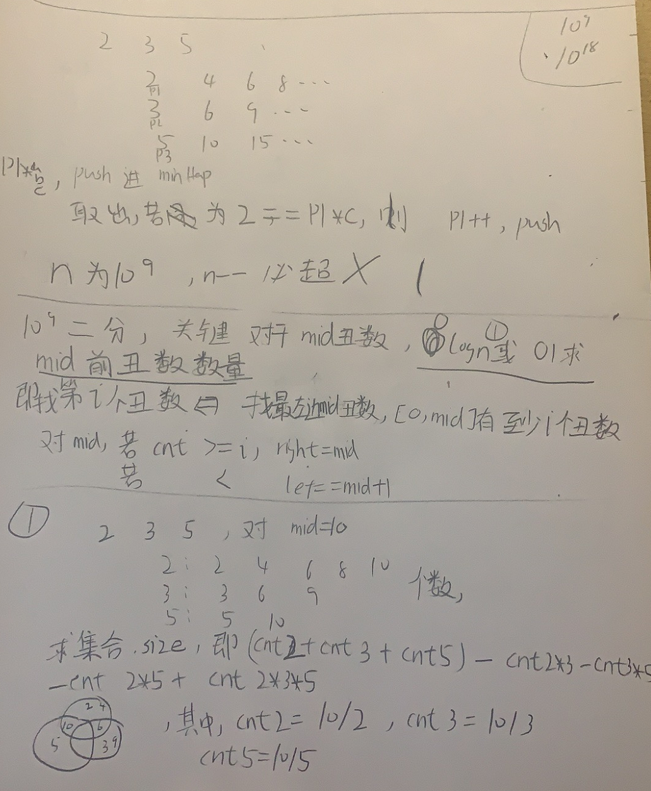

丑数III

抽象图一二ij



```c
#define ll long long
class Solution {
public:
    int nthUglyNumber(int n, int a, int b, int c) {
        priority_queue<ll,vector<ll>,greater<ll>>minHeap;
        ll p1,p2,p3;
        p1=p2=p3=1;
        minHeap.push(p1*a);
        minHeap.push(p2*b);
        minHeap.push(p3*c);
        n--;
        while(n--){
            ll minNum=minHeap.top();minHeap.pop();
            while(minHeap.top()==minNum)minHeap.pop();
            if(p1*a==minNum)minHeap.push((++p1)*a);
            if(p2*b==minNum)minHeap.push((++p2)*b);
            if(p3*c==minNum)minHeap.push((++p3)*c);
        }
        return minHeap.top();
    }
};


#define ll long long
class Solution {
public:
    int nthUglyNumber(int n, int a, int b, int c) {
        int left=1,right=min(min(a,b),c)*n;
        while(left<right){
            int mid=left+(right-left)/2;
            if(check(mid,a,b,c,n))right=mid;
            else left=mid+1;
        }
        return left;
    }
    bool check(int mid,int a,int b,int c,int n){
        ll cnt=mid/a+mid/b+mid/c-(mid/lcm(a,b)+mid/lcm(a,c)+mid/lcm(b,c))+mid/lcm(lcm(a,b),c);
        if(cnt>=n)return true;
        return false;
    }
    ll lcm(ll a,ll b){
        return a*b/gcd(a,b);
    }
    ll gcd(ll a,ll b){
        if(a==0)return b;
        return gcd(b%a,a);
    }
};
```

