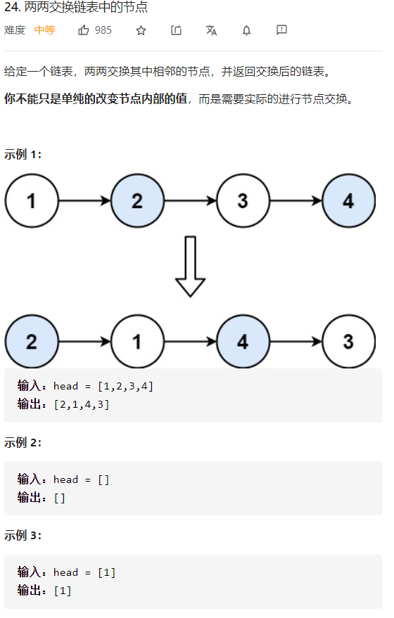

两两交换链表中的节点



详细思路

大于1才用从左到右，每次找到右一右二两个节点，当前节点next指向右二，右一next指向右二的next，右二next指向右一，做完当前节点向右两次，遇到空就不用了

精确定义

cur当前已解决

first右一

second右二

```c
class Solution {
public:
    ListNode* swapPairs(ListNode* head) {
        ListNode*dummy=new ListNode(0,head);
        ListNode*cur=dummy;
        while(cur->next&&cur->next->next){
            ListNode*first=cur->next;
            ListNode*second=first->next;
            cur->next=second;
            first->next=second->next;
            second->next=first;
            cur=cur->next->next;
        }
        return dummy->next;
    }
};
```

踩过的坑

链表遍历一条链表能用一个cur就只用一个cur，cur是已经处理好的