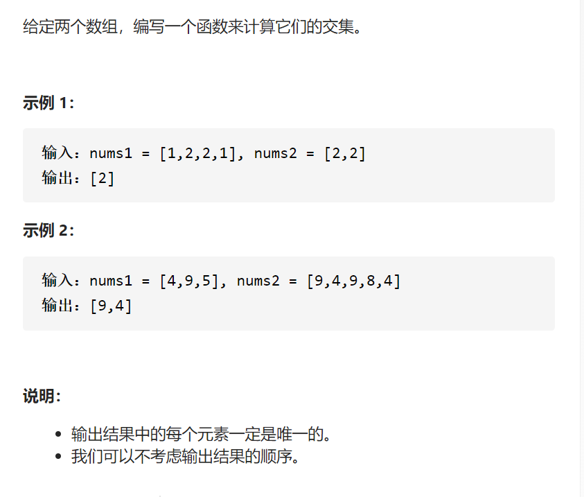

两个数组的交集



变量简洁正确完整思路

unordered_set<int值>mp;保存nums1，遍历nums2，找到就删掉mp并更新ans

```c
class Solution {
public:
    vector<int> intersection(vector<int>& nums1, vector<int>& nums2) {
        unordered_set<int>mp;
        vector<int>ans;
        for(int &num:nums1)mp.insert(num);
        for(int &num:nums2){
            if(mp.count(num)){
                ans.push_back(num);
                mp.erase(num);
            }
        }
        return ans;
    }   
};
```

