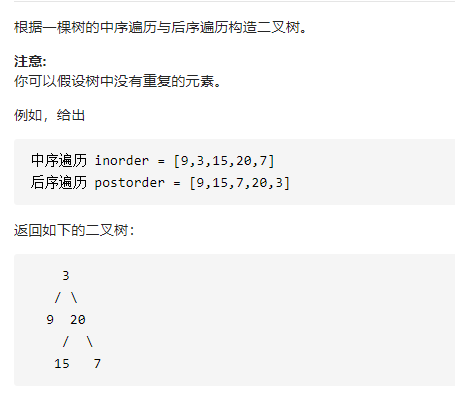

从中序与后序遍历序列构造二叉树



详细思路

dfs，形参left1right1是中序的一整棵树的节点，形参left2right2是后序的一整棵树的节点，

资源inorderpostorderindex，dfs可以生产一整棵树，只需要找到根结点接上递归左子树和递归

右子树，需要找到左子树left1right1left2right2和右子树left1right1left2right2和根结点，后序找到根结点，哈希根结点对应下标找到中序，继续找

精确定义

dfs left1>right1临界返回nullptr

```c
class Solution {
public:
    TreeNode* buildTree(vector<int>& inorder, vector<int>& postorder) {
        int n=inorder.size();
        unordered_map<int,int>index;
        for(int i=0;i<n;i++){
            index[inorder[i]]=i;
        }
        return dfs(0,n-1,0,n-1,inorder,postorder,index);
    }
    TreeNode*dfs(int left1,int right1,int left2,int right2,vector<int>& inorder, vector<int>& postorder,unordered_map<int,int>&index){
        if(left1>right1)return nullptr;
        int rootVal=postorder[right2];
        int rootIndex=index[rootVal];
        int leftTreeLen=rootIndex-left1;
        TreeNode*leftTree=dfs(left1,rootIndex-1,left2,left2+leftTreeLen-1,inorder,postorder,index);
        TreeNode*rightTree=dfs(rootIndex+1,right1,left2+leftTreeLen,right2-1,inorder,postorder,index);
        return new TreeNode(rootVal,leftTree,rightTree);
    }
};

```

