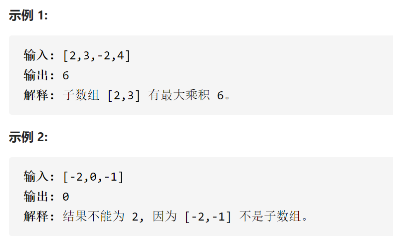

乘积最大子数组



变量简洁正确完整思路

具有某种递推关系dpi，因为遇到负数则前面越小越好，所以维护dp2 i，遇到正数，则前面的越大越好，不要麻烦的ifelse，直接维护dp和dp2，一个最大一个最小

精确定义

dp i 第i个元素结尾连续数组最大乘积，dp0是空，dp1是第一个

dp2 i 第i个元素结尾连续数组最小乘积

递推

1 2 3 4 

dp i =max(num,dp[i-1]*num,dp2[i-1]*num)

-1 -2 -3 -4

dp2 i=min (num,dp[i-1]*num,dp2[i-1]*num)

初始化

dp 0 =0不能很小，不然dp2 1很小，为0正好防止误用，dp1能用num就用num

dp2 0 =0，不能很大，不然dp1 1很大，为0正好防止误用，dp1能用num就用num

```c
class Solution {
public:
    int maxProduct(vector<int>& nums) {
        int n=nums.size();
        if(n==1)return nums[0];
        vector<int>dp(n+1,0);
        vector<int>dp2(n+1,0);
        for(int i=1;i<=n;i++){
            dp[i]=max(nums[i-1],max(dp[i-1]*nums[i-1],dp2[i-1]*nums[i-1]));
            dp2[i]=min(nums[i-1],min(dp[i-1]*nums[i-1],dp2[i-1]*nums[i-1]));
        }
        return *max_element(dp.begin(),dp.end());
    }
};
```

踩过的坑

这道题没有必要dp0是空，dp0完全可以是nums[0]，因为我没有这么做，导致了dp1

没法取负数，因为dp0=0，导致了[-3]额外判断

状态压缩，因为dpi在全在等号左边，dpi-1全在等号右边，非常容易

```c
class Solution {
public:
    int maxProduct(vector<int>& nums) {
        int n=nums.size();
        if(n==1)return nums[0];
        vector<int>dp(2,0);
        vector<int>dp2(2,0);
        int ans=-0x3f3f3f3f;
        for(int i=1;i<=n;i++){
            dp[i%2]=max(nums[i-1],max(dp[(i-1)%2]*nums[i-1],dp2[(i-1)%2]*nums[i-1]));
            ans=max(ans,dp[i%2]);
            dp2[i%2]=min(nums[i-1],min(dp[(i-1)%2]*nums[i-1],dp2[(i-1)%2]*nums[i-1]));
        }
        return ans;
    }
};
```

