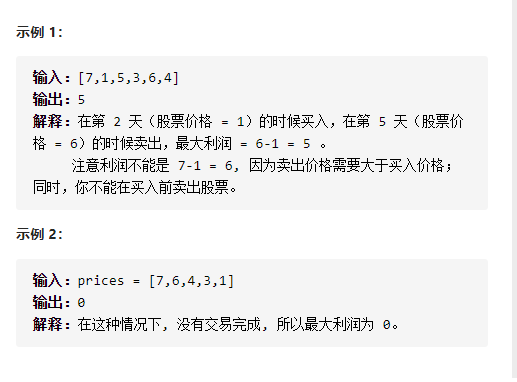
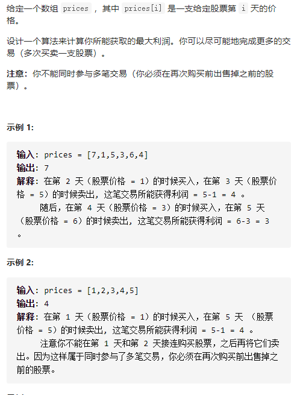
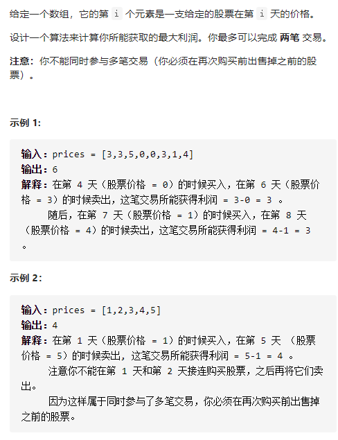
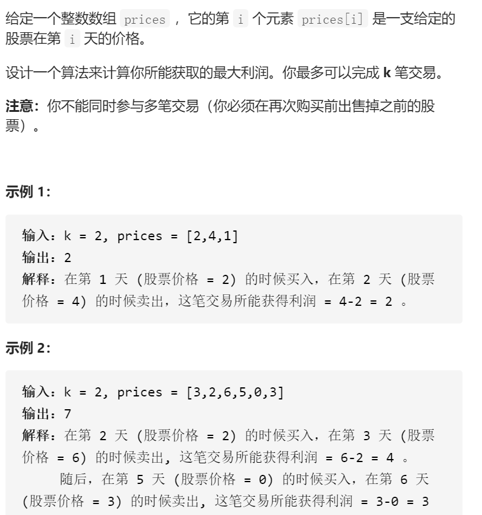
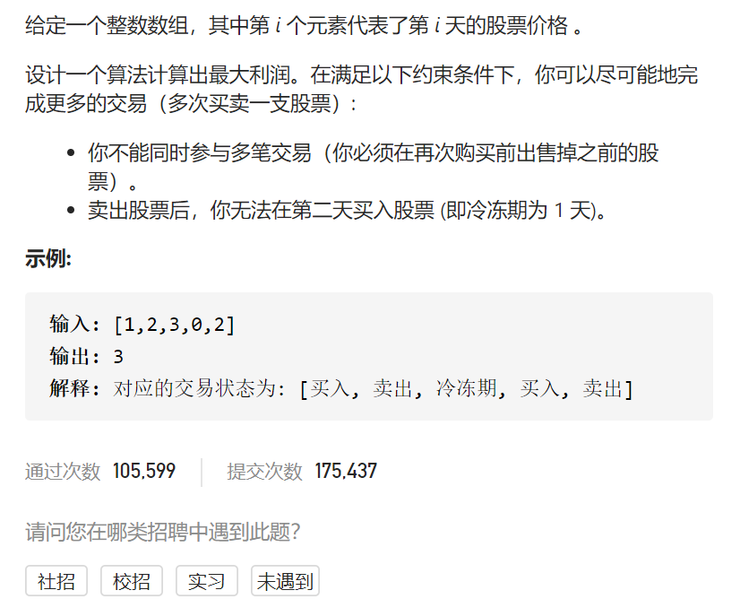
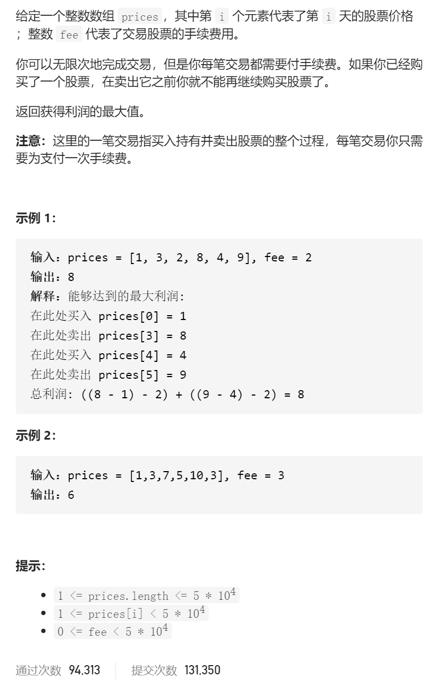
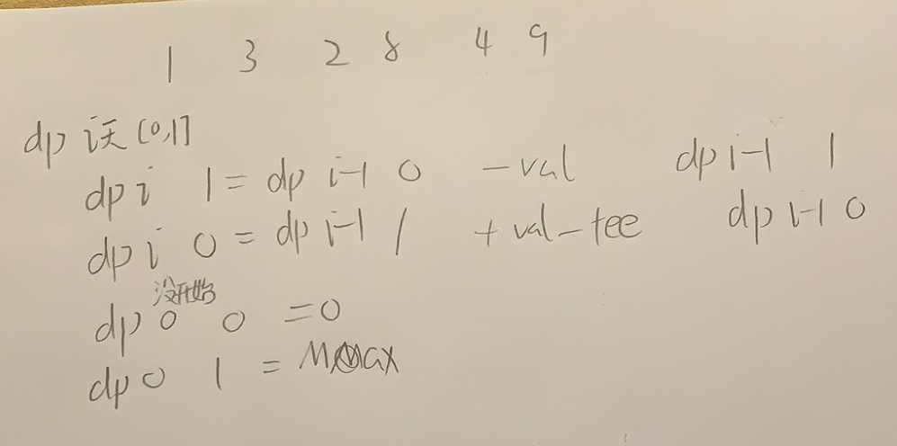
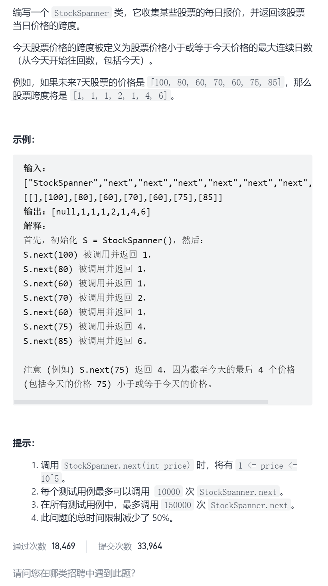
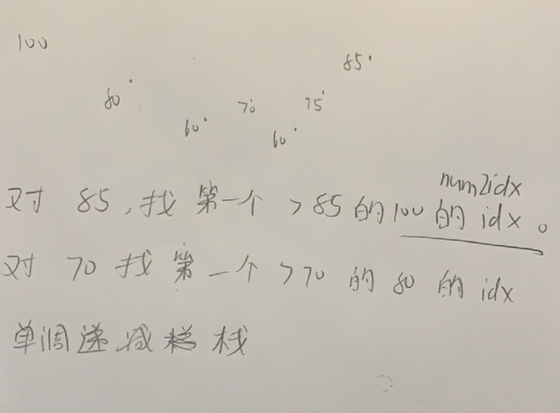

买卖股票的最佳时机



详细思路

只能买一次

精确定义

dpi j第i天，0无股票1有股票，利润最大，dp0是空，dp1是第一天

转移

7 1 5 3 6 4 

dp i 0=max（dp i-1 0,  dp i-1 1 +val )  dpi 1=max(dpi-1 1, -val)

初始化

踩过的坑

只能买一次，所以dpi 1不能从dpi 0过来，否则会多次，而要从-val过来

```c
class Solution {
public:
    int maxProfit(vector<int>& prices) {
        int n=prices.size();
        vector<vector<int>>dp(n+1,vector<int>(2,-0x3f3f3f3f));
        dp[0][0]=0;
        for(int i=1;i<=n;i++){
            dp[i][0]=max(dp[i-1][0],dp[i-1][1]+prices[i-1]);
            dp[i][1]=max(dp[i-1][1],-prices[i-1]);
        }
        return dp[n][0];
    }
};
```


详细思路

状态压缩，把所有i变为i%2，因为只需要i i-1 不需要i-2等等

```c
class Solution {
public:
    int maxProfit(vector<int>& prices) {
        int n=prices.size();
        vector<vector<int>>dp(2,vector<int>(2,-0x3f3f3f3f));
        dp[0][0]=0;
        for(int i=1;i<=n;i++){
            dp[i%2][0]=max(dp[(i-1)%2][0],dp[(i-1)%2][1]+prices[i-1]);
            dp[i%2][1]=max(dp[(i-1)%2][1],-prices[i-1]);
        }
        return dp[n%2][0];
    }
};
```


------

买卖股票的最佳时机II



详细思路

具有某种转移

精确定义

dpij  第i天0无股票1有股票的最大利润，dp0是空dp1是第一天

转移

7 1 5 3 6 4 

dp i 0=max(dp i-1 0,dp i-1 1 +val)

dp i 1=max(dp i-1 1,dp i-1 0 -val)

初始化

dp0 0=0；dp01=INT_MIN

```c
class Solution {
public:
    int maxProfit(vector<int>& prices) {
        int n=prices.size();
        vector<vector<int>>dp(n+1,vector<int>(2,-0x3f3f3f3f));
        dp[0][0]=0;
        for(int i=1;i<=n;i++){
            dp[i][0]=max(dp[i-1][0],dp[i-1][1]+prices[i-1]);
            dp[i][1]=max(dp[i-1][1],dp[i-1][0]-prices[i-1]);
        }
        return dp[n][0];
    }
};
```

状态压缩，只需要i i-1，一维取余2


```c
class Solution {
public:
    int maxProfit(vector<int>& prices) {
        int n=prices.size();
        vector<vector<int>>dp(2,vector<int>(2,-0x3f3f3f3f));
        dp[0][0]=0;
        for(int i=1;i<=n;i++){
            dp[i%2][0]=max(dp[(i-1)%2][0],dp[(i-1)%2][1]+prices[i-1]);
            dp[i%2][1]=max(dp[(i-1)%2][1],dp[(i-1)%2][0]-prices[i-1]);
        }
        return dp[n%2][0];
    }
};
```

------

买卖股票的最佳时机III



详细思路

具有某种递归关系，最多进行几笔用第三维，不可能作为边界的初始化为-0x3f3f3f3f，k次数超过一半就是无数次交易的函数

精确定义

dpijt 第i天0代表还没开始1代表第1天，0无股票1有股票，正在处理第t笔交易，t=0代表最多买入0次，t=1代表最多买入一次

转移

3 3 5 0 0 3 1 4 

一旦买入必须说明t-1，卖出不用管

dp i 0 t=max(dpi-1 0 t , dp i-1 1 t +val)

dp i 1 t=max(dp i-1 1 t,dp i-1 0 t -val)

初始化

dp i 0 0=0

dp 0 0 t=0

无论什么时候，最多0笔交易答案必定为0，无论什么时候，还没开始最多无数次买入利润也是0

```c

class Solution {
public:
    int maxProfit(vector<int>& prices) {
        int k=2;
        int n=prices.size();
        if(k>=n/2)k=n/2;
        vector<vector<vector<int>>>dp(n+1,vector<vector<int>>(2,vector<int>(k+1,-0x3f3f3f3f)));
        for(int i=0;i<=n;i++)dp[i][0][0]=0;
        for(int t=0;t<=k;t++)dp[0][0][t]=0;
        for(int i=1;i<=n;i++){
            for(int t=1;t<=k;t++){
                dp[i][0][t]=max(dp[i-1][0][t],dp[i-1][1][t]+prices[i-1]);
                dp[i][1][t]=max(dp[i-1][1][t],dp[i-1][0][t-1]-prices[i-1]);
            }
        }
        return dp[n][0][k];
    }
    int unlimited(vector<int>& prices) {
        int n=prices.size();
        vector<vector<int>>dp(n+1,vector<int>(2,-0x3f3f3f3f));
        dp[0][0]=0;
        for(int i=1;i<=n;i++){
            dp[i][0]=max(dp[i-1][0],dp[i-1][1]+prices[i-1]);
            dp[i][1]=max(dp[i-1][1],dp[i-1][0]-prices[i-1]);
        }
        return dp[n][0];
    }
};
```

踩过的坑

第三维t是最多进行了，而不是已经进行了，也不是正在进行，不然的话你也

不应该返回dp[n][0][k]而是返回dp[n][0][t]的最大值

每次买入，最多买入的次数t要从t-1推过来，卖出的话最多买入次数是不变的

​        dp[i][0][t]=max(dp[i-1][0][t],dp[i-1][1][t]+prices[i-1]);

​        dp[i][1][t]=max(dp[i-1][1][t],dp[i-1][0][t-1]-prices[i-1]);

无论什么时候，最多0笔交易答案必定为0，无论什么时候，还没开始最多无数次买入利润也是0

​    for(int i=0;i<=n;i++)dp[i][0][0]=0;

​    for(int t=0;t<=k;t++)dp[0][0][t]=0;

状态压缩


```c
class Solution {
public:
    int maxProfit(vector<int>& prices) {
        int k=2;
        int n=prices.size();
        if(k>=n/2)k=n/2;
        vector<vector<vector<int>>>dp(2,vector<vector<int>>(2,vector<int>(k+1,-0x3f3f3f3f)));
        for(int i=0;i<=n;i++)dp[i%2][0][0]=0;
        for(int t=0;t<=k;t++)dp[0][0][t]=0;
        for(int i=1;i<=n;i++){
            for(int t=1;t<=k;t++){
                dp[i%2][0][t]=max(dp[(i-1)%2][0][t],dp[(i-1)%2][1][t]+prices[i-1]);
                dp[i%2][1][t]=max(dp[(i-1)%2][1][t],dp[(i-1)%2][0][t-1]-prices[i-1]);
            }
        }
        return dp[n%2][0][k];
    }
    int unlimited(vector<int>& prices) {
        int n=prices.size();
        vector<vector<int>>dp(2,vector<int>(2,-0x3f3f3f3f));
        dp[0][0]=0;
        for(int i=1;i<=n;i++){
            dp[i%2][0]=max(dp[(i-1)%2][0],dp[(i-1)%2][1]+prices[i-1]);
            dp[i%2][1]=max(dp[(i-1)%2][1],dp[(i-1)%2][0]-prices[i-1]);
        }
        return dp[n%2][0];
    }
};
```


k较难压缩，因为dp[t]出现在等号右边干扰

------


买卖股票的最佳时机IV



详细思路

具有某种递归关系，最多进行几笔用第三维，不可能作为边界的初始化为-0x3f3f3f3f，k次数超过一半就是无数次交易的函数

精确定义

dpijt 第i天0代表还没开始1代表第1天，0无股票1有股票，正在处理第t笔交易，t=0代表最多买入0次，t=1代表最多买入一次

转移

3 3 5 0 0 3 1 4 

一旦买入必须说明t-1，卖出不用管

dp i 0 t=max(dpi-1 0 t , dp i-1 1 t +val)

dp i 1 t=max(dp i-1 1 t,dp i-1 0 t -val)

初始化

dp i 0 0=0

dp 0 0 t=0

无论什么时候，最多0笔交易答案必定为0，无论什么时候，还没开始最多无数次买入利润也是0

```c
class Solution {
public:
    int maxProfit(int k,vector<int>& prices) {
        int n=prices.size();
        if(k>=n/2)k=n/2;
        vector<vector<vector<int>>>dp(n+1,vector<vector<int>>(2,vector<int>(k+1,-0x3f3f3f3f)));
        for(int i=0;i<=n;i++)dp[i][0][0]=0;
        for(int t=0;t<=k;t++)dp[0][0][t]=0;
        for(int i=1;i<=n;i++){
            for(int t=1;t<=k;t++){
                dp[i][0][t]=max(dp[i-1][0][t],dp[i-1][1][t]+prices[i-1]);
                dp[i][1][t]=max(dp[i-1][1][t],dp[i-1][0][t-1]-prices[i-1]);
            }
        }
        return dp[n][0][k];
    }
    int unlimited(vector<int>& prices) {
        int n=prices.size();
        vector<vector<int>>dp(n+1,vector<int>(2,-0x3f3f3f3f));
        dp[0][0]=0;
        for(int i=1;i<=n;i++){
            dp[i][0]=max(dp[i-1][0],dp[i-1][1]+prices[i-1]);
            dp[i][1]=max(dp[i-1][1],dp[i-1][0]-prices[i-1]);
        }
        return dp[n][0];
    }
};
```

踩过的坑

第三维t是最多进行了，而不是已经进行了，也不是正在进行，不然的话你也

不应该返回dp[n][0][k]而是返回dp[n][0][t]的最大值

每次买入，最多买入的次数t要从t-1推过来，卖出的话最多买入次数是不变的

​        dp[i][0][t]=max(dp[i-1][0][t],dp[i-1][1][t]+prices[i-1]);

​        dp[i][1][t]=max(dp[i-1][1][t],dp[i-1][0][t-1]-prices[i-1]);

无论什么时候，最多0笔交易答案必定为0，无论什么时候，还没开始最多无数次买入利润也是0

​    for(int i=0;i<=n;i++)dp[i][0][0]=0;

​    for(int t=0;t<=k;t++)dp[0][0][t]=0;

状态压缩

```c
class Solution {
public:
    int maxProfit(int k,vector<int>& prices) {
        int n=prices.size();
        if(k>=n/2)k=n/2;
        vector<vector<vector<int>>>dp(2,vector<vector<int>>(2,vector<int>(k+1,-0x3f3f3f3f)));
        for(int i=0;i<=n;i++)dp[i%2][0][0]=0;
        for(int t=0;t<=k;t++)dp[0][0][t]=0;
        for(int i=1;i<=n;i++){
            for(int t=1;t<=k;t++){
                dp[i%2][0][t]=max(dp[(i-1)%2][0][t],dp[(i-1)%2][1][t]+prices[i-1]);
                dp[i%2][1][t]=max(dp[(i-1)%2][1][t],dp[(i-1)%2][0][t-1]-prices[i-1]);
            }
        }
        return dp[n%2][0][k];
    }
    int unlimited(vector<int>& prices) {
        int n=prices.size();
        vector<vector<int>>dp(2,vector<int>(2,-0x3f3f3f3f));
        dp[0][0]=0;
        for(int i=1;i<=n;i++){
            dp[i%2][0]=max(dp[(i-1)%2][0],dp[(i-1)%2][1]+prices[i-1]);
            dp[i%2][1]=max(dp[(i-1)%2][1],dp[(i-1)%2][0]-prices[i-1]);
        }
        return dp[n%2][0];
    }
};
```

k较难压缩，因为dp[t]出现在等号右边干扰

------

最佳买卖股票时机含冷冻期



变量简洁正确完整思路

dpij 第i天j=0无股票j=1有股票

dp0表示还没开始，dp1表示第一天

转移

1 2 3 0 2

dp i1=max  dp i-1 1  dp i-2 0 -val如果i-1卖出变为0，则不能i买入变为1，如果i-2及之前卖出变为0则能从i-2买入i变为1

dp i0=max  dp i-1 0  dp i-1 1 +val

初始化

dp 00=0 dp01=MAX

dp 10=0 dp11=-val

```c
class Solution {
public:
    int maxProfit(vector<int>& prices) {
        int n=prices.size();
        if(n==0)return 0;
        vector<vector<int>>dp(n+1,vector<int>(2,0));
        dp[0][1]=0x3f3f3f3f;
        dp[1][1]=-prices[0];
        for(int i=2;i<=n;i++){
            dp[i][0]=max(dp[i-1][0],dp[i-1][1]+prices[i-1]);
            dp[i][1]=max(dp[i-1][1],dp[i-2][0]-prices[i-1]);
        }
        return dp[n][0];
    }
};

```

滚动数组压缩


```c
class Solution {
public:
    int maxProfit(vector<int>& prices) {
        int n=prices.size();
        if(n==0)return 0;
        vector<vector<int>>dp(3,vector<int>(2,0));
        dp[0][1]=0x3f3f3f3f;
        dp[1][1]=-prices[0];
        for(int i=2;i<=n;i++){
            dp[i%3][0]=max(dp[(i-1)%3][0],dp[(i-1)%3][1]+prices[i-1]);
            dp[i%3][1]=max(dp[(i-1)%3][1],dp[(i-2)%3][0]-prices[i-1]);
        }
        return dp[n%3][0];
    }
};
```


------

买卖股票的最佳时机含手续费



抽象图一二ij



```c
class Solution {
public:
    int maxProfit(vector<int>& prices, int fee) {
        int n=prices.size();
        vector<vector<int>>dp(n+1,vector<int>(2,0));
        dp[0][1]=-0x3f3f3f3f;
        for(int i=1;i<=n;i++){
            dp[i][1]=max(dp[i-1][0]-prices[i-1],dp[i-1][1]);
            dp[i][0]=max(dp[i-1][1]+prices[i-1]-fee,dp[i-1][0]);
        }
        return dp[n][0];
    }
};
```


滚动数组优化

```c
class Solution {
public:
    int maxProfit(vector<int>& prices, int fee) {
        int n=prices.size();
        vector<vector<int>>dp(2,vector<int>(2,0));
        dp[0][1]=-0x3f3f3f3f;
        for(int i=1;i<=n;i++){
            dp[i%2][1]=max(dp[(i-1)%2][0]-prices[i-1],dp[(i-1)%2][1]);
            dp[i%2][0]=max(dp[(i-1)%2][1]+prices[i-1]-fee,dp[(i-1)%2][0]);
        }
        return dp[n%2][0];
    }
};
```

------


股票加个跨度



抽象图一二ij



```c
class StockSpanner {
public:
    stack<int>stk;
    unordered_map<int,int>num2idx;
    int curIdx=0;
    StockSpanner() {
    }
    int next(int price) {
        while(stk.empty()==false&&stk.top()<=price)stk.pop();
        int preIdx=-1;
        if(stk.empty()==false)preIdx=num2idx[stk.top()];
        num2idx[price]=curIdx;
        int ans=curIdx-preIdx;
        curIdx++;
        stk.push(price);
        return ans;
    }
};
```


