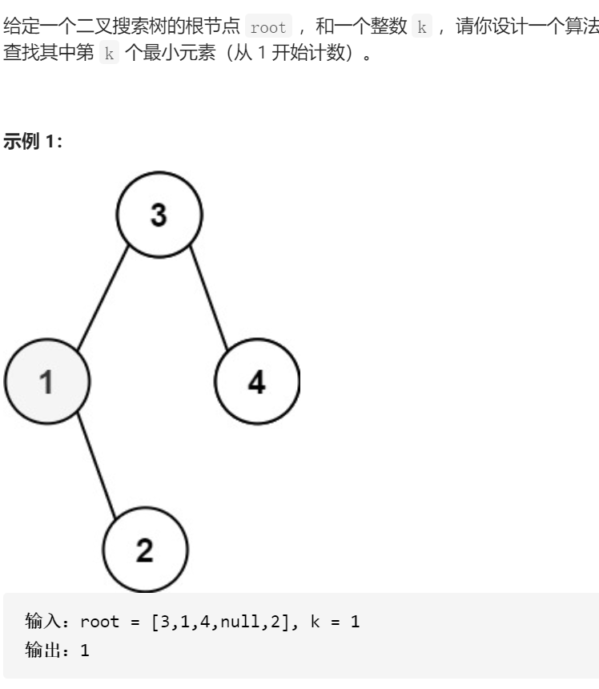

二叉搜索树中第K小的元素



变量简洁正确完整思路

中序遍历，cnt==k结束

```c
class Solution {
public:
    int kthSmallest(TreeNode* root, int k) {
        stack<TreeNode*>stk;
        int cnt=0;
        stk.push(root);
        while(!stk.empty()){
            root=stk.top();
            if(root){
                //遇到中，pop中，右中标记左
                stk.pop();
                if(root->right)stk.push(root->right);
                stk.push(root);
                stk.push(nullptr);
                if(root->left)stk.push(root->left);
            }else{
                //遇到标记，pop标记处理答案
                stk.pop();
                root=stk.top();stk.pop();
                cnt++;
                if(cnt==k)return root->val;
            }
        }
        return -1;
    }
};
```


