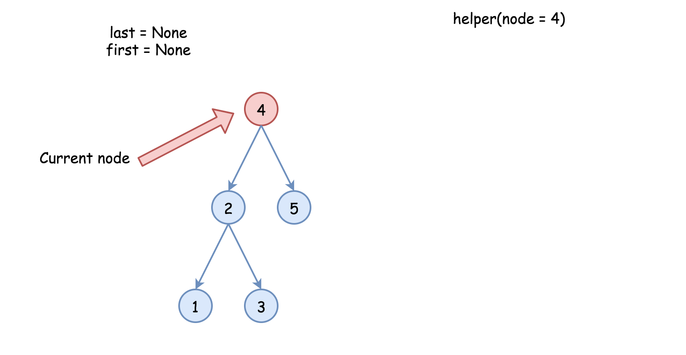

#### [426. 将二叉搜索树转化为排序的双向链表](https://leetcode-cn.com/problems/convert-binary-search-tree-to-sorted-doubly-linked-list/)

难度中等141

将一个 **二叉搜索树** 就地转化为一个 **已排序的双向循环链表** 。

对于双向循环列表，你可以将左右孩子指针作为双向循环链表的前驱和后继指针，第一个节点的前驱是最后一个节点，最后一个节点的后继是第一个节点。

特别地，我们希望可以 **就地** 完成转换操作。当转化完成以后，树中节点的左指针需要指向前驱，树中节点的右指针需要指向后继。还需要返回链表中最小元素的指针。

 

**示例 1：**

```
输入：root = [4,2,5,1,3] 


输出：[1,2,3,4,5]

解释：下图显示了转化后的二叉搜索树，实线表示后继关系，虚线表示前驱关系。
```

**示例 2：**

```
输入：root = [2,1,3]
输出：[1,2,3]
```

**示例 3：**

```
输入：root = []
输出：[]
解释：输入是空树，所以输出也是空链表。
```

**示例 4：**

```
输入：root = [1]
输出：[1]
```


# 将二叉搜索树转化为排序的双向链表

[力扣 (LeetCode)L6](https://leetcode-cn.com/u/leetcode/)发布于 2019-07-217.8k**官方**[二叉搜索树](https://leetcode-cn.com/tag/binary-search-tree/)[递归](https://leetcode-cn.com/tag/recursion/)[链表](https://leetcode-cn.com/tag/linked-list/)[C++](https://leetcode-cn.com/topic/cpp/)[Java](https://leetcode-cn.com/topic/java/)[Python](https://leetcode-cn.com/topic/python/)

#### 如何遍历树

总的来说，有两种遍历树的策略：

- *深度优先搜索* (`DFS`)

  在深度优先搜索中，我们以 `深度` 优先，从根开始先抵达某个叶子，再回退以前往下一个分支。

  深度优先搜索又可以根据根节点、左子结点和右子结点的顺序关系分为`前序遍历`，`中序遍历`和`后序遍历`。

- *广度优先搜索* (`BFS`)

  逐层扫描整棵树，按照高度顺序自顶向下。上层的结点比下层更先访问。

下图表示了不同策略下的访问顺序，请按照 `1-2-3-4-5` 的顺序来比较不同的策略。


由于原地的要求，本问题需要使用深度优先搜索的中序遍历，利用备忘录法实现。


------

#### 方法一：递归

**算法**

标准的中序遍历采用 `左 -> 根 -> 右` 的顺序，其中 `左` 和 `右` 的部分调用递归。

本题的处理在于将前一个结点与当前结点链接，因此，必须跟踪最后一个结点，该结点在新的双向链表中是当前最大的。


另外一个细节：我们也需要保留第一个，也就是最小的结点，以完成闭环。

下面是具体算法：

- 将 `first` 和 `last` 结点 初始化为 null。
- 调用标准中序遍历 `helper(root)` :
  - 若结点不为 null :
    - 调用左子树递归 `helper(node.left)`。
    - 若 `last` 结点不为空，将 `last` 与当前的 `node` 链接。
    - 否则初始化 `first` 结点。
    - 将当前结点标记为最后 : `last = node`.
    - 调用右子树递归 `helper(node.right)`。
- 将最前与最后的结点链接完成闭环，返回 `first` 。

**实现**




1 / 9


- Python
- C++
- Java

```
class Solution {
  public:
  // the smallest (first) and the largest (last) nodes
  Node* first = NULL;
  Node* last = NULL;

  void helper(Node* node) {
    if (node) {
      // left
      helper(node->left);
      // node 
      if (last) {
        // link the previous node (last)
        // with the current one (node)
        last->right = node;
        node->left = last;
      }
      else {
        // keep the smallest node
        // to close DLL later on
        first = node;
      }
      last = node;
      // right
      helper(node->right);
    }
  }

  Node* treeToDoublyList(Node* root) {
    if (!root) return NULL;

    helper(root);
    // close DLL
    last->right = first;
    first->left = last;
    return first;
  }
};
```

**复杂度分析**

- 时间复杂度：{O}(N)*O*(*N*)，每个结点被处理一次。
- 空间复杂度：{O}(N)*O*(*N*)。需要树高度大小的递归栈，最好情况（平衡树）为 {O}(\log N)*O*(log*N*)，最坏情况下（完全不平衡）为 O(N)*O*(*N*)。